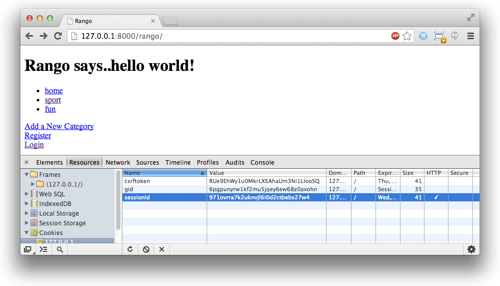

.. _cookie-label:

Cookies e Sessões
=================

Neste capítulo vamos estar abordando sobre *sessões* e *cookies*, sendo que ambos andam de mãos dadas, e são de suma importância nas aplicações web atuais. No capítulo anterior, Django usou sessões e cookies para manipular a funcionalidade de login e logout (tudo por trás dos panos). Aqui vamos explorar como usar de forma explícita cookies para outros propósitos.

Cookies, Cookies em todo lugar!
-------------------------------
Se você já está confortável com as ideias e conceitos sobre cookies, então pode pular direto para a Seção :ref:`model-cookies-protocols-label`, se não, continue lendo.

Sempre que é feito um request para um website, o servidor web retorna o conteúdo da página requisitada. Além disso, um ou mais cookies podem também ser enviados para o cliente, que por sua vez são armazenados no cache do navegador. Quando um usuário requisita uma nova página do mesmo servidor web, quaisquer cookies que correspondem a esse servidor são enviados com a requisição. O servidor pode então interpretar os cookies como parte do contexto da requisição e gerar uma resposta adequada.

O termo *cookie* não foi derivado da comida, mas do termo *magic cookie*, um pacote de dados que um programa recebe e envia novamente sem alterar. Em 1994, MCI enviou um pedido para *Netscape Communications* para implementar uma maneira de implementar persistência através de requests HTTP. Isso veio em resposta à necessidade deles de armazenar de forma confiável o conteúdo de uma cesta virtual de compras do usuário para um e-commerce que eles estavam desenvolvendo. O programador da Netscape Lou Montulli levou o conceito de magic cookie e aplicou ele para comunicações web. Você pode encontrar mais sobre `cookies e sua história no Wikipedia <http://pt.wikipedia.org/wiki/Cookie_HTTP>`_. Claro, com essa grande ideia veio uma patente de software - e você pode ler sobre em `US patent 5774670 <http://patft.uspto.gov/netacgi/nph-Parser?Sect1=PTO1&Sect2=HITOFF&d=PALL&p=1&u=%2Fnetahtml%2FPTO%2Fsrchnum.htm&r=1&f=G&l=50&s1=5774670.PN.&OS=PN/5774670&RS=PN/5774670>`_ que foi submetido pelo próprio Montulli.

Como um exemplo, você pode logar em um site com um username e senha. Quando você for autenticado, um cookie pode ser retornado para o seu browser contendo seu username, indicando que você está naquele momento logado no site. Em cada requisição, essa informação é passada de volta para o servidor onde sua informação de login é usada para renderizar a página apropriada - talvez incluindo seu username em lugares particulares da página. Sua sessão não pode durar pra sempre, no entanto - cookies *têm* que expirar em algum momento - eles não podem ser de tamanho infinito. Uma aplicação web contendo infomações importantes podem expirar depois de alguns minutos de inatividade. Uma aplicação web diferente com informações triviais podem expirar depois de meia hora desde a última interação - ou mesmo semanas depois.

A passagem de informação na forma de cookies podem abrir buracos de seguraçã na sua aplicação web. Por isso que desenvolvedores web precisam ser extremamentes cuidadosos quando usarem cookies - a informação que você quer armazenar como um cookie *realmente* precisa ser enviada? Em muitos casos, existem alternativas - e mais seguras - soluções para o problema. Passar o número de cartão de crédito do usuário em um site de e-commerce como um cookie, por exemplo, seria muito imprudente. E se o computador do usuário estiver comprometido? O cookie poderia ser levado por um programa malicioso. A partir daí, hackers teriam o número do cartão - tudo porque o design da sua aplicação web é fundamentalmente falho. No entanto, você ficará feliz em saber que a maioria dos sites usam cookies para funcionalidades específicas da aplicação.

.. _fig-bbcnews-cookies:

	Uma screenshot do site de notícias BBC (hospedado no Reino Unido) com a mensagem de aviso de cookie apresentada no topo da página.

.. note:: Note que em 2011, a União Europeia (EU) introduziu uma 'lei de cookie', onde todos os sites hospedados dentro da EU devem apresentar uma mensagem de aviso de cookie quando um usuário visitar o site pela primeira vez. Você pode ler mais sobre `a lei aqui <http://www.ico.org.uk/for_organisations/privacy_and_electronic_communications/the_guide/cookies>`_. 

.. _model-cookies-protocols-label:

Sessões e o Protocolo Sem Estado
--------------------------------
Toda a comunicação entre navegadores web (clientes) e servidores é conseguida através do `protocolo HTTP <http://pt.wikipedia.org/wiki/Hypertext_Transfer_Protocol>`_. Como nós *muito brevemente* abordamos no Capítulo :ref:`forms-label`, HTTP é um `protocolo sem estado <http://pt.wikipedia.org/wiki/Protocolo_sem_estado>`_. Isto portanto significa que um computador do cliente rodando um navegador web deve estabelecer uma nova conexão de rede (uma conexão TCP) ao servidor cada vez que um recurso é requisitado (HTTP ``GET``) ou enviado (HTTP ``POST``) [#stateless_http11]_.

Sem uma conexão persistente entre o cliente e servidor, o software em ambos os lados não pode simplesmente depender de conexões por si só para *manter o estado da sessão*. Por exemplo, o cliente poderia precisar falar para o servidor toda vez que está logado na aplicação web naquele computador. Isso é conhecido como uma forma de *diálogo* entre o cliente e servidor, e é a base de uma *sessão* - uma `troca semi permanente de infromações <http://en.wikipedia.org/wiki/Session_(computer_science)>`_. Sendo um protocolo sem estado, HTTP torna uma tarefa bem desafiadora (e frustrante) manter o estado da sessão - mas felizmente existem muitas técnicas que podemos usar para resolver este problema.

A maneira mais comummente usada pra manter o estado, é através do uso de uma *ID de sessão* armazenada como um cookie no computador do cliente. Um ID de sessão pode ser considerado como um token (uma sequência de caracteres) para identificar uma sessão única dentro de uma aplicação web. Ao invés de armazenar todo tipo de informação como cookies no cliente (como usernames, nomes, senhas...), apenas o ID da sessão é armazenada, que pode entao ser mapeado para uma estrutura de dados no servidor web. Dentro dessa estrutura de dados, você pode armazenar todo tipo de informação que precisar. Essa abordagem é uma maneira **muito mais segura** de armazenar informação sobre usuários. Desta maneira, a informação não pode ser comprometida por um cliente inseguro ou uma conexão que está sendo espionada.

Se seu navegador suporta cookies, praticamente todos os sites criam uma nova sessão para você quando você os visita. Você pode ver isso por si agora - confira a Figura :num:`fig-session-id`. No Google Chrome, através do developer tools, você pode visualizar cookies que são enviados pelo servidor web que você acessou. Na Figura :num:`fig-session-id`, você pode observar o cookie selecionado ``sessionid``. O cookie contém uma série de letras e números que o Django usa para identificar unicamente sua sessão. A partir daí, todas os detalhes da sua sessão podem ser acessados - mas apenas no lado do servidor.

.. _fig-session-id:

	Uma screenshot do Google Chrome com o Developer Tools aerto - veja o cookie ``sessionid``...

ID's de sessão não tem de ser armazenadas com cookies. Aplicações PHP legadas incluem eles (ID's) como uma *querystring*, ou parte da URL para um dado recurso. Se você alguma vez já viu uma URL como ``http://www.site.com/index.php?sessid=omgPhPwtfIsThisIdDoingHere332i942394``, isso é para provavelmente identificar unicamente você ao servidor.

.. note:: Dê uma olhada de perto na Figura :num:`fig-session-id`. Você notou o token ``csrftoken``? Esse cookie é para ajudar a prevenir qualquer cross-site forgery.

Configurando Sessões no Django
------------------------------
Embora isso já deva estar configurado e funcionando corretamente, é ainda assim boa prática aprender quais módulos do Django fornecem qual funcionalidade. No caso de sessões, Django fornece um `middleware <https://docs.djangoproject.com/en/1.7/topics/http/middleware/>`_ que implementam a funcionalidade de sessão.

Para conferir se tudo está em ordem, abra seu arquivo ``settings.py`` do projeto. Dentro do arquivo, localize a tupla ``MIDDLEWARE_CLASSES``. Você deve encontrar o módulo ``django.contrib.sessions.middleware.SessionMiddleware`` listado como uma string na tupla -  se você não o vê, adicione-o a tupla agora. è o middleware ``SessionMiddleware`` que habilita a criação de cookies ``sessionid`` únicos.

O ``SessionMiddleware`` é projetado para trabalhar flexivelmente com diferentes maneiras de armazenar informação de sessão. Existem muitas abordagens que podem ser tomadas - você poderia armazenar tudo em um arquivo, em um banco de dados, ou mesmo no cache. A abordagem mais simples é usar a aplicação ``django.contrib.sessions`` para armazenar informação de sessão em uma tabela/banco de dados do Django (especificamente, o model ``django.contrib.sessions.models.Session``). Para usar esta abordagem, você vai também precisar se certificar que ``django.contrib.sessions`` está na tupla ``INSTALLED_APPS`` do ``settings.py`` do projeto. Se você adicionar a aplicação agora, você vai precisar atualizar seu banco de dados com os comandos de migração.

.. note:: Se você está procurando por desempenho rápido, você pode querer considerar uma abordagem cacheada para armazenar informação da sessão. Pode conferir a `documentação oficial do Django sobrre sessão cacheada <https://docs.djangoproject.com/en/1.7/topics/http/sessions/#using-cached-sessions>`_.

Uma Sessão de Degustação de Cookie
----------------------------------
Podemos agora testar se seu navegador suporta cookies. Embora todos os navegadores modernos tenham suporte de cookies, é válido checar as configurações do seu navegador em relação a cookies. Se você tiver o nível de segurança do seu navegador alto, alguns cookies podem ser bloqueados. Dê uma olhada na documentação do seu browser para mais informações, e habilite cookies.

Testando a Funcionalidade de Cookie
...................................
Para testar cookies, você pode fazer uso de alguns métodos convenientes fornecidos pelo objeto ``request`` do Django. Os três de particular interesse para nós são: ``set_test_cookie()``, ``test_cookie_worked()`` e ``delete_test_cookie()``. Em uma view, você vai precisar setar um cookie. Em outra, você vai precisar testar se cookie existe. Duas diferentes views são necessárias para testar cookies porque você precisa esperar para ver se o cliente aceitou o cookie do servidor.

Vamos usar duas views pré-existentes para esse exercício simples, ``index()`` and ``register()``. Você precisará se certificar que está deslogado do Rango se tiver implementado a funcionalidade de autenticação do usuário. Em vez de mostrar qualquer coisa nas páginas, vamos fazer uso da saída do terminal do servidor de desenvolvimento do Django para verificar se os cookies estão funcionando corretamente. Depois que nós conseguirmos fazer com sucesso que cookies estejam funcionando, podemos remover o código que adicionamos para restaurar as duas views para seu estado anterior.

No arquivo ``views.py`` do Rango, localize sua view ``index()``. Adicione a seguinte linha de código na view. Para assegurar que a linha é executada, certifique-se que você a colocou como a primeira linha da view, fora de qualquer bloco condicional.

.. code-block:: python
	
	request.session.set_test_cookie()

Na view ``register()``, adicione as três seguintes linhas no topo da função - novamente, assegure que elas são executadas.

.. code-block:: python
	
	if request.session.test_cookie_worked():
	    print ">>>> TEST COOKIE WORKED!"
	    request.session.delete_test_cookie()

Com essas pequenas mudanças salvas, rode o servidor de desenvolvimento e navegue para a página inicial do Rango, ``http://127.0.0.1:8000/rango/``. Uma vez que a página é carregada, navegue para a página de cadastro/registro. Quando a página de cadastro é carregada, você deve ver ``>>>> TEST COOKIE WORKED!`` aparecer no console do seu servidor de desenvolvimento, como na Figura :num:`fig-test-cookie`. Se aparecer, tudo funcionou como esperado!

.. _fig-test-cookie:

	Uma screenshot da saída no console do servidor de desenvolvimento do Django com a mensagem ``>>>> TEST COOKIE WORKED!``.

Se a mensagem não for mostrada, você irá checar suas configurações de segurança do navegador. As configurações podem estar prevenindo o navegador de aceitar o cookie.

.. note:: Você pode deletar o código que você adicionou nessa seção - nós apenas usamos ele para demonstrar cookies em ação.

Cookies no Lado do Cliente: Um exemplo local
------------------------------------------------------
Agora que nós sabemos que cookies funcionam, vamos implementar um simples contador de visitas do site. Para conseguirmos isso, vamos estar criando dois cookies: um para rastrear o número de vezes que o usuário visitou o site do Rango, e o outro para rastrear a última vez que ele/ela acessou o site. Manter o controle da data e hora do último acesso vai nos permitir apenas incrementar o contador do site uma vez por dia, por exemplo.

O lugar mais sensato para assumir que um usuário entrou no site do Rango, é na página inicial. Abra ``rango/views.py`` e edite a view ``index()`` como a seguir:

.. code-block:: python
	
	def index(request):
	   
	    category_list = Category.objects.all()
	    page_list = Page.objects.order_by('-views')[:5]
	    context_dict = {'categories': category_list, 'pages': page_list}

	    # Pegue o número de visitas ao site.
	    # Nós usamos a função COOKIES.get() para obter o cookie de visitas.
	    # Se o cookie existir, o valor retornado é convertido para um inteiro.
	    # Se o cookie não existir, por padrão setamos para zero e convertemos.
	    visits = int(request.COOKIES.get('visits', '0'))
		
	    reset_last_visit_time = False
	
	    # O cookie last_visit existe?
	    if 'last_visit' in request.COOKIES:
	        # Sim, ele existe! Pegue o valor do cookie.
	        last_visit = request.COOKIES['last_visit']
	        # Converta o valor para um objeto date/time Python.
	        last_visit_time = datetime.strptime(last_visit[:-7], "%Y-%m-%d %H:%M:%S")
	
	        # Se tiver passado mais que um dia desde a última visita...
	        if (datetime.now() - last_visit_time).days > 0:
	            visits = visits + 1
	            # ... e um aviso que o cookie de última visita precisa ser atualizado
	            reset_last_visit_time = True
	    else:
	        # Cookie last_visit não existe, então avise que ele deve ser definido.
	        reset_last_visit_time = True
	
	
	    context_dict['visits'] = visits
		
	    # Obter logo nosso objeto Response, de modo que possamos adicionar informação do cookie.
	    response = render(request, 'rango/index.html', context_dict)
	    if reset_last_visit_time:
	        response.set_cookie('last_visit', datetime.now())
	    response.set_cookie('visits', visits)
	
	    # Retornar uma resposta para o usuário, atualizando quaisquer cookies que precisem ser mudados.
	    return response

Ao ler o código, você verá que a maioria do código lida com checagem da data e hora atual. Para isso, você vai precisar incluir o módulo ``datetime`` do Python, ao adicionar o seguinte import no topo do arquivo ``views.py``:

.. code-block:: python
	
	from datetime import datetime

Certifique-se de também importar o objeto ``datetime`` dentro do módulo ``datetime``.

No código adicionado, nós checamos pra ver se o cookie ``last_visit`` existe. Se sim, nós podemos pegar o valor do cookie usando a sintaxe ``request.COOKIES['cookie_name']``, onde ``request`` é o nome do objeto ``request``, e ``'cookie_name'`` é o nome do cookie que você deseja recuperar. **Note que todos os valores do cookie são retornados como strings**; *não assuma que um cookie armazenando números vai retornar um inteiro*. Você tem que manualmente convertê-lo para o tipo correto. Se o cookie não existir, você pode criá-lo com o método ``set_cookie()`` do objeto ``response``, como mostrado acima. O método recebe dois valores, o nome do cookie que você quer criar (como string), e o valor do cookie. Neste caso, não importa qual tipo você passa como o valor - ele será automaticamente convertido para string.

.. _fig-cookie-visits:

	Uma screenshot do Developer Tools do Google Chrome aberto mostrando os cookies do Rango. Note o cookie ``visits`` - o usuário tem um total de seis visitas, com intervalo de pelo menos um dia em cada visita.

Agora se você visitar a página inicial do Rango, e inspecionar com o developer tools fornecido pelo seu navegador, você deve ser capaz de ver os cookies ``visits`` e ``last_visit``. A Figure :num:`fig-cookie-visits` demonstra os cookies em ação.

.. note:: Você pode notar que o cookie ``visits`` não incrementa quando você atualiza a página. Porque? O exemplo de código que fornecemos acima, apenas incrementa o contador *pelo menos uma vez por dia* depois de um usuário revisitar a página inicial do Rango. Esse é um tempo meio grande para esperar ao testar - então porque não mudar temporariamente o delay para um período mais curto? Na view ``index`` encontre a seguinte linha:

	``if (datetime.now() - last_visit_time).days > 0:``

	Nós podemos facilmente mudar esta linha para comparar o número de *segundos* entre visitas. No exemplo acima, checamos se o usuário visitou pelo menos cinco segundos antes.
	
	``if (datetime.now() - last_visit_time).seconds > 5:``

	Isso significa que você precisa apenas esperar cinco segundos para ver seu cookie ``visits`` incrementar, ao invés de um dia inteiro. Quando você estiver feliz por seu código funcionar, pode reverter a comparação anterior de volta ao original.
	
	Ser capaz de encontrar a diferença entre tempos usando o operador ``-`` é um dos muitos recursos incríveis que Python fornece. Quando o tempos são subtraídos, um objeto ``timedelta`` é retornado, o qual fornece os atributos ``days`` e ``seconds`` que nós usamos no código acima. Você pode ver mais na `documentação oficial do Python <http://docs.python.org/2/library/datetime.html#timedelta-objects>`_ para mais informações sobre este tipo de objeto, e quais outros atributos ele fornece.
	
Em vez de usar o developer tools você pode atualizar o ``index.html`` e adicionar: ``
 visits: {{ visits }}
`` para mostrar o número de visitas.

Dados de Sessão
---------------
No exemplo anterior, nós usamos cookies do lado do cliente. No entanto, uma maneira mais segura de salvar infomações de sessão é armazenar esses dados no lado do servidor. Podemos então usar o cookie-ID da sessão que é armazenado no lado do cliente (mas é efetivamente anônimo) como chave para desbloquear o dado.

Para usar cookies baseados na sessão você precisa executar os seguintes passos:

#. Certifique-se que em ``MIDDLEWARE_CLASSES`` em ``settings.py`` contém ``django.contrib.sessions.middleware.SessionMiddleware``.
#. Configure seu backend de sessão. Certifique-se que ``django.contrib.sessions`` está no seu ``INSTALLED_APPS`` no ``settings.py``. Se não, adicione-o, e rode o comando de migração ``python manage.py migrate``.
#. Por padrão um backend de banco de dados é adotado, mas você pode querer uma outra configuração (isto é, um cache). Veja a `documentação oficial do Django sobre outras configurações de backend para Sessões <https://docs.djangoproject.com/en/1.7/topics/http/sessions/>`_.

Agora em vez de armazenar os cookies diretamente no request (e assim na máquina do cliente), você pode acessar os cookies do lado do servidor através da chamada do método ``request.session.get()`` e armazená-los com ``request.session[]``. Note que um cookie-ID de sessão ainda é usado para lembrar a máquina do cliente (então tecnicamente um cookie do lado do navegador existe), no entanto todos os dados estão armazenados no lado do servidor. Abaixo nós atualizamos a view ``index()`` com cookies baseados na sessão:

.. code-block:: python
	
	def index(request):
	    
	    category_list = Category.objects.order_by('-likes')[:5]
	    page_list = Page.objects.order_by('-views')[:5]

	    context_dict = {'categories': category_list, 'pages': page_list}

	    visits = request.session.get('visits')
	    if not visits:
	        visits = 0
	    reset_last_visit_time = False

	    last_visit = request.session.get('last_visit')
	    if last_visit:
	        last_visit_time = datetime.strptime(last_visit[:-7], "%Y-%m-%d %H:%M:%S")
	        if (datetime.now() - last_visit_time).seconds > 0:
	            # soma o valor anterior do cookie com +1.
	            visits = visits + 1
	            # E atualiza o cookie last_visit também.
	            reset_last_visit_time = True
	    else:
	        # O cookie last_visit não existe, então crie-o com a data/hora atual
	        reset_last_visit_time = True

	    context_dict['visits'] = visits
	    request.session['visits'] = visits
	    if reset_last_visit_time:
	        request.session['last_visit'] = str(datetime.now())
		
	    response = render(request,'rango/index.html', context_dict)

	    return response
	

.. warning:: É altamente recomendado que você delete qualquer cookies do lado do cliente do Rango *antes* de você começar a usar dados baseados na sessão. Você pode fazer isso no developer tools do seu navegador ao deletar cada cookie individualmente, ou simplesmente limpar completamente o cache do browser - garantindo que cookies sejam deletados no processo.

.. note:: Uma vantagem de armazenar dados da sessão no servidor é sua habilidade de converter dados de strings para o tipo desejado. Isso apenas funciona no entanto para `built-in types <http://docs.python.org/2/library/stdtypes.html>`_, tais como ``int``, ``float``, ``long``, ``complex`` e ``boolean``. Se você quiser armazenar um dicionário ou outro tipo complexo, não espere que funcione. Neste cenário, você pode considerar `serializar seus objetos usando o Pickle <https://wiki.python.org/moin/UsingPickle>`_.

Browser-Length e Sessões Persistentes
-------------------------------------
Ao usar cookies você pode usar o framework de sessão do Django para configurar como *browser-length sessions* ou *sessões persistentes*. Como os nomes dos dois tipos sugerem:

* browser-length sessions expiram quando o usuário fecha o navegador; e
* sessões persistentes podem durar ao longo de várias instâncias do navegador - expirando no momento de sua escolha. Isso poderia ser meia hora, ou mesmo tão longo quanto um mês.

Por padrão, browser-length sessions estão desabilitadas. Você pode habilitá-las ao modificar o ``settings.py`` do seu projeto. Adicione a variável ``SESSION_EXPIRE_AT_BROWSER_CLOSE``, setando ele para ``True``.

Alternativamente, sessões persistentes estão habilitadas por padrão, com ``SESSION_EXPIRE_AT_BROWSER_CLOSE`` setado para ``False``, ou não estando presente no ``settings.py``. Sessões persistentes tem uma configuração adicional, ``SESSION_COOKIE_AGE``, que permite você especificar a idade de que um cookie pode viver. Esse valor deve ser um inteiro, representando o número de segundos que o cookie pode viver. Por exemplo, especificar o valor de ``1209600`` significará que o cookie do seu site expira depois do período de duas semanas.

Confira as configurações disponíveis que você pode usar na `documentação oficial do Django sobre cookies <https://docs.djangoproject.com/en/1.7/ref/settings/#session-cookie-age>`_ para mais detalhes. Você pode também checar o `blog do Eli Bendersky <http://eli.thegreenplace.net/2011/06/24/django-sessions-part-i-cookies/>`_ para um excelente tutorial sobre cookies e Django.

Limpando o Banco de Dados de Sessões
------------------------------------
Cookies de sessão se acumulam. Então se você está usando backend de banco de dados você vai ter que periodicamente limpar o banco de dados que armazena os cookies. Isso pode ser feito usando ``python manage.py clearsessions``. A documentação do Django sugere rodar isso diariamente como uma tarefa agendada (cron job). Veja https://docs.djangoproject.com/en/1.7/topics/http/sessions/#clearing-the-session-store

Considerações Básicas e Fluxo de Trabalho
-----------------------------------------
Ao usar cookies dentro da sua aplicação Django, existem algumas coisas que você deve considerar:

* Primeira, considere quais tipos de cookies sua aplicação web requer. A informação que você deseja armazenar precisa persistir ao longo de uma série de sessões do navegador do usuário, ou pode ser desconsiderada com segurança após o fim de uma sessão?
* Pense cuidadosamente sobre a informação que você deseja armazenar usando cookies. Lembre-se, armazenar informações em cookies por sua definição significa que a informação será armazenada no computador do cliente também. Isso é um potencial risco de segurança enorme: você simplesmente não sabe se o computador do usuário estará comprometido. Considere alternativas do lado do servidor se informações sensíveis estiverem envolvidas.
* Como se segue no ponto anterior, lembre que usuários podem configurar as configurações de segurança de seus navegadores para alto nível, que poderia potencialmente bloquear seus cookies. Como seus cookies poderiam ser bloqueados, seu site pode funcionar incorretamente. Você *deve* atender a este cenário - *você não tem controle sobre as configurações do navegador do cliente*.

Se cookies do lado do cliente é a abordagem certa para você, então trabalhe pelos seguintes passos:

#. Você deve primeiro executar uma checagem para ver se o cookie que você quer existe. Isso pode ser feito ao checar o parâmetro ``request``. A função ``request.COOKIES.has_key('<cookie_name>')`` retorna um valor booleano indicando se um cookie <cookie_name> existe no computado do cliente ou não.
#. Se o cookie existir, você pode então recuperar seu valor - novamente através do ``request`` - com ``request.COOKIES[]``. O atributo ``COOKIES`` está exposto como um dicionário, então passe o nome do cookie que você deseja recuperar como uma string entre os colchetes. Lembre-se, cookies são todos retornados como strings, independente do que eles contenham. Você deve portanto estar preparado para convertê-lo para o tipo correto.
#. Se o cookie não existir, ou você quiser atualizar o cookie, passe o valor que você deseja salvar ao response que você gerou. ``response.set_cookie('<cookie_name>', value)`` é a função que você chama, onde dois parâmetros são fornecidos: o nome do cookie, e o ``value`` para configurá-lo.

Se você precisa de cookies mais seguros, então use cookies baseados na sessão:

#. Certifique-se que ``MIDDLEWARE_CLASSES`` em ``settings.py`` contenha 'django.contrib.sessions.middleware.SessionMiddleware'.
#. Configure seu backend de sessão ``SESSION_ENGINE``. Veja a `documentação oficial do Django sobre sessões <https://docs.djangoproject.com/en/1.7/topics/http/sessions/>`_ para várias configurações de backend.
#. Cheque se o cookie existe através do ``requests.sessions.get()``
#. Atualize ou configure o cookie através do dicionário da sessão, ``requests.session['<cookie_name>']``

Exercícios
----------
Agora que você leu todo este capítulo e testou o código, aqui mais exercícios.

- Mude seus cookie do lado do cliente para o lado do servidor para tornar sua aplicação mais segura. Limpe o cache do seu browser e cookies, então cheque para se certificar que você não consegue ver as variáveis ``last_visit`` e ``visits`` no browser. Note que você vai continuar vendo o cookie ``sessionid``.
- Atualize a view e template da página *About*  falando aos visitantes quantas vezes eles visitaram o site.

Dicas
.....
Para ajudá-lo a completar os exercícios acima, as seguintes dicas podem ajudar.

Você terá que passar o valor do cookie para o contexto do template para ele ser renderizado como parte da página, como mostrado no exemplo abaixo:

.. code-block:: python
	
	# Se a variável de sessão da visita existir, pegue-a e use-a.
	# Se não, nós não temos visitas, então vamos setar o contador para zero.
	if request.session.get('visits'):
	    count = request.session.get('visits')
	else:
	    count = 0

	# Lembre-se de incluir o dado de visita ao contexto.
	return render(request, 'rango/about.html', {'visits': count})

.. rubric:: Notas de Rodapé

.. [#stateless_http11] A última versão do HTTP padrão, HTTP 1.1 na verdade suporta a habilidade para múltiplas requisições serem enviadas em uma conexão de rede TCP. Isso fornece enormes melhorias na perfomance, especialmente sobre conexões de rede de alta latência (tais como através de conexões discadas e satélite). Isso é conhecido como *HTTP pipelining*, e você pode ler mais sobre esta técnica no `Wikipedia <http://en.wikipedia.org/wiki/HTTP_pipelining>`_.
