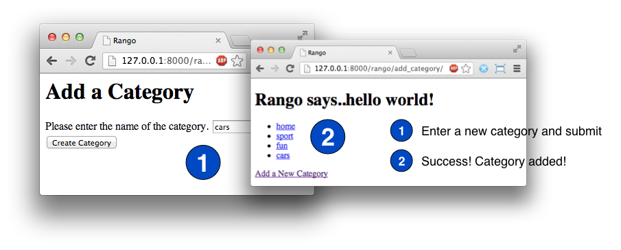

.. _forms-label:

Vamos Brincar com Forms
=======================

Até agora nós apenas apresentamos os dados através das views e templates que nós criamos. Neste capítulo, iremos ver como capturar dados através de formulários web. Django vem com algumas funcionalidades bacanas de manipulação de formulários, tornando-se um processo muito simples coletar informações a partir dos usuários e enviá-las de volta pra sua aplicação web. De acordo com a `documentação do Django sobre forms <https://docs.djangoproject.com/en/1.7/topics/forms/>`_, a funcionalidade de manipulação de forms permite que você:

#. Mostrar um form HTML com campos gerados automaticamente (como um input de texto);
#. Conferir os dados submetidos em um conjunto de regras de validação;
#. Mostrar novamente um form no caso de erros de validação; e
#. Converter os dados do form submetido para tipos de dados relevantes do Python.

Uma das maiores vantagens de usar a funcionalidade dos forms do Django é que ela pode salvar muito do seu tempo e problemas com o código HTML. Nessa parte do tutorial veremos como implementar a infraestrutura necessária que permitirá usuários do Rango adicionarem categorias e páginas ao banco de dados através dos forms.

Fluxo de Trabalho Básico
------------------------
Os passos básicos envolvidos em criar um form e permitir usuários entrarem com dados através deles está descrito abaixo:

#. Se você não tiver criado um ainda, crie um arquivo ``forms.py`` dentro do diretório da sua aplicação, para armazenar as classes relacionadas ao form.
#. Crie uma classe ``ModelForm`` para cada model que você deseja apresentar como um form.
#. Customize o formulário como você quiser.
#. Crie ou atualize uma view para manipular o form - incluindo *mostrar* o form, *salvar* os dados, e *sinalizar os erros* que podem ocorrer quando o usuário entra com dados incorretos (ou está faltando algum dado) no form.
#. Crie ou atualize um template para renderizar o form.
#. Adicione um ``urlpattern`` para mapear a nova view (se você tiver criado uma nova).

Esse fluxo de trabalho está um pouco mais complicado que os anteriores, e as views que nós temos que construir também tem mais complexidade. No entanto, uma vez que você realize o processo algumas vezes, vai ficar cada vez mais claro como todas essas partes funcionam juntas.

Formulários de Categoria e Página
---------------------------------
Primeiro, crie um arquivo chamado ``forms.py`` dentro do diretório da aplicação ``rango``. Embora este passo não seja absolutamente necessário, já que você pode colocar os forms no ``models.py``, isso torna a base de código mais limpa e clara para entender.

Criando Classes ``ModelForm``
.............................
Dentro do módulo ``forms.py`` do Rango, estaremos criando uma série de clasess que herdam de ``ModelForm`` do Django. Na essência, `um ModelForm <https://docs.djangoproject.com/en/1.7/topics/forms/modelforms/#modelform>`_ é uma *classe auxiliar* que permite que você crie um ``Form`` Django a partir de um model existente. Como nós já temos dois models definidos para o Rango (``Category`` e ``Page``), criaremos o ``ModelForms`` para ambos.

No arquivo ``rango/forms.py`` adicione o seguinte código:

.. code-block:: python
	
	from django import forms
	from rango.models import Page, Category
	
	class CategoryForm(forms.ModelForm):
	    name = forms.CharField(max_length=128, help_text="Please enter the category name.")
	    views = forms.IntegerField(widget=forms.HiddenInput(), initial=0)
	    likes = forms.IntegerField(widget=forms.HiddenInput(), initial=0)
	    slug = forms.CharField(widget=forms.HiddenInput(), required=False)
		
	    # Uma classe aninhada para fornecer informação adicional ao form.
	    class Meta:
	        # Fornece uma associação entre o ModelForm e um model.
	        model = Category
	        fields = ('name',)
			
	
	class PageForm(forms.ModelForm):
	    title = forms.CharField(max_length=128, help_text="Please enter the title of the page.")
	    url = forms.URLField(max_length=200, help_text="Please enter the URL of the page.")
	    views = forms.IntegerField(widget=forms.HiddenInput(), initial=0)
	    
	    class Meta:
	        # Fornece uma associação entre o ModelForm e um model.
	        model = Page
	        
	        # Quais forms nós queremos incluir em nosso form?
	        # Dessa vez nós não precisamos de todos os fields do model.
	        # Alguns fields podem permitir valores NULL, então podemos querer não incluí-los
	        # Aqui, nós escondemos a chave estrangeira.
	        # Nós podemos também excluir o field category do form
	        exclude = ('category',)
	        # Ou especificar os fields a serem incluídos (isto é, não incluindo o field category)
	        # fields = ('title', 'url', 'views')
			
			
Django nos fornece uma série de maneiras para customizar os forms que são criados em nosso favor. No código do exemplo acima, nós especificamos os widgets que queremos usar para cada field a ser exibido. Por exemplo, na nossa classe ``PageForm``, nós definimos ``forms.CharField`` para o field ``title``, e ``forms.URLField`` para o field ``url``. Ambos os fields fornecem entradas de texto para os usuários. Note o parâmetro ``max_length`` que nós passamos para nossos fields - o tamanho que nós especificamos são idênticos ao tamanho máximo de cada field que especificamos nos models correspondentes. Volte ao Capítulo :ref:`model-label` para conferir, ou dar uma olhada melhor no arquivo ``models.py`` do Rango.

Você também vai notar que incluímos várias entradas ``IntegerField`` para os fields views e likes em cada form. Veja que nós configuramos o widget para ficar oculto com o parâmetro ``widget=forms.HiddenInput()``, e então setamos o valor para zero com ``initial=0``. Esta é uma maneira de configurar o field para zero sem dar o controle ao usuário, já que o campo estará escondido, e assim o form fornecerá o valor para o model. No entanto, como você pode ver em ``PageForm``, apesar do fato que nós escondemos um field, ainda precisamos incluir o field no form. Se em ``fields`` nós excluirmos ``views``, então o form poderia não conter esse field (apesar de ser especificado) e assim o form poderia não retorna o valor zero para esse field. Isso pode lançar um erro dependendo de como o model foi configurado. Se nos models nós especificamos que o ``default=0`` para esses field, então nós podemos contar com o model para popular o field automaticamente com o valor default - e assim evitamos um erro ``not null``.

Neste caso, poderia não ser necessário ter esses fields escondidos. Nós também incluímos o field ``slug`` no form, e configuramos ele para usar o ``widget=forms.HiddenInput()``, mas ao invés de especificar um valor inicial ou defaul, nós falamos que o field não é obrigatório para o form. Isso ocorre porque nosso model será responsável por dar o ``save()`` para preencher este campo. Essencialmente, você precisa ser cuidadoso quando define seus models e forms, para certificar-se que o form vai conter e passar todos os dados que são necessários para preencher corretamente seu model.

Além do widget ``CharField`` e ``IntegerField``, muitos outros estão disponíveis para você usar. Como exemplo, Django fornece o ``EmailField`` (para entradas de endereço de email), ``ChoiceField`` (para botões de input radio), e ``DateField`` (para entradas de datas/horas). Existem muitos outros tipos de fields que você pode usar, que resultam em erros ao validar para você (por exemplo, *o valor fornecido é um inteiro válido?*). Nós recomendamos fortemente que você dê uma olhada na `documentação oficial do Django sobre widgets <https://docs.djangoproject.com/en/1.7/ref/forms/widgets/>`_ para ver quais componentes existem e os argumentos que você pode fornecer para customizá-los.

Talvez o aspecto mais importante de uma classe herdar de ``ModelForm`` é a necessidade de definir *qual model nós queremos fornecer para um form*. Nós cuidamos disso através da nossa classe aninhada ``Meta``. Definimos o atributo ``model`` dessa classe aninhada com o model que você deseja usar. Por exemplo, nossa classe ``CategoryForm`` tem uma referência ao model ``Category``. Esse é um passo crucial: habilitar o Django para criar um form na imagem do model especificado. Isso também ajudará na manipulação de sinalizações de quaisquer erros, juntamente em salvar e mostra os dados no formulário.

Nós também usaremos a classe ``Meta`` para especificar quais fields que nós queremos incluir em nosso form, através da tupla ``fields``. Use uma tupla de nomes de fields para especificar os fields que você deseja incluir.

.. note:: Nós recomendamos fortemente que você confira a `documentação oficial do Django sobre forms  <https://docs.djangoproject.com/en/1.7/ref/forms/>`_ para mais informações sobre como customizá-los.

Criando uma View *Add Category*
...............................
Com nossa classe ``CategoryForm`` agora definida, estamos prontos para criar uma nova view para mostrar o form e manipular a publicação dos dados de formulário. Para fazer isso, adicione o seguinte código em ``rango/views.py``.

.. code-block:: python
	
	from rango.forms import CategoryForm
	
	def add_category(request):
	    # É um HTTP POST?
	    if request.method == 'POST':
	        form = CategoryForm(request.POST)
	        
	        # Foi fornecido um form válido?
	        if form.is_valid():
	            # Salve a nova categoria no banco de dados.
	            form.save(commit=True)
	            
	            # Agora chame a view index()
	            # O usuário será levado para a página inicial
	            return index(request)
	        else:
	            # O form fornecido contém erros - apenas dê um print neles no terminal.
	            print form.errors
	    else:
	        # Se a requisição não foi um POST, mostre o form para inserir os dados
	        form = CategoryForm()
	    
	    # Algum problema no form, ou form não fornecido...
	    # Renderize o form com as mensagens de erro (se houver alguma)
	    return render(request, 'rango/add_category.html', {'form': form})

A nova view ``add_category()`` adiciona algumas peças-chave da funcionalidade para manipular forms. Primeiro, nós checamos o método de requisição do HTTP, para determinar se ele foi um HTTP ``GET`` ou ``POST``. Podemos então manipular apropriadamente diferentes métodos de requisição - isto é, se queremos mostrar um form (se o método for ``GET``), ou processar os dados do form (se for ``POST``) - tudo a partir da mesma URL. A view ``add_category()`` pode manipular três cenários diferentes:

- mostrar form novo e em branco para adicionar uma categoria;
- salvar dados do form fornecidos pelo usuário ao model associado, e renderizar a página inicial do Rango; e
- Se houver algum erro, mostrar novamente o form com as mensagens de erro.

.. note::
	O que nós queremos dizer com ``GET`` and ``POST``? Existem dois tipos diferentes de *HTTP requests* (requisições HTTP).

	- Um HTTP ``GET`` é usado para *requisitar uma representação do recurso especificado*. Em outras palavras, usamos um HTTP ``GET`` para recuperar um recurso particular, sendo ele uma página web, imagem ou outro arquivo.
	- Em contraste, um HTTP ``POST`` *submete dados a partir do web browser do cliente para ser processado*. Esse tipo de requisição é usada, por exemplo, quando enviamos o conteúdo de um form HTML.
	- Por fim, um HTTP ``POST`` pode acabar sendo programado para criar um novo recurso (por exemplo, uma nova entrada no banco de dados) no servidor. Este pode ser acessado mais tarde através de uma requisição HTTP ``GET``.

Forms do Django manipula o processamento dos dados retornados do browser de um usuário através de uma requisição HTTP ``POST``. Ele não apenas manipula o salvamento de dados do formulário para o model escolhido, mas também vai gerar automaticamente mensagens de erro para cada field do form (se algum for obrigatório). Isso significa que o Django não vai armazenar forms submetidos faltando informações que poderiam potencialmente causar problemas para a integridade referencial do banco de dados. Por exemplo, não fornecer valor no field de nome da categoria retornará um erro, bem como o se field estiver em branco.

Você vai notar a partir da linha em que nós chamamos o ``render()`` que nós nos referimos a um novo template chamado ``add_category.html``, que vai conter o código de template do Django e HTML para o form e a página.

Criando o Template  *Add Category*
..................................
Crie o arquivo ``templates/rango/add_category.html``. Dentro do arquivo, adicione o seguinte código:

.. code-block:: html
	
	<!DOCTYPE html>
	<html>
	    <head>
	        <title>Rango</title>
	    </head>
	    
	    <body>
	        <h1>Adicione uma categoria</h1>
	        
	        <form id="category_form" method="post" action="/rango/add_category/">
	            
	            
	            
	                {{ hidden }}
	            	
	        
	            
	                {{ field.errors }}
	                {{ field.help_text }}
	                {{ field }}
	            
	            
	            <input type="submit" name="submit" value="Create Category" />
	        </form>
	    </body>
	
	</html>

Agora, o que esse código faz? Você pode ver que dentro do ``<body>`` da página nós colocamos um elemento ``<form>``. Analisando os atributos do elemento ``<form>``, você pode ver que todos os dados capturados dentro deste form está sendo enviados para a URL ``/rango/add_category/`` como uma requisição HTTP ``POST`` (o atributo ``method`` não é case-sensitive, então você pode colocar ``POST`` ou ``post`` - ambos fornecem a mesma funcionalidade). Dentro do form, nós temos dois loops for - um controlando os fields *ocultos* do form, e o outro os fields *visíveis* - com field visíveis controlados pelo atributo ``fields`` da classe ``Meta`` do seu ``ModelForm``. Esses loops produzem código HTML para cada elemento do form. Para fields visível do form, nós também adicionamos quaisquer erros que podem aparecer com um field particular, e um texto de ajuda que pode ser usado para explicar ao usuário com quais dados ele/ela devem entrar.

.. note:: A necessidade por campos ocultos, bem como visíveis é necessário pelo fato que HTTP é um protocolo sem estado. Você não pode persistir o estado entre diferentes requisições HTTP, o que pode tornar certas partes da aplicação web difíceis de implementar. Para superar essa limitação, ocultar campos do form que foram criados para que permitam que aplicações web passem informações importantes para um cliente (que pode não ser vista na página renderizada) é um form HTML, apenas ao ser enviada de volta ao servidor quando o usuário submeter o form.

Você também deve tomar nota do trecho de código ````. Esse é um token *Cross-Site Request Forgery (CSRF) token*, que ajuda a proteger e garantir a ação do ``POST`` do HTTP que é iniciada na submissão posterior de um form. *O token CSRF é obrigatório pelo Django. Se você esquecer de incluir um token CSRF nos seus forms, um usuário poder encontrar erros quando for enviar o form*. Confira a `documentação oficial do Django sobre tokens CSRF <https://docs.djangoproject.com/en/1.7/ref/contrib/csrf/>`_ para mais informações sobre isso.

Mapeando a View *Add Category*
..............................
Agora precisamos mapear a view ``add_category()`` para uma URL. No template usamos a URL ``/rango/add_category/`` no atributo submit do form. Sendo assim, vamos precisar seguir o exemplo em ``rango/urls.py`` e modificar o ``urlpatterns`` como é mostrado abaixo:

.. code-block:: python
	
	urlpatterns = patterns('',
	    url(r'^$', views.index, name='index'),
	    url(r'^about/$', views.about, name='about'),
	    url(r'^add_category/$', views.add_category, name='add_category'), # NEW MAPPING!
	    url(r'^category/(?P<category_name_url>\w+)$', views.category, name='category'),)

Ordenar os mapeamentos não importa muito. No entanto, dê uma olhada na `documentação oficial do Django sobre como Django processa uma requisição <https://docs.djangoproject.com/en/1.7/topics/http/urls/#how-django-processes-a-request>`_ para mais informações. Nossa nova URL para adicionar uma categoria é ``/rango/add_category/``.

Modificando a View da Página Inicial
....................................
Como passo final, vamos colocar um link na página inicial, de modo que possamos facilmente adicionar categorias. Edite o template ``rango/index.html`` e adicione o seguinte link, antes de fechar a tag ``</body>``:

.. code-block:: html
	
	<a href="/rango/add_category/">Add a New Category</a> 

Demonstração
............
Agora vamos testar! Rode seu servidor de desenvolvimento, e navegue até ``http://127.0.0.1:8000/rango/``. Use seu novo link para acessar a página para adicionar categorias, e tente adicionar uma. A Figura :num:`fig-rango-form-steps` mostra uma screenshot da página inicial e adicionar categoria.

.. _fig-rango-form-steps:

	
	Adicionando uma nova categoria ao Rango, com nosso novo form. O diagrama ilustra os passos envolvidos.

.. note:: Se você adicionar uma série de categorias, elas não irão aparecer na página inicial, e isso é porque nós estamos mostrando apenas o top 5 das categorias. Se você logar no admin, você conseguirá ver todas as categorias que cadastrou. Para ver o que está acontecendo com as categorias que você cadastrou em ``rango/views.py`` na view ``add_category()``, você pode pegar a referência do objeto do model da categoria criada a partir do ``form.save()``, com ``cat = form.save(commit=True)`` e então printar no console a categoria e o slug, usando ``print cat, cat.slug`` para ver o que está sendo criado.
	
Forms mais Limpos
.................
Relembre que nosso model ``Page`` tem um atributo ``url`` configurado como uma instância do tipo ``URLField``. Em um form HTML correspondente, Django seria razoável ao esperar que qualquer texto em um field ``url`` ser uma URL completa e bem formada. No entanto, usuário podem acabar entrando com algo como ``http://www.url.com`` -  na verdade, usuários `podem não saber qual o formato correto de uma URL <https://support.google.com/webmasters/answer/76329?hl=en>`_!

Em cenários onde o usuário pode entrar com um dado que pode não estar completamente correto, nós podemos *sobrescrever* o método ``clean()`` implementado no ``ModelForm``. Esse método é chamado antes de salvar os dados do form em uma nova instância do model, e assim nos fornece um local onde podemos inserir código que pode verificar - e assim resolver - qualquer dado do form que o usuário enviou. Em nosso exemplo acima, podemos checar se o valor do field ``url`` enviado pelo usuário inicia com ``http://`` - se não iniciar, nós podemos adicionar.

.. code-block:: python

	class PageForm(forms.ModelForm):

	    ...
	    
	    def clean(self):
	        cleaned_data = self.cleaned_data
	        url = cleaned_data.get('url')
	        
	        # Se a url não está vazia e não inicia com 'http://', adicionamos essa string ao inicio
	        if url and not url.startswith('http://'):
	            url = 'http://' + url
	            cleaned_data['url'] = url
	        
                return cleaned_data

Dentro do método ``clean()``, podemos observar um padrão: que você pode colocar código feito por você para manipular o form do Django.

#. Dado do form é obtido a partir do atributo de dicionário ``cleaned_data`` do ``ModelForm``.
#. Fields do form que você quer conferir podem então ser obtidos desse dicionário ``cleaned_data``. Use o método ``.get()`` fornecido pelo objeto de dicionários para obter os valores do form. Se um usuário não entrar com um valor no field do form, sua entrada não vai existir no dicionário ``cleaned_data``. Neste caso, ``.get()`` retornaria ``None`` ao invés de lançar uma exceção ``KeyError``. Isso ajuda seu código a parecer mais limpo!
#. Para field do form que você quiser processar, cheque se um valor foi recuperado. Se algo foi inserido, cheque qual valor. Se ele não for o que você espera, você pode então adicionar alguma lógica para arrumar esse problema antes de *reatribuir* o valor no dicionário ``cleaned_data`` para o field em questão.
#. Você *deve* sempre terminar o método ``clean()`` retornando a referência para o dicionário ``cleaned_data``. Se você não fizer isso, você vai obter alguns erros.

Esse exemplo simples mostra como podemos limpar os dados que estão sendo passados através do form antes de serem armazenados. Isso é muito útil, especialmente quando fields em particular precisam ter valores default - quando estão faltando dados dentro do form, e precisamos manipular esses problemas dos dados inseridos.

.. note:: Sobrescrever métodos implementados como parte do Django pode fornecer uma maneira elegante de adicionar uma pequena funcionalidade extra para sua aplicação. Existem diversos métod que você pode sobrescrever com segurança para seu benefício, assim como fizemos com o método ``clean()`` em ``ModelForm``. Confira `a documentação oficial do Django sobre Models <https://docs.djangoproject.com/en/1.7/topics/db/models/#overriding-predefined-model-methods>`_ para mais exemplos sobre como você pode sobrescrever funcionalidades default para encaixar as suas.

Exercícios
----------
Agora que você trabalhou por todo capítulo, tente realizar esses exercícios para solidifcar seu conhecimento sobre o form do Django.

- O que acontece quando você não digita o nome da categoria no form de adicionar categorias?
- O que acontece quando você tenta adicionar uma categoria que já existe?
- O que acontece quando você visita uma categoria que não existe?
- Como você poderia lidar de forma elegante quando um usuário visita uma categoria que não existe?
- Faça a `parte quatro do tutorial oficial do Django <https://docs.djangoproject.com/en/1.7/intro/tutorial04/>`_ se você ainda não tiver feito, apenas para reforçar o que você aprendeu aqui.

.. _forms-add-pages-view-label:

Criando uma View *Add Pages*, Template e Mapeamento de URL
..........................................................
O próximo passo lógico seria permitir aos usuário adicionar páginas para uma dada categoria. Para fazer isso, repita o mesmo fluxo acima, mas agora para Pages - crie uma nova view (``add_page()``), um novo template (``rango/add_page.html``), mapeie a URL e então adicione um link a partir da página de categoria. Para ajudar você a iniciar, aqui temos a lógica da view para você.

.. code-block:: python
	
	from rango.forms import PageForm
	
	def add_page(request, category_name_slug):
	
	    try:
	        cat = Category.objects.get(slug=category_name_slug)
	    except Category.DoesNotExist:
	        cat = None

	    if request.method == 'POST':
	        form = PageForm(request.POST)
	        if form.is_valid():
	            if cat:
	                page = form.save(commit=False)
	                page.category = cat
	                page.views = 0
	                page.save()
	                # Provavelmente é melhor usar um redirect aqui.
	                return category(request, category_name_slug)
	        else:
	            print form.errors
	    else:
	        form = PageForm()
				
	    context_dict = {'form':form, 'category': cat}

	    return render(request, 'rango/add_page.html', context_dict)
	
	
Dicas
.....
Para ajudar você com os exercícios acima, as seguintes dicas podem servir.

* Atualize a view ``category()`` para passar ``category_name_slug`` ao inseri-lo ao dicionário de contexto ``context_dict`` da view.
* Atualize o ``category.html`` com um link para ``/rango/category/<category_name_slug>/add_page/``.
* Certifique que o link apenas aparece quando *a categoria requisitada existe* - com ou sem páginas. Isto é, no template cheque com `` ....  A categoria com este nome não existe ``.
* Atualize o  ``rango/urls.py`` com um novo mapeamento de URL para manipular o link acima.
