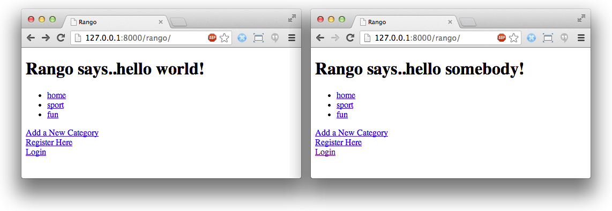

.. _login-label:

Autenticação de Usuário
=======================
O objetivo desta próxima parte do tutorial, é deixar você familiarizado com os mecanismos de autenticação de usuário fornecido pelo Django. Estaremos usando a aplicação ``auth`` fornecida como parte da instalação padrão do Django no pacote ``django.contrib.auth``. De acordo com a `documentação oficial do Django sobre Autenticação <https://docs.djangoproject.com/en/1.7/topics/auth/>`_, essa aplicação consiste dos seguintes aspectos:

- *Users*.
- *Permissions*: uma série de sinalizadores binários (como sim/não, yes/no) determinando o que o usuário pode ou não fazer.
- *Groups*: um método de aplicar permissões para mais de um usuário.
- Um *sistema de hash de senha*: uma necessidade para garantir a segurança dos dados.
- *Ferramentas de forms e views para logar usuários*, ou restringir conteúdo.

Existem muitas coisas que Django pode fazer pra você na área de autenticação de usuário. Estaremos cobrindo o básico para você poder iniciar. Isso vai ajudar você a ter confiança com as ferramentas disponíveis e seu conceitos.

Configurando Autenticação
-------------------------
Antes que você possa iniciar a brincar com o que a Autenticação do Django tem a oferecer, você precisar se certificar que as configurações relevantes estão presentes no arquivo ``settings.py`` do seu projeto Rango.

Dentro do ``settings.py`` procure pela tupla ``INSTALLED_APPS`` e cheque se ``django.contrib.auth`` e ``django.contrib.contenttypes`` estão listados, de modo que a tupla se pareça com o código abaixo:

.. code-block:: python
	
	INSTALLED_APPS = (
	    'django.contrib.admin',
	    'django.contrib.auth',
	    'django.contrib.contenttypes', 
	    'django.contrib.sessions',
	    'django.contrib.messages',
	    'django.contrib.staticfiles',
	    'rango',
	)

Embora ``django.contrib.auth`` forneça ao Django acesso ao sistema de autenticação, ``django.contrib.contenttypes`` é usado pela aplicação de autenticação pra rastrear modelos instalados no seu banco de dados.

.. note:: Lembre-se, se você adicinou a aplicação ``auth`` na sua tupla ``INSTALLED_APPS``, você vai precisar atualizar seu banco de dados com o comando ``$ python manage.py migrate``.

Senhas são armazenadas por padrão no Django usando o `algoritmo PBKDF2 <http://en.wikipedia.org/wiki/PBKDF2>`_, fornecendo um bom nível de segurança pra os dados dos seus usuários. Você pode ler mais sobre isso na `documentação oficial do Django sobre como ele armazena senhas <https://docs.djangoproject.com/en/1.7/topics/auth/passwords/#how-django-stores-passwords>`_. A documentação também fornece uma explicação de como usar diferentes hashes de senha se você quer um nível maior de segurança.

Se você quer mais controle sobre como o hash é aplicado as senhas, então no arquivo ``settings.py`` adicione a tupla ``PASSWORD_HASHERS``:

.. code-block:: python

	PASSWORD_HASHERS = (
	    'django.contrib.auth.hashers.PBKDF2PasswordHasher',
	    'django.contrib.auth.hashers.PBKDF2SHA1PasswordHasher',
	)

Django usará o primeiro hasher do ``PASSWORD_HASHERS``, isto é, settings.PASSWORD_HASHERS[0]. Se você quiser usar um hasher mais seguro, você pode instalar Bcrypt (acesse https://pypi.python.org/pypi/bcrypt/) usando ``pip install bcrypt``, e então configurando o ``PASSWORD_HASHERS`` para:

.. code-block:: python

	PASSWORD_HASHERS = (
	    'django.contrib.auth.hashers.BCryptSHA256PasswordHasher',
	    'django.contrib.auth.hashers.BCryptPasswordHasher',
	    'django.contrib.auth.hashers.PBKDF2PasswordHasher',
	    'django.contrib.auth.hashers.PBKDF2SHA1PasswordHasher',
	)

No entanto, para ter tudo isso funcionando você não precisa especificar explicitamente o ``PASSWORD_HASHERS``, onde nesse caso o Django usa por padrão ``django.contrib.auth.hashers.PBKDF2PasswordHasher``.

O Model ``User``
----------------
O núcleo do sistema de autenticação do Django é o objeto ``User``, localizado em ``django.contrib.auth.models.User``. Um objeto ``User`` representa cada uma das pessoas que interagem com uma aplicação do Django. A `documentação do Django sobre objetos User <https://docs.djangoproject.com/en/1.7/topics/auth/default/#user-objects>`_ afirma que eles são usados para permitir aspectos do sistema de autenticação, como restrição de acesso, registro de novos perfis de usuários, e a associação de criadores com o conteúdo do site.

O model ``User`` vem completo, com 5 atributos primários. São eles:

- O username para a conta do usuário;
- a senha do usuário;
- o endereço de email;
- o primeiro nome; e
- o sobrenome do usuário.

O model também vem com outros atributos, tais como o ``is_active`` (que determina se uma conta em particular está ativa ou não). Cheque a `documentação oficial do Django sobre o model User <https://docs.djangoproject.com/en/1.7/ref/contrib/auth/#django.contrib.auth.models.User>`_ para uma lista completa de atributos fornecidos por padrão pelo model ``User``.

Atributos Adicionais do Usuário
-------------------------------
Se você quiser incluir outros atributos a mais do que é fornecido pelo model ``User``, então você vai precisar criar um model que seja associado ao model ``User``. Para nossa aplicação Rango, nós queremos incluir 2 atributos adicionais para cada conta de usuário. Especificamente, queremos incluir:

- um ``URLField``, permitindo um usuário do Rango especificar seu próprio web site; e
- um ``ImageField``, que permita usuários especificarem uma imagem para seu perfil.

Isso pode ser conseguido ao criar um model adicional ao nosso arquivo ``models.py`` do Rango. Vamos adicionar um novo model chamado ``UserProfile``:

.. code-block:: python
	
	class UserProfile(models.Model):
	    # Esta linha é necessária. Linkar UserProfile a uma instância do model User
	    user = models.OneToOneField(User)
	    
	    # Os atributos adicionais que queremos incluir
	    website = models.URLField(blank=True)
	    picture = models.ImageField(upload_to='profile_images', blank=True)
	    
	    # Sobrescrever o método __unicode__() para retornar algo que faça sentido
	    def __unicode__(self):
	        return self.user.username

Note que nós referenciamos o model ``User`` usando o relacionamento de um-para-um. Desde que nós referenciamos o model padrão ``User``, nós precisamos importar ele dentro do arquivo ``models.py``:

.. code-block:: python
	
	from django.contrib.auth.models import User
	
Pode ser tentador adicionar esses fields adicionais por herdar do model ``User`` diretamente. No entanto, uma vez que outras aplicações podem também querer acessar o model ``User``, então não é recomendado usar herança, mas em vez disso usar um relacionamento um-para-um.

Para o Rango, nós adicionamos dois fields para completar nosso perfil de usuário, e sobrescrevermos o método ``__unicode__()`` para retornar um valor que faça sentido quando uma reprensentação da instância do model ``UserProfile`` for requisitada.

Para os dois fields ``website`` e ``picture``, nós configuramos ``blank=True`` para ambos. Isso permite que cada um dos fields possa estar em branco se necessário, o que significa que usuário não tem que fornecer valores para esses atributos se eles não quiserem.

Note que o field ``ImageField`` tem um atributo ``upload_to``. O valor deste atributo é conjunto com o caminho da configuração ``MEDIA_ROOT`` do projeto para fornecer um caminho com o qual as imagens de perfis enviadas serão armazenadas. Por exemplo, um ``MEDIA_ROOT`` de ``<workspace>/tango_with_django_project/media/`` e o atributo ``upload_to`` de ``profile_images``, resultará em todas as imagens de perfis sendo armazendas no diretório ``<workspace>/tango_with_django_project/media/profile_images/``.

.. warning:: O field ``ImageField`` do Django faz uso do *Python Imaging Library (PIL)*. Volte ao Capítulo :ref:`requirements-label`, nós discutimos sobre instalar PIL junto com o Django na sua configuração. Se você não tem PIL instalado ainda, você vai precisar instalá-lo agora. Se não, você vai ser surpreendido com exceções indicando que o módulo ``pil`` não pode ser encontrado.

.. note:: 
	Como acabamos de adicionar um novo model, não se esqueça de realizar o processo de migração das mudanças para o banco de dados, executando os comandos ``python manage.py makemigrations rango`` e depois ``python manage.py migrate``.

Com nosso model ``UserProfile`` definido, nós agora vamos editar o arquivo ``admin.py`` do Rango, para incluir o novo model ``UserProfile`` na interface web admistrativa do Django. No arquivo ``admin.py``, adicione a seguinte linha:

.. code-block:: python

	from rango.models import UserProfile
	
	admin.site.register(UserProfile)

.. note:: Lembre-se que seu banco de dados deve ser atualizado com a criação de um novo model. Rode ``$ python manage.py makemigrations rango`` no seu terminar para criar o script de migração para o novo model ``UserProfile``. Então rode ``$ python manage.py migrate``.

Criando uma View e Template de *Registro de Usuário*
----------------------------------------------------
Com nossa infra-estrutura de autenticação definida, podemos agora começar a construí-lo, fornecendo aos usuários da nossa aplicação a oportunidade de criar novas contas de usuários. Faremos isso através da criação de uma nova combinação de view e template.

.. note:: É importante notar que existem muitos pacotes disponíveis de registro de usuário prontos para uso, que reduzem um monte de problemas de construir seu próprio registro e login em forms. No entanto, é bom que você tenha experiência sobre o que está acontecendo por trás, antes de usar essas aplicações. Vai também reforçar seu entendimento de trabalhar com forms, como extender o model User, e como fazer upload de arquivos.

Para prover a funcionalidade de registro, nós iremos seguir os seguintes passos:

#. Crie um ``UserForm`` e ``UserProfileForm``.
#. Adicione uma view para manipular a criação de um novo usuário.
#. Crie um template que mostre o ``UserForm`` e ``UserProfileForm``.
#. Mapeie a URL para a view criada.
#. Link a página principal para a página de registro.

.. _login-formclasses-label:

Criando o ``UserForm`` e ``UserProfileForm``
............................................
No ``rango/forms.py``, agora precisamos criar duas classes herdando de ``forms.ModelForm``. Vamos estar criando uma para a classe base ``User``, bem como a outra para o novo model ``UserProfile`` que nós acabamos de criar. As duas classes herdando de ``ModelForm`` nos permitem mostrar um form HTML com os fields necessários para um model particular, tirando de nós uma quantidade significativa de trabalho. Muito bom!

No ``rango/forms.py``, vamos criar nossas duas classes que herdam de ``forms.ModelForm``. Adicione o seguinte código no módulo:

.. code-block:: python
	
	class UserForm(forms.ModelForm):
	    password = forms.CharField(widget=forms.PasswordInput())
	    
	    class Meta:
	        model = User
	        fields = ('username', 'email', 'password')

	class UserProfileForm(forms.ModelForm):
	    class Meta:
	        model = UserProfile
	        fields = ('website', 'picture')

Você notará que dentro de ambas classes, nós adicionamos uma classe ``Meta`` `aninhada <http://www.brpreiss.com/books/opus7/html/page598.html>`_. Como o `nome de classe aninhada já sugere <http://www.webopedia.com/TERM/M/meta.html>`_, qualquer coisa dentro de uma classe aninha ``Meta`` descreve propriedades adicionais sobre a classe ``ModelForm`` particular a que pertence. Cada classe ``Meta`` deve, no mínimo, oferecer um field ``model``, que faz referência ao model herdando a classe ``ModelForm`` que deve relacionar. Nossa classe ``UserForm`` é portanto associada com o model ``User``, por exemplo. A partir do Django 1.7, você também precisa especificar ``fields`` ou ``exclude`` para indicar quais fields associados com o model devem ser apresentados no form.

Aqui queremos apenas mostrar os fields: ``username``, ``email`` e ``password``, associados com o model ``User``, e o ``website`` e ``picture`` associados com o model ``UserProfile``. Por causa do field ``user`` dentro de ``UserProfile`` nós precisaremos fazer essa associação quando registrarmos o usuário.

Você também vai notar que ``UserForm`` inclui uma definição do atributo ``password``. Embora um instância de model ``User`` contenha um atributo ``password`` por padrão, o form HTML renderizado não esconderá a senha. Se um usuário digitar a senha, ela será visível. Ao atualizar o atributo ``password``, nós podemos então especificar que a instância ``CharField`` deve esconder a entrada do usuário, através do uso do widget ``PasswordInput()``.

Por fim, lembre-se de incluir as classes necessários no topo do módulo ``forms.py``.

.. code-block:: python
	
	
	from django import forms
	from django.contrib.auth.models import User
	from rango.models import Category, Page, UserProfile

Criando a view ``register()``
.............................
Como próximo passo, precisamos lidar tanto com a renderização do form, quanto com o processamento dos dados recebidos pelo form. Dentro do arquivo ``views.py``, adicione a seguinte função:

.. code-block:: python
	
	from rango.forms import UserForm, UserProfileForm
	
	def register(request):
	    
	    # Um valor boolean para falar ao template se o registro foi salvo com sucesso.
	    # Setado como False inicialmente. Se der tudo certo, mudamos para True.
	    registered = False
	    
	    # Se é um HTTP POST, nós vamos processar os dados do form.
	    if request.method == 'POST':
	        # Tente pegar as informações diretamente do form.
	        # Note que nós usamos ambos UserForm e UserProfileForm.
	        user_form = UserForm(data=request.POST)
	        profile_form = UserProfileForm(data=request.POST)
	        
	        # Se os dois forms são válidos...
	        if user_form.is_valid() and profile_form.is_valid():
	            # Salve os dados do form do usuário no banco de dados.
	            user = user_form.save()
	            
	            # Agora nós aplicamos o hash na senha com o método set_password.
	            # Uma vez o hash aplicado, nós podemos atualizar o objeto user.
	            user.set_password(user.password)
	            user.save()
	            
	            # Agora vamos resolver a instância UserProfile
	            # Desde que nós quem precisamos setar os atributos do usuário, setamos commit=False.
	            # Isso atrasa que o model seja salvo no banco, até que esteja realmente pronto.
	            # Isso evita problemas de integridade.
	            profile = profile_form.save(commit=False)
	            profile.user = user
	            
	            # O usuário forneceu uma imagem de perfil?
	            # Se sim, precisamos pegá-la do form e colocá-la no model UserProfile.
	            if 'picture' in request.FILES:
	                profile.picture = request.FILES['picture']
	            
	            # Agora nós salvamos a instância do model UserProfile.
	            profile.save()
	            
	            # Atualizamos nossa variável para falar ao template que tudo deu certo.
	            registered = True
	        
	        # Form inválido ou erros?
	        # Dê um print neles no terminal.
	        # Eles também vão ser mostrados ao usuário.
	        else:
	            print user_form.errors, profile_form.errors
	    
	    # Não é um HTTP POST, então vamos renderizar nosso form usando duas instâncias de ModelForm.
	    # Esses forms estarão em branco, prontos para as entradas do usuário.
	    else:
	        user_form = UserForm()
	        profile_form = UserProfileForm()
	    
	    # Renderize o template dependendo do contexto.
	    return render(request,
	            'rango/register.html',
	            {'user_form': user_form, 'profile_form': profile_form, 'registered': registered} )

Esta view está mais complexa? Pode parecer, a primeira vista, mas na verdade não é. A única complexidade adicionada desde nossa view anterior, ``add_category()``, é a necessidade de manipular duas instâncias distintas de ``ModelForm`` - uma para o model ``User``, e outra para o model ``UserProfile``. Também precisamos manipular uma imagem de perfil do usuário, se ele ou ela escolheu enviar uma.

Também estabelecemos um link entre as duas instâncias de model que criamos. Depois de criar uma nova instância de model ``User``, nós referenciamos ela na instância ``UserProfile`` com a linha ``profile.user = user``. Ali é onde nós populamos o atributo ``user`` do form ``UserProfileForm``, que nós escondemos dos usuários na seção :ref:`login-formclasses-label`.

Criando o Template *registro*
.............................
Agora crie um novo arquivo de template, ``rango/register.html``, e adicione o seguinte código:

.. code-block:: html
	
	<!DOCTYPE html>
	<html>
	    <head>
	        <title>Rango</title>
	    </head>

	    <body>
	        <h1>Registre-se no Rango</h1>

	        
	            Rango diz: <strong>obrigado por se registrar!</strong>
	            <a href="/rango/">Retorne para homepage.</a> 
	        
	            Rango diz: <strong>registre-se aqui!</strong> 

	        <form id="user_form" method="post" action="/rango/register/" enctype="multipart/form-data">

	            
	            
	            <!-- Mostra cada form. O método as_p envolve cada elemento em um parágrafo
	                 (
). Isso garante que cada elemento apareça em uma nova linha,
	                 fazendo tudo parecer mais bonito. -->
	            {{ user_form.as_p }}
	            {{ profile_form.as_p }}
	            
	            <!-- Forneça um botão para clicar e enviar o form. -->
	            <input type="submit" name="submit" value="Register" />
	        </form>
	        
	    </body>
	</html>

Este template HTML faz uso da variável ``registered`` que nós criamos na nossa view para indicar se um registro ocorreu com sucesso, ou não. Note que ``registered`` deve ser ``False`` num primeiro momento, para o template mostrar o form de cadastro - por outro lado, além do título, apenas uma mensagem de sucesso é mostrada.

.. warning::
	Você deve estar ciente do atributo ``enctype`` do elemento ``<form>``. Quando você quer que usuários enviem arquivos a partir do form, é uma necessidade absoluta definir ``enctype`` para ``multipart/form-data``. Esta combinação de atributo e valor instruem seu browser para enviar dados do form em uma maneira especial de volta aos servidores. Para mais informações, confira `esta ótima resposta no Stack Overflow <http://stackoverflow.com/a/4526286>`_. Você deve também lembrar de incluir o token CSRF. Certifique-se que incluiu ```` dentro do seu elemento ``<form>``.

O Mapeamento de URL da View ``register()``
..........................................
Agora podemos adicionar um mapeamento de URL para nossa nova view. Em ``rango/urls.py``, modifique a tupla ``urlpatterns`` como mostrado abaixo:

.. code-block:: python
	
	urlpatterns = patterns('',
	    url(r'^$', views.index, name='index'),
	    url(r'^about/$', views.about, name='about'),
	    url(r'^category/(?P<category_name_slug>\w+)$', views.category, name='category'),
	    url(r'^add_category/$', views.add_category, name='add_category'),
	    url(r'^category/(?P<category_name_slug>\w+)/add_page/$', views.add_page, name='add_page'),
	    url(r'^register/$', views.register, name='register'), # Adicione este novo padrão!
	)

O novo padrão adicionado direciona a URL ``/rango/register/`` para a view ``register()``.

Criando Link
............
Por fim, podemos adicionar um link apontando para essa URL no nosso template ``index.html``. Logo abaixo do link para a página de adicionar categoria, adicione o seguinte link:

.. code-block:: html
	
	<a href="/rango/register/">Registre-se aqui</a>

Demonstração
............
Fácil! Agora você terá um novo link com o texto ``Registre-se aqui`` que levará você para a página de cadastro. Teste ela agora! Inicie seu servidor de desenvolvimento, e tente registrar uma nova conta de usuário. Envie uma imagem de perfil se você quiser. Seu form de registro deve ser parecer como esse ilustrado na Figura :num:`fig-rango-register-form`.

.. _fig-rango-register-form:

.. figure:: ../images/rango-register-form.png
	:figclass: align-center

	Um screenshot ilustrando o form de cadastro básico que você criou, como parte deste tutorial.

Ao ver a mensagem indicando que suas informações foram salvas com sucesso, o banco de dados deve ter duas novas entradas em suas tabelas, correspondendo aos models ``User`` e ``UserProfile``.

Adicionando Funcionalidade de Login
-----------------------------------
Com a habilidade de registrar contas completada, agora precisamos adicionar a funcionalidade de login. Para conseguir isso, precisaremos realizar o seguinte fluxo de trabalho:

* Crie um login na view para manipular as credenciais do usuário
* Crie um template de login para mostrar o form de login
* Mapeie a view para uma URL
* Forneça um link para login a partir da página inicial

Criando a View ``login()``
..........................
Em ``rango/views.py``, crie uma nova função chamada ``user_login()`` e adicione o seguinte código:

.. code-block:: python
	
	def user_login(request):
	    
	    # Se a requisição é um HTTP POST, tente pegar a informação relevante. 
	    if request.method == 'POST':
	        # Pegue o username e senha fornecidos pelo usuário.
	        # Essa informação é obtida a partir do form de login.
	        username = request.POST['username']
	        password = request.POST['password']
	        
	        # Use os mecanismos do Django para ver se a combinação username/senha
	        # está válida - um objeto User é retornado se estiver.
	        user = authenticate(username=username, password=password)
	        
	        # Se nós temos um objeto user, os detalhes estão corretos.
	        # Se None (maneira do Python representar a ausência de valor), nenhum usuário
	        # com as credenciais fornecidas foi encontrado.
	        if user:
	            # A conta está ativa? Ela poderia ter sido desativada.
	            if user.is_active:
	                # Se a conta é válida e ativa, nós podemos logar o usuário.
	                # Nós enviaremos o usuário de volta para a página inicial.
	                login(request, user)
	                return HttpResponseRedirect('/rango/')
	            else:
	                # Uma conta inativa foi usada - não logue-a!
	                return HttpResponse("Sua conta do Rango está desativada.")
	        else:
	            # Login inválido foi fornecido. Assim, nós não podemos logar o usuário.
	            print "Detalhes inválidos de login: {0}, {1}".format(username, password)
	            return HttpResponse("Detalhes inválidos de login fornecidos.")
	    
	    # O request não é um HTTP POST, então mostre o form de login.
	    # Este cenário seria mais provável ser um HTTP GET.
	    else:
	        # Sem variáveis de contexto para passar ao sistema de template
	        # Daí temos o dicionário em branco...
	        return render(request, 'rango/login.html', {})

Essa view pode parecer um pouco complicada, pois ela tem que lidar com uma variedade de situações. Assim como nos exemplo anteriores, a view ``user_login()`` manipula o form e processa.

Primeiro, se a view é acessada através do método HTTP GET, então o form de login é mostrado. No entanto, se o form foi enviado através de um HTTP POST, então podemos manipular o processamento do form.

Se um form válido é enviado, o username e senha são extraídos do form. Esses detalhes são então usados para tentar autenticar o usuário (com a função ``authenticate()`` do Django). ``authenticate()`` então retorna um objeto ``User`` se a combinação username/senha existe no banco de dados - ou retorna ``None`` se não bater com nenhum.

Se recuperamos um objeto ``User``, podemos então checar se a conta está ativa ou inativa - e retornamos a resposta apropriada para o browser do cliente. 

No entanto, se um form inválido é enviado, por causa que o usuário não adicionou um username e senha, o form de login é apresentado de volta ao usuário com as mensagens de erro (por exemplo, "está faltando username/senha serem fornecidos").

De particular interesse no código do exemplo acima, temos o uso das funções padrões do Django para ajudar com o processo de autenticação. Note o uso da função ``authenticate()`` para checar se o username e senha fornecidos batem com uma conta de usuário válida, e a função ``login()`` para indicar para o Django que o usuário deve ser logado/conectado.

Você também notará que nós fazemos uso de uma nova classe, a ``HttpResponseRedirect``. Como o nome pode sugerir, a resposta gerada por uma instância da classe  ``HttpResponseRedirect`` fala ao navegador do cliente redirecionar para a URL que você fornece como argumento. Veja que isso retornará um código de status HTTP 302, que indica um redicionamento, diferente de um código de status 200, isto é, OK. Veja a `documentação oficial do Django sobre redirecionamento <https://docs.djangoproject.com/en/1.7/ref/request-response/#django.http.HttpResponseRedirect>`_ para aprender mais.

Todas essas funções e classes são fornecidas pelo Django, e como tal você vai precisar importá-las, então adicione os seguintes imports ao ``rango/views.py``:

.. code-block:: python
	
	from django.contrib.auth import authenticate, login
	from django.http import HttpResponseRedirect, HttpResponse

Criando um Template *Login*
...........................
Com nossa nova view criada, vamos precisar criar um novo template, permitindo assim que usuários possam fazer login. Embora saibamos que o template vai ficar no diretório ``templates/rango/``, vamos deixar você escolher o nome do arquivo. Analise o código de exemplo acima para decidir o nome. No seu novo arquivo de template, adicione o seguinte código:

.. code-block:: html
	
	<!DOCTYPE html>
	<html>
	    <head>
	        <!-- Alguém está cansado de repetir esse header de novo e de novo?? -->
	        <title>Rango</title>
	    </head>

	    <body>
	        <h1>Login to Rango</h1>

	        <form id="login_form" method="post" action="/rango/login/">
	            
	            Username: <input type="text" name="username" value="" size="50" />
	             
	            Password: <input type="password" name="password" value="" size="50" />
	             

	            <input type="submit" value="submit" />
	        </form>

	    </body>
	</html>

Certifique-se que você combinou os atributos ``name`` do input com aqueles que você especificou na view ``user_login()`` - isto é, ``username`` para username, e ``password`` para senha. E não esqueça também do ````.

Mapeando a View Login para uma URL
..................................
Com seu template de login criado, podemos agora combinar a view ``user_login()`` a uma URL. Modifique o arquivo ``urls.py`` do Rango, de modo que sua tupla ``urlpatterns`` pareça com o código abaixo:

.. code-block:: python
	
	urlpatterns = patterns('',
	    url(r'^$', views.index, name='index'),
	    url(r'^about/$', views.about, name='about'),
	    url(r'^category/(?P<category_name_slug>\w+)$', views.category, name='category'),
	    url(r'^add_category/$', views.add_category, name='add_category'),
	    url(r'^category/(?P<category_name_slug>\w+)/add_page/$', views.add_page, name='add_page'),
	    url(r'^register/$', views.register, name='register'),
	    url(r'^login/$', views.user_login, name='login'),
	    )

Juntando tudo
.............
Nosso último passo é fornecer aos usuários do Rango um link fácil para acessar a página de login. Para fazer isso, vamos editar o template ``index.html`` que está dentro do diretório ``templates/rango/``. Encontre o local onde você adicionou o link para cadastro e adição de categoria, e adicione o link para login logo abaixo.

.. code-block:: python
	
	<a href="/rango/login/">Login</a>

Se você quiser, você pode também modificar o header da página inicial para prover uma mensagem personalizada se um usuário está logado, e uma mensagem mais genérica se não estiver. Ainda dentro do template ``index.html``, encontre o header como mostrado abaixo:

.. code-block:: python
	
	<h1>Rango diz..hello world!</h1>

Substitua esse header com o seguinte código. Note que fazemos uso do objeto ``user``, que está disponível no sistema do template do Django através do contexto. Podemos falar com este objeto para saber se o usuário está logado (autenticado). Se ele ou ela estiver, nós podemos então obter alguns detalhes sobre ele ou ela.

.. code-block:: python
	
	
	    <h1>Rango diz... hello {{ user.username }}!</h1>
	
	    <h1>Rango diz... hello world!</h1>
	

Como você pode ver, nós usamos a Linguagem de Template do Django para checar se o usuário está autenticado com ````. A variável de contexto que nós passamos passamos ao template incluirá uma variável user se o usuário estiver logado - assim podemos checar se ele está autenticado ou não. Se estiver, ele receberá uma mensagem personalizada no header, isto é, ``Rango diz... hello leifos!``. Por outro lado, a mensagem normal ``Rango diz... hello world!`` será mostrada.

Demonstração
............
Confira a Figura :num:`fig-rango-login-message` para ver screenshots de como tudo vai parecer.

.. _fig-rango-login-message:

	Screenshots ilustrando o header que usuários recebem quando não estão logados, e quando está com o username ``somebody``.

Com esta parte completada, login de usuário agora está completo! Para testar tudo, inicie o servidor de desenvolvimento do Django e tente registrar uma nova conta. Depois de cadastrar com sucesso, você deve então ser capaz de logar com as informações que você acabou de fornecer.

Restringindo Acesso
-------------------
Agora que usuários podem logar no Rango, podemos agora começar a restringir acesso a partes particulares da aplicação, assim como está nas especificações do projeto, isto é, que apenas usuários registrados possam adicionar categorias e páginas. Com Django, existem duas maneiras nas quais você pode fazer isso:

* diretamente, ao examinar o objeto ``request`` e checar se o usuário está ou não autenticado, ou,
* usando um *decorator* que checa se o usuário está autenticado.

A abordagem direta checa se o usuário está logado, através do método ``user.is_authenticated()``. O objeto ``user`` está disponível através do objeto ``request`` passado a uma view. O seguinte exemplo demonstra essa abordagem:

.. code-block:: python
	
	def some_view(request):
	    if not request.user.is_authenticated():
	        return HttpResponse("You are logged in.")
	    else:
	        return HttpResponse("You are not logged in.")

A segunda abordagem usa `Python decorators <http://wiki.python.org/moin/PythonDecorators>`_. `Decorators <http://indacode.com/funcoes-python-ii-decorators/>`_ tem o nome de um `design pattern de software de mesmo nome <http://en.wikipedia.org/wiki/Decorator_pattern>`_. Eles podem alterar dinamicamente a funcionalidade de uma função, método ou classe sem ter que editar diretamente o código fonte.

Django fornece um decorator chamado ``login_required()``, que podemos anexar em qualquer view onde for preciso que o usuário esteja logado. Se um usuário não está logado e tenta acessar uma página que chama essa view, então ele é redirecionado para outra página que você pode definir, que normalmente é a página de login.

Restringindo Acesso com um Decorator
....................................
Para tentar isso, crie uma view no Rango, chamada ``restricted()`` e adicione o seguinte código:

.. code-block:: python
	
	@login_required
	def restricted(request):
	    return HttpResponse("Desde que você esteja logado, você poderá ver esse texto!")

Note que para usar um decorator, você o coloca *diretamente acima* da assinatura da função, e coloca uma ``@`` antes do nome do decorator. Python executará o decorator antes de executar o código da sua função/método. Para usar o decorator você terá que importá-lo, assim também adicione o seguinte import:

.. code-block:: python
	
	from django.contrib.auth.decorators import login_required

Vamos também adicionar outro padrão a tupla ``urlpatterns`` no ``urls.py`` do Rango. Nossa tupla deve estar mais ou menos parecida com o código de exemplo abaixo. Note a inclusão do mapeamento da view ``views.restricted`` - esse é o mapeamento que você precisa adicionar agora.

.. code-block:: python
	
	urlpatterns = patterns('',
	    url(r'^$', views.index, name='index'),
	    url(r'^add_category/$', views.add_category, name='add_category'),
	    url(r'^register/$', views.register, name='register'),
	    url(r'^login/$', views.user_login, name='login'),
	    url(r'^(?P<category_name_slug>\w+)', views.category, name='category'),
	    url(r'^restricted/', views.restricted, name='restricted'),
	    )

Também precisaremos manipular o cenário onde um usuário tenta acessar a view ``restricted()``, mas não está logado. O que nós faremos com o usuário? A abordagem mais simples é redirecionar seu navegador. Django nos permite especificar isso no nosso arquivo ``settings.py``, localizado no diretório de configuração do projeto. No ``settings.py``, defina a variável ``LOGIN_URL`` com a URL que você gostaria de redirecionar usuário que não está logados, ou seja, a página de login em ``/rango/login/``:

.. code-block:: python
	
	LOGIN_URL = '/rango/login/'

Isso garante que o decorator ``login_required()`` redirecionará qualquer usuário não logado para a URL ``/rango/login/``. 

Fazendo Logout
--------------
Seria legal fornecer a opção dos usuários saírem de suas contas, ou seja, deslogar. Django traz uma função muito útil chamada ``logout()`` que cuida de assegurar que o usuário está deslogado, que sua sessão foi finalizada, e que se ele posteriormente tentar acessar uma view, seu acesso será negado.

Para prover a funcionalidade de logout em ``rango/views.py``, adicione uma view chamada ``user_logout()`` com o seguinte código:

.. code-block:: python
	
	from django.contrib.auth import logout
	
	# Use o decorator login_required() para garantir que apenas aqueles logados possam acessa a view.
	@login_required
	def user_logout(request):
	    # Desde que sabemos que o usuário está logado, agora podemos apenas deslogá-lo.
	    logout(request)
	    
	    # Leve o usuário de volta a página inicial.
	    return HttpResponseRedirect('/rango/')

Com a view criada, mapeie a URL ``/rango/logout/`` para a view ``user_logout()``:

.. code-block:: python
	
	urlpatterns = patterns('',
	    url(r'^$', views.index, name='index'),
	    url(r'^about/$', views.about, name='about'),
	    url(r'^category/(?P<category_name_slug>\w+)$', views.category, name='category'),
	    url(r'^add_category/$', views.add_category, name='add_category'),
	    url(r'^category/(?P<category_name_slug>\w+)/add_page/$', views.add_page, name='add_page'),
	    url(r'^register/$', views.register, name='register'),
	    url(r'^login/$', views.user_login, name='login'),
	    url(r'^restricted/$', views.restricted, name='restricted'),
	    url(r'^logout/$', views.user_logout, name='logout'),
	    )

Agora que todos os mecanismos para deslogar um usuário foram completados, seria útil fornecer um link a partir da página principal para permitir o usuário simplesmente clicar para deslogar. No entanto, vamos ser espertos quanto a isso: há alguma lógica em fornecer um link de logout para um usuário que não está logado? Talvez não - deve ser melhor mostrar o link de cadastro para aquele usuário não logado.

Como em seções anteriores, vamos modificar o template ``index.html`` do Rango, e fazer uso do objeto ``user`` no contexto do template para determinar quais links queremos mostrar. Encontre sua lista de links na parte debaixo da página, e substitua com o seguite código HTML e template do Django. Note que também adicionamos um link para nossa página restrita em ``/rango/restricted/``.

.. code-block:: html
	
	
	    <a href="/rango/restricted/">Página restrita</a> 
	    <a href="/rango/logout/">Logout</a> 
	
	    <a href="/rango/register/">Registre-se aqui</a> 
	    <a href="/rango/login/">Login</a> 
	
	
	<a href="/rango/about/">About</a> 
	<a href="/rango/add_category/">Adicione uma nova Categoria</a> 

Simples - quando um usuário está autenticado e logado, ele ou ela pode ver os links ``Página Restrita`` e ``Logout``. Caso não esteja logado, ``Registre-se aqui`` e ``Login`` são mostrados. Como ``About`` e ``Adicione uma nova Categoria`` não estão dentro dos blocos condicionais, esses links estão disponíveis para ambos usuários, autenticados e anônimos.

Exercícios
----------
Esse capítulo cobriu aspectos muito importantes de gerenciamento de autenticação de usuário dentro do Django. Nós cobrimos o básico da instalação da aplicação ``django.contrib.auth`` do Django dentro do nosso projeto. Adicionalmente, também mostramos como implementar um model de perfil de usuário que possa fornecer fields adicionais ao model base ``django.contrib.auth.models.User``. Também detalhamos como configurar a funcionalidade de permitir que usuários se cadastrem, façam login e logout, e controle de acesso a determinadas partes da aplicação. Para mais informações sobre autenticação e cadastro de usuário, consulte a `documentação oficial do Django sobre Autenticação <https://docs.djangoproject.com/en/1.7/topics/auth/>`_.

* Customize a aplicação de modo que apenas usuários cadastrados possam adicionar/editar, enquanto usuários não cadastrados possam apenas ver/usar as páginas de categorias/páginas. Você também terá que se certificar que links para adicionar/editar páginas apareçam apenas para usuários logados.
* Forneça mensagens informativas de erros quando usuários entrarem incorretamente com seus username/senha.

Na maioria das aplicações em que você vai precisar de diferentes níveis de segurança quando cadastrar e gerenciar usuários - por exemplo, ter a certeza que o usuário entrou com um email que ele tem acesso, ou o envio a senha de usuários que se esqueceram. Embora nós possamos extender a abordagem atual e construir toda a infra-estrutura necessária para suportar essas funcionalidades, uma aplicação chamada ``django-registration-redux`` foi desenvolvida para simplificar esse processo - visite https://django-registration-redux.readthedocs.org para descobrir mais sobre como usar esse pacote. Templates podem ser encontrados em: https://github.com/macdhuibh/django-registration-templates.
