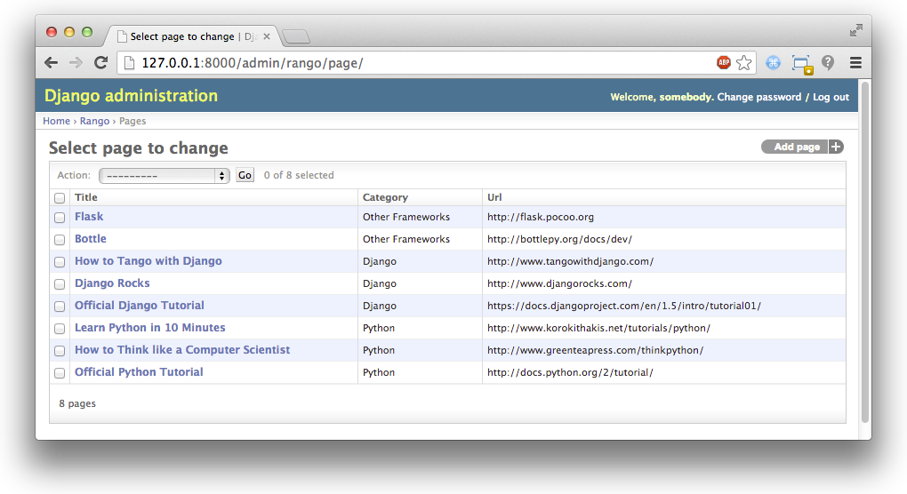

.. _model-label:

Modelos e Banco de Dados
========================
Trabalhar com banco de dados, geralmente requer que você suje suas mãos com SQL. Em Django, muito desse aborrecimento é tomado de você pelas funções de *mapeamento objeto relacional (ORM)* do Django, e como Django encapsula tabelas de banco de dados através de modelos (models). Essencialmente, um model é um objeto Python que descreve sua tabela/model de dado. Em vez de trabalhar diretamente com tabelas de banco de dados via SQL, tudo que você tem que fazer é manipular o objeto Python correspondente. Neste capítulo, vamos explicar passo a passo como configurar um banco de dados e os models e os models necessários para o Rango.

Requisitos do Rango
-------------------
Primeiro, vamos aos requisitos de dados para o Rango. A seguinte lista fornece os detalhes chave desses requisitos.

* Rango é essencialmente um *diretório de página web* - um site contendo links para outros sites.
* Existem uma série de diferentes *categorias de páginas web*, e cada categoria abriga uma série de links. Nós assumimos no Capítulo :ref:`overview-label` que esta é uma relação um-para-muitos (one-to-many). Veha o Diagrama Entidade-Relacionamento abaixo.
* Uma categoria tem um nome, número de visitas, e número de likes.
* Uma página refere-se para uma categoria, tem um título, URL e um número de views.

.. figure:: ../images/rango-erd.svg
	:scale: 100%
	:figclass: align-center

	O Diagrama Entidade-Relacionamento das duas entidades principais do Rango.

Falando ao Django sobre seu Banco de Dados
------------------------------------------
Antes de podermos criar qualquer model, a configuração do banco de dados precisar ser feita. No Django 1.7, quando você cria um projeto, Django automaticamente popula o dicionário chamado ``DATABASES``, que está localizado no seu ``settings.py``. Ele irá conter algo como:

.. code-block:: python
	
	DATABASES = {
	    'default': {
	        'ENGINE': 'django.db.backends.sqlite3',
	        'NAME': os.path.join(BASE_DIR, 'db.sqlite3'),
	    }
	}

Como você pode ver, a engine padrão para o backend do banco de dados será o SQLite3. Isto nos proporciona o acesso ao leve banco de dados Python, `SQLite <http://www.sqlite.org/>`_, que é ótimo para propósitos de desenvolvimento. O único outro valor que precisamos definir é o par chave/valor ``NAME``, que temos que definir ao ``DATABASE_PATH``. Para outras engines de bancos de dados, outras chaves como ``USER``, ``PASSWORD``, ``HOST`` e ``PORT`` podem também ser adicionados ao dicionário.

.. note:: Embora esteja tudo bem usar uma engine SQLite para este tutorial, talvez não seja a melhor opção quando você for fazer deploy da sua aplicação. Em vez disso, pode ser melhor usar uma engine de banco de dados mais robusta e escalável. Django vem com suporte nativo para muitas outras engines, tais como `PostgreSQL <http://www.postgresql.org/>`_ e `MySQL <http://www.mysql.com/>`_. Veja a `documentação oficial do Django sobre Engines de Banco de Dados <https://docs.djangoproject.com/en/1.7/ref/settings/#std:setting-DATABASE-ENGINE>`_ para mais detalhes. Você pode também checar `este excelente artigo <http://www.sqlite.org/whentouse.html>`_ no site do SQLite, que explica as situações onde você deve ou não considerar usar a leve engine SQLite.

Criando Models
--------------
Com seu banco de dados configurado no ``settings.py``, vamos criar os dois models de dados iniciais para a aplicação Rango.

No arquivo ``rango/models.py``, nós iremos definir duas classes - ambas das quais devem herdar de ``django.db.models.Model``. As duas classes Python serão as definições para os modelos representando *categorias* (categories) e *páginas* (pages). Defina os models ``Category`` e ``Page`` como segue abaixo.

.. code-block:: python
	
	class Category(models.Model):
	    name = models.CharField(max_length=128, unique=True)

	    def __unicode__(self):
	        return self.name
	
	class Page(models.Model):
	    category = models.ForeignKey(Category)
	    title = models.CharField(max_length=128)
	    url = models.URLField()
	    views = models.IntegerField(default=0)
	    
	    def __unicode__(self):
	        return self.title

Quando você define um model, você precisa especificar a lista de atributos e seus tipos associados junto com qualquer parâmetro opcional. Django fornece uma série de fields (campos) nativos. Alguns dos mais comumente usados são os listados abaixo:

* ``CharField``, um field para armazenar dados de caracteres (por exemplo, strings). Especifique ``max_length`` para fornecer um número máximo de caracteres que o field pode armazenar.
* ``URLField``, muito parecido com ``CharField``, mas projetado para armazenar URLs. Você pode também especificar um parâmetro ``max_length``.
* ``IntegerField``, armazena inteiros.
* ``DateField``, armazena um ``datetime.date`` Python.

Confira a `documentação do Django sobre fields de models <https://docs.djangoproject.com/en/1.7/ref/models/fields/>`_ para uma listagem completa.

Para cada field, você pode especificar o atributo ``unique``. Se definido ``True``, apenas uma instância de um valor particular neste field pode existir em todo o model no banco de dados. Por exemplo, dê uma olhada no nosso model ``Category`` definido acima. O field ``name`` foi setado para ser único (unique) - assim, cada nome de categoria deve ser único.

Isso é útil se você deseja usar um field particular como uma chave adicional de banco de dados. Você pode também especificar atributos adicionais para cada field, tais como especificar um valor default (``default='value'``), e se o valor para um field pode ser ``NULL`` (``null=True``) ou não.

Django também fornece um mecanismo simples que nos permite relacionar models/tabelas de banco de dados juntos. Esses mecanismos são encapsulados em mais três tipos de fields, e estão listados abaixo:

* ``ForeignKey``, um tipo de field que nos permite criar um relacionamento um-para-muitos (one-to-many).
* ``OneToOneField``, um tipo de field que nos permite define um relacionamento estrito um-para-um (one-to-one);
* ``ManyToManyField``, um tipo de field que nos permite definir um relacionamento muitos-para-muitos (many-to-many).

A partir de nossos exemplos do model acima, o field ``category`` no model ``Page`` é do tipo ``ForeignKey``. Isto nos permite criar um relacionamento um-para-muitos com o model/tabela ``Category``, que é especificado como um argumento para o construtor do field. *Você deve estar ciente que Django cria um field ID automaticamente para você em cada tabela relativa a um model. Você, portanto, não precisa explicitamente definir uma chave primária para cada model - isto já foi feito pra você!*

.. note:: Ao criar um model Django, é uma boa prática assegurar que você incluiu o método ``__unicode__()`` - um método quase idêntico ao método ``__str__()``. Se você não está familiarizado com ambos deles, pense neles como métodos análogos ao método ``toString()`` em uma classe Java. O método ``__unicode__()`` é portanto usado para fornecer uma representação unicode da instância de um model. Nosso model ``Category`` por exemplo, retorna o nome da categoria no método ``__unicode__()`` - algo que será incrivelmente útil para você quando você começar a usar a interface admin do Django, mais tarde neste capítulo.

	Incluindo um método ``__unicode__()`` nas suas classes é também útil quando for debugar seu código. Emitir um ``print`` em uma instância de model ``Category`` *sem* um método ``__unicode__()``, retornará ``<Category: Category object>``. Nós sabemos que é uma categoria, mas *qual delas?* Incluindo ``__unicode()__`` poderia então retornar ``<Category: python>``, onde ``python`` é o ``name`` de uma dada categoria. Muito melhor!

Criando e Migrando o Banco de dados
-----------------------------------
Com nossos models definidos, nós podemos agora deixar o Django realizar sua mágica e criar a representação da tabela em nosso banco de dados. Em versões anteriores do Django, isso seria executando usando o comando:

``$ python manage.py syncdb``

No entanto, Django 1.7 fornece uma ferramenta de migração para configurar e atualizar o banco de dados para refletir mudanças nos models. Desse modo, o processo se tornou um pouco mais complicado - mas a ideia é que se você faz mudanças aos models, você será capaz de atualizar o banco de dados sem ter que deletá-lo.

Configurar o Banco de dados e Criar o Super Usuário
...................................................
Se você tiver feito isso, você primeiro precisar iniciar o banco de dados. Isso é feito via o comando migrate.

.. code-block:: bash

	$ python manage.py migrate

	Operations to perform:
	  Apply all migrations: admin, contenttypes, auth, sessions
	Running migrations:
	  Applying contenttypes.0001_initial... OK
	  Applying auth.0001_initial... OK
	  Applying admin.0001_initial... OK
	  Applying sessions.0001_initial... OK
	  
Se você lembrar, em ``settings.py`` havia uma lista de INSTALLED_APPS, essa chamada inicial para migrar cria as tabelas para as apps associadas, isto é, auth, admin, e etc. Deve haver um arquivo chamado ``db.sqlite`` no diretório do seu projeto.
 
Agora você vai querer criar um super usuário para gerenciar o banco de dados. Rode o seguinte comando:

.. code-block:: bash

	$ python manage.py createsuperuser

A conta de super usuário será usada para acessar a interface admin do Django, mais tarde neste tutorial. Entre com um nome de usuário para a conta, endereço de email e forneça uma senha quando solicitado. Uma vez completada, o script deve finalizar com sucesso. Assegure que você tomou nota do nome de usuário e senha para a sua conta de super usuário.

Criar / Atualizar Models/Tabelas
................................
Sempre que você fizer mudança aos models, você então precisa registrar as mudanças, através do comando ``makemigrations`` para aquela app em particular. Então, para a aplicação *rango*, nós precisamos executar:

.. code-block:: bash
	
	$ python manage.py makemigrations rango
	
	Migrations for 'rango':
	  0001_initial.py:
	    - Create model Category
	    - Create model Page

Se você inspecionar a pasta ``rango/migrations``, você verá que um script python foi criado, chamado ``0001_initial.py``. Para ver o SQL que será executado para realizar essa migração, você pode executar o comando ``python manage.py sqlmigrate <app_name> <migration_no>``. O número de migração é mostrado acima como 0001, assim nós devemos executar o comando ``python manage.py sqlmigrate rango 0001`` para *rango* ver o SQL. Tente fazer isso.

Agora, para aplicar essas migrações (que irão essencialmente criar as tabelas do banco de dados), então você precisa executar:

.. code-block:: bash
	
	$ python manage.py migrate

	Operations to perform:
	  Apply all migrations: admin, rango, contenttypes, auth, sessions
	Running migrations:
	  Applying rango.0001_initial... OK

.. warning:: Sempre que você adicionar aos models existentes, *você terá que repetir este processo em execução*, ``python manage.py makemigrations <app_name>``, e então ``python manage.py migrate``

Você pode também ter notado que nosso model ``Category`` está atualmente faltando alguns fields que nós definimos nos requisitos do Rango. Nós adicionaremos esses requisitos mais tarde, para lembrar você de atualizar usando esse processo.

Models Django e o Shell do Django
---------------------------------
Antes de nós voltarmos nossa atenção para demonstrar a interface admin do Django, é importante notar que você pode interagir com os models do Django a partir do shell do Django - uma ajuda muito útil para propósitos de depuração. Nós iremos demonstrar como criar uma instância de ``Category`` usando este método.

Para acessar o shell, nós precisamos chamar o ``manage.py`` a partir do diretório raiz do seu projeto mais uma vez. Rode o seguinte comando:

``$ python manage.py shell``

Isso iniciará uma instância do interpretador Python, e carregar as configurações do seu projeto para você. Você pode então interagir com os models. A seguinte sessão de terminal demonstra essa funcionalidade. Confira o comentário na linha para ver o que cada comando faz.

.. code-block:: python
	
	# Importa o model Category da aplicação Rango
	>>> from rango.models import Category
	
	# Mostra todos as categorias atuais
	>>> print Category.objects.all()
	[] # Retorna uma lista vazia (nenhuma categoria foi definida!)
	
	# Cria um novo objeto categoria, e salva-o no banco de dados.
	>>> c = Category(name="Test")
	>>> c.save()
	
	# Agora mais uma vez lista todos os objetos categoria armazenados.
	>>> print Category.objects.all()
	[<Category: test>] # Nós agora temos uma categoria chamada 'test' salva no banco de dados!
	
	# Saia do shell do Django.
	>>> quit()

No exemplo, nós primeiro importamos o model que nós queremos manipular. Nós então mostramos todos as categorias existentes, das quais não existe nenhuma, porque nossa tabela está vazia. Então nós criamos e salvamos uma categoria, depois mostrados todas as categorias novamente. Este segundo ``print`` deve então mostrar a categoria adicionada.

.. note:: O exemplo que nós fornecemos acima é apenas um aperitivo muito básico sobre atividades relacionada a banco de dados que você pode executar no shell do Django. Se você não tiver feito isso, é uma boa hora de completa a parte um do `Tutorial Oficial do Django para aprender mais sobre interações com models <https://docs.djangoproject.com/en/1.7/intro/tutorial01/>`_. Também confira `a documentação oficial do Django sobre a lista dos comandos disponíveis <https://docs.djangoproject.com/en/1.7/ref/django-admin/#available-commands>`_ para trabalhar com models.

.. _admin-section:

Configurando a Interface Admin
------------------------------
Um dos recursos do Django que se destacam, é que ele fornece uma interface web administrativa nativa que nos permite navegar e editar dados armazenados dentro de nossos models e tabelas de bancos de dados correspondentes. No arquivo ``settings.py``, você irá notar que uma das apps pré-instaladas é o ``django.contrib.admin``, e no seu ``urls.py`` do seu projeto existe um padrão de URL (urlpattern) que corresponde com ``admin/``.

Inicie o servidor de desenvolvimento:

.. code-block:: bash

	$ python manage.py runserver

E visite a url ``http://127.0.0.1:8000/admin/``. Você deve ser capaz de logar na interface de Admin do Django usando o nome de usuário e senha criados para o super usuário. A interface admin apenas contém tabelas relevantes para a administração de sites, ``Groups`` e ``Users``. Então nós iremos precisar instruir ao Django para também incluir os models do ``rango``.
	
Para fazer isso, abra o arquivo ``rango/admin.py`` e adicione o seguinte código:

.. code-block:: python
	
	from django.contrib import admin
	from rango.models import Category, Page

	admin.site.register(Category)
	admin.site.register(Page)

Isso irá registrar os models com a interface admin. Se tivéssemos de ter um outro model, seria um caso trivial de chamar a função ``admin.site.register()``, passando o model como um parâmetro.

Com todas essas mudanças feitas, visite novamente/atualize ``http://127.0.0.1:8000/admin/``. Você agora deve ser capaz de ver os models Page e Category, como na Figura :num:`fig-rango-admin`. 

.. _fig-rango-admin:

.. figure:: ../images/ch5-rango-admin-models.png
	:figclass: align-center

	A interface admin do Django. Note a categoria do Rango, e os dois models contidos dentro.

Tente clicar no link ``Categorys`` dentro da seção ``Rango``. A partir daqui, você deve ver a categoria ``test`` que nós criamos através do shell do Django. Tente deletar a categoria, já que estaremos populando o banco de dados com um script mais pra frente. A interface é fácil de usar. Gaste alguns minutos criando, modificando e deletando categorias e páginas. Você pode também adicionar novos usuários que podem logar na interface de administração do Django para o seu projeto, ao adicionar um usuário no ``User`` na aplicação ``Auth``.

.. note:: Note o erro de digitação na interface admin (categorys, e não categories). Esse problema pode ser resolvido ao adicionar uma classe aninhada dentro da definição do seu model, com o atributo ``verbose_name_plural``. Confira `a documentação oficial sobre models <https://docs.djangoproject.com/en/1.7/topics/db/models/#meta-options>`_ para mais informações.

.. note:: O exemplo do arquivo ``admin.py`` para nossa aplicação Rango é o exemplo mais simples e funcional disponível. Existem muitos recursos diferentes que você pode usar no ``admin.py`` para executar todo tipo de customizações legais, tais como mudar a maneira que os models aparecem na interface admin. Para este tutorial, vamos ficar com a interface de administração básica, mas você pode checar a `documentação oficial do Django sobre interface de administração <https://docs.djangoproject.com/en/1.7/ref/contrib/admin/>`_ para mais informações, se você estiver interessado.

.. _model-population-script-label:

Criando um Script de Povoamento
-------------------------------
É altamente provável que durante o curso de desenvolvimento, você irá chegar a um ponto onde você precisará modificar um model Django. Ao fazer isso, a opção mais fácil - sem usar software externo - é recriar todo seu banco de dados e rodar ``python manage.py syncdb`` ...novamente! Desde que esta tarefa lenta e repetitiva pode ser como uma dor, é uma boa prática criar o que nós chamamos de *script de povoamento* para o seu banco de dados. Esse script é projetado para povoar automaticamente seu banco de dados com dados de teste para você, que pode potencialmente poupar muito tempo seu.

Para criar um script de povoamento para o banco de dados do Rango, iniciamos ao criar um novo módulo Python dentro da raiz do diretório do nosso projeto Django (por exemplo, ``<workspace>/tango_with_django_project/``). Crie o arquivo ``populate_rango.py`` e adicione o seguinte código:

.. code-block:: python
	
	import os
	os.environ.setdefault('DJANGO_SETTINGS_MODULE', 'tango_with_django_project.settings')

	import django
	django.setup()

	from rango.models import Category, Page
	
	
	def populate():
	    python_cat = add_cat('Python')
	
	    add_page(cat=python_cat,
	        title="Official Python Tutorial",
	        url="http://docs.python.org/2/tutorial/")
	
	    add_page(cat=python_cat,
	        title="How to Think like a Computer Scientist",
	        url="http://www.greenteapress.com/thinkpython/")
	
	    add_page(cat=python_cat,
	        title="Learn Python in 10 Minutes",
	        url="http://www.korokithakis.net/tutorials/python/")
	
	    django_cat = add_cat("Django")
	
	    add_page(cat=django_cat,
	        title="Official Django Tutorial",
	        url="https://docs.djangoproject.com/en/1.5/intro/tutorial01/")
	
	    add_page(cat=django_cat,
	        title="Django Rocks",
	        url="http://www.djangorocks.com/")
	    
	    add_page(cat=django_cat,
	        title="How to Tango with Django",
	        url="http://www.tangowithdjango.com/")
	
	    frame_cat = add_cat("Other Frameworks")
	
	    add_page(cat=frame_cat,
	        title="Bottle",
	        url="http://bottlepy.org/docs/dev/")
	
	    add_page(cat=frame_cat,
	        title="Flask",
	        url="http://flask.pocoo.org")
	
	    # Print out what we have added to the user.
	    for c in Category.objects.all():
	        for p in Page.objects.filter(category=c):
	            print "- {0} - {1}".format(str(c), str(p))
	
	def add_page(cat, title, url, views=0):
	    p = Page.objects.get_or_create(category=cat, title=title, url=url, views=views)[0]
	    return p
	
	def add_cat(name):
	    c = Category.objects.get_or_create(name=name)[0]
	    return c
	
	# Start execution here!
	if __name__ == '__main__':
	    print "Starting Rango population script..."
	    populate()

Embora isso pareça um monte de código, o que ele faz é relativamente simples. Como nós definimos uma série de funções no topo do arquivo, a execução do código começa no final - veja a linha ``if __name__ == '__main__'``. Nós chamamos a função ``populate()``.

.. warning:: Quando importar models Django, certifique-se de ter importado as configurações do projeto,importando Django e definindo a variável de ambiente ``DJANGO_SETTINGS_MODULE`` para ser o arquivo de configuração do projeto. Então você pode chamar ``django.setup()`` para importar as configurações do Django. Se você não fizer isso, uma exceção será levantada. É por isso que nós importamos ``Category`` e ``Page`` depois das configurações estarem carregadas.

A função ``populate()`` é responsável por chamar as funções ``add_cat()`` e ``add_page()``, que são as responsáveis pela criação de novas categorias e páginas, respectivamente. ``populate()`` se mantém atualizado sobre as referências de categorias para nós, enquanto cria cada instância de model ``Page`` individual e armazena-os dentro do nosso banco de dados. Finalmente, nós iteramos nossos models ``Category`` e ``Page`` para imprimir para o usuário todas as instâncias de ``Page`` e suas respectivas categorias.

.. note:: Nós fazemos uso da conveniência do método ``get_or_create()`` para criar instâncias de model. Como nós não queremos criar duplicatas da mesma entrada, nós podemos usar ``get_or_create()`` para checar para nós se a entrada já existe no banco de dados. Se ele não existe, o método cria. Isso pode remover um monte de código repetitivo para nós - ao invés de fazermos essa checagem trabalhosa, nós podemos fazer uso de código que faz exatamente isso para nós. Como mencionamos anteriormente, porque reinventar a roda se ela já existe?
	
	O método ``get_or_create()`` retorna uma tupla de ``(object, created)``. O primeiro elemento, ``object``, é uma referência para a instância de model que o método ``get_or_create()`` cria se a entrada não for encontrada no banco de dados. A entrada é criada usando os parâmetros que você passou ao método - assim como ``category``, ``title``, ``url`` e ``views`` no exemplo acima. Se a entrada já existe no banco de dados, o método simplesmente retorna a instância do model correspondente a entrada. ``created`` é um valor booleano; ``true`` é retornado se ``get_or_create()`` tiver que criar uma instância de model.
	
	O ``[0]`` no fim da nossa chamada ao método recupera a parte ``object`` da tupla retornada de ``get_or_create()``. Assim como a maioria das outras estruturas de dados de linguagens de programação, tuplas Python usam `numeração com base zero <http://en.wikipedia.org/wiki/Zero-based_numbering>`_.
	
	Você pode conferir a `documentação oficial do Django <https://docs.djangoproject.com/en/1.7/ref/models/querysets/#get-or-create>`_ para mais informações sobre útil método ``get_or_create()``.

Quando salvo, você pode rodar o script mudando o diretório de trabalho no terminal para a raiz do nosso projeto Django, e executar o módulo com o comando ``$ python populate_rango.py``. Você deverá então ver uma saída similar a esta mostrada abaixo:

.. code-block:: bash
	
	$ python populate_rango.py
	
	Starting Rango population script...
	- Python - Official Python Tutorial
	- Python - How to Think like a Computer Scientist
	- Python - Learn Python in 10 Minutes
	- Django - Official Django Tutorial
	- Django - Django Rocks
	- Django - How to Tango with Django
	- Other Frameworks - Bottle
	- Other Frameworks - Flask

Agora vamos verificar se o script povoou o banco de dados. Reinicie o servidor de desenvolvimento do Django, navegue até a interface de administração, e confira se você tem algumas novas categorias e páginas. Você vê todas as páginas se você clica em ``Pages``, como na Figura :num:`fig-admin-populated`?

.. _fig-admin-populated:

.. figure:: ../images/ch5-rango-admin.png
	:figclass: align-center

	A interface de administração do Django, mostrando a tabela Pages povoada com os dados de exemplo do nosso script de povoament.

Um script de povoamento leva um pouco de tempo para escrever, mas quando você está trabalhando com um time, você será capaz de compartilhar esse script, de modo que qualquer um possa criar o banco de dados e tê-lo povoado. Além disso, virá a calhar bem para unit testing.

Fluxo de Trabalho Básico
------------------------
Agora que nós cobrimos os princípios fundamentais de lidar com a funcionalidade de models do Django, agora é uma boa hora para resumir o processo envolvido em configurar tudo. Dividimos as tarefas principais em seções separadas para você.

Configurando seu Banco de Dados
...............................
Com um novo projeto Django, você deve primeiro falar ao Django sobre o banco de dados que você pretende usar (isto é, configure o ``DATABASES`` no settings.py). Você pode também registrar qualquer models no arquivo ``admin.py`` para torná-los acessíveis através da interface de administração.

Adicionando um Model
....................
O fluxo para adicionar models pode ser quebrado em 5 passos, mostrados abaixo:
#. Primeiro, crie seu novo model no arquivo ``models.py`` na sua aplicação Django.
#. Atualize o ``admin.py`` para incluir e registrar seu novo model.
#. Então execute a migração ``$ python manage.py sqlmigrate <app_name>``
#. Aplique as mudanças com ``$ python manage.py migrate``. Isso criará a insfraestrutura necessária dentro do banco de dados para seu novo model.
#. Crie/Edite seu script de povoamento para seu novo model.

Invariavelmente, haverão horas que você terá que deletar seu banco de dados. Neste caso, você terá que rodar o comando ``migrate``, e então o comando ``createsuperuser``, seguido pelo comando ``sqlmigrate`` para cada app, e então você pode povoar o banco de dados.

Exercícios
----------
Agora que você completou o capítulo, tente fazer esses exercícios para reforçar e praticar o que você aprendeu.

* Atualize o model Category para incluir os atributos adicionais: ``views`` e ``likes`` onde o valor padrão é zero.
* Faça o migração para seu app/model, e então migre seu banco de dados.
* Atualize seu script de povoamento de modo que a categoria Python tenha 128 views e 64 likes, a categoria Django tenha 64 views e 32 likes, e a categoria Other Frameworks tenha 32 views e 16 likes.
* Realizar a `parte 2 do tutorial oficial do Django <https://docs.djangoproject.com/en/1.7/intro/tutorial02/>`_ se você ainda não tiver feito. Isso ajudará a reforçar ainda mais o que você aprendeu aqui, e aprender mais sobre customização da interface de administração.
* Customize a Interface de Administração - de modo que quando você visualizar o model Page, ele mostre em uma lista a categoria, o nome da página e a URL.

Dicas
.....
Se você precisar de alguma ajuda ou inspiração para realizar esses exercícios, essas dicas serão de grande ajudar para você.

* Modifique o model ``Category`` ao adicionar nos fields ``view`` e ``likes`` como ``IntegerField``.
* Modifique a função ``add_cat`` no script ``populate.py``, para levar as ``views`` e ``likes``. Uma vez que você tenha a Categoria c, então você pode atualizar o número de views com ``c.views``, e similarmente com likes.
* Para customizar a interface de administração, você precisará editar ``rango/admin.py`` e criar uma classe ``PageAdmin`` que herda de ``admin.ModelAdmin``.
* Dentro da sua classe ``PageAdmin``, adicione ``list_display = ('title', 'category', 'url')``.
* Finalmente, registre a classe ``PageAdmin`` na interface de administração do Django. Você deve modificar a linha ``admin.site.register(Page)``. Mude-a para ``admin.site.register(Page, PageAdmin)`` no arquivo ``admin.py`` do Rango.

.. _fig-admin-customised:

	
	A visualização da página da interface de administração atualizada, completa com colunas para categoria e URL.
