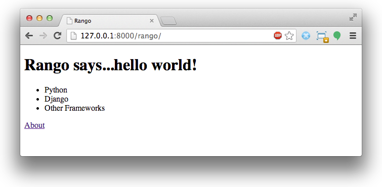

.. _model-using-label:

Models, Templates e Views
=========================
Agora que nós temos os models configurados e populados com alguns dados, nós vamos começar a juntar as coisas. Estaremos descobrindo como acessar dados dos models dentro das views, e como apresentar esse dado através de templates.

Fluxo de Trabalho Básico: Páginas Orientada a Dados
---------------------------------------------------
Exitem 5 passos principais que você deve realizar para criar uma página web orientada a dados no Django.

#. Primeiro, importe os models que você deseja usar dentro do arquivo ``views.py`` da sua aplicação.
#. Dentro da view que você deseja usar, consulte o model para obter o dado que você quer apresentar.
#. Passe o resultado do seu model para dentro do contexto do template.
#. Configure seu template para apresentar os dados para o usuário da maneira que você deseja.
#. Mapeie a URL para sua view, se já não tiver feito isso.

Esses passos destacam como o framework Django separa as responsabilidade entre models, views e templates.

Mostrando as Categorias na Página Inicial do Rango
--------------------------------------------------
Um dos requisitos no que diz respeito a página principal, era mostrar o top five das categorias do rango.

Importando os Models Necessários
................................
Para completar esse requisito, nós vamos percorrer através de cada um dos passos citados acima. Primeiro, abra ``rango/views.py`` e importe o model ``Category`` do arquivo ``models.py`` do Rango.

.. code-block:: python
	
	# Importe o model Category
	from rango.models import Category

Modificando a View Index
........................
Com o primeiro passo feito, agora nós temos que modificar nossa função ``index()``. Se jogarmos nossas mentes no passado, nós devemos lembrar que a função ``index()`` é responsável pela view da página principal. Modifique a função para que pareça como a do exemplo abaixo:

.. code-block:: python
	
	def index(request):
		# Consulte o banco de dados por uma lista de TODAS as categorias armazenadas.
		# Ordene as categorias pelo número de likes em ordem decrescente.
		# Recupere apenas o top 5 - ou todas se for menos do que 5.
		# Coloque a lista em nosso dicionário de contexto context_dict que será passado para a engine de template.
		categories = Category.objects.order_by('-likes')[:5]
		context_dict = {'categories': categories}
	    
		# Renderize a resposta e envie-a de volta!
		return render(request, 'rango/index.html', context_dict)

Aqui nós executamos os passos dois e três de uma vez. Primeiro, nós consultamos o model ``Category`` para recuperar as categorias do top five. Aqui nós usamos o método ``order_by()`` para ordenar pelo número de likes em ordem decrescente - daí a inclusão do ``-``. Nós eñtão restringimos esta lista para os 5 primeiros objetos ``Category`` na lista.

Com a consulta completa, nós passamos a referência da lista (armazenada na variável ``categories``) para o dicionário ``context_dict``. Este dicionário é então passado como parte do contexto para a engine de template na chamada do ``render()``.

.. warning:: Note que o model Category contém o campo ``likes``. Então, para que isso funcione você precisa ter completado os exercícios no capítulo anterior, isto é, o model Category precisa ser atualizado para incluir o campo ``likes``.

Modificando o Template Index
............................
Com a view atualizada, tudo que resta pra nós fazermos é atualizar o template ``rango/index.html``, localizado dentro do diretório ``template`` do seu projeto. Mude o código HTML do arquivo, de modo que ele pareça com o exemplo demonstrado abaixo:

.. code-block:: html
	
	<!DOCTYPE html>
	<html>
	    <head>
	        <title>Rango</title>
	    </head>
	
	    <body>
	        <h1>Rango says...hello world!</h1>
	
	        
	            <ul>
	                
	                <li>{{ category.name }}</li>
	                
	            </ul>
	        
	            <strong>There are no categories present.</strong>
	        
	        
	        <a href="/rango/about/">About</a>
	    </body>
	</html>

Aqui, nós usamos a linguagem e template do Django para apresentar o dado, usando as declarações de controle ``if`` e ``for``. Dentro do ``<body>`` da página, nós testamos se ``categories`` - o nome da variável de contexto contendo nossa lista - realmente contém alguma categoria (isto é, ````).

Se sim, nós prosseguimos construindo uma lista HTML não ordenada (dentro da tag ``<ul>``). O loop for (````) então itera em todos os elementos resultantes da lista, mostrando o nome de cada categoria (``{{ category.name }}``) dentro de um par da tag ``<li>`` para indicar um elemento de lista.

Se não existir nenhuma categoria, uma mensagem é mostrada no lugar, indicando este resultado.

Como o exemplo mostrado na linguagem de template do Django, todos os comandos são colocados dentro das tags ````, enquanto variáveis são referenciadas dentro de chaves ``{{`` and ``}}``.

Se você visitar agora a página inicial do Rango no link http://127.0.0.1:8000/rango/, você deve ver uma lista de três categorias, embaixo do título da página, assim como na Figura :num:`fig-rango-categories-simple`.

.. _fig-rango-categories-simple:

	A página inicial do Rango - agora dinamicamente gerada - mostrando uma lista de categorias. Muito bacana!

Criando uma Página Detalhes
---------------------------
De acordo com as especificações do Rango, nós também precisamos mostrar uma lista de páginas que estão associadas com cada categoria.
Aqui, nós temos uma série de desafios para superar. Uma nova view precisa ser criada, que deverá ser parametrizada. Nós também precisamos criar um padrão de URL e strings de URL que codificam os nomes das categorias.

Design de URL e Mapeamento
..........................
Vamos começar pelo problema da URL. Uma maneira que nós poderíamos lidar com esse problema, é usar o ID único para cada categoria dentro da URL. Por exemplo, nós poderíamos criar URLs como ``/rango/category/1/`` ou ``/rango/category/2/``, onde os números correspondem as categorias com IDs únicos 1 e 2, respectivamente. No entanto, essas URLs não são facilmente entendidas por nós, humanos. Embora nós, programadores, provavelmente poderíamos inferir que o número relaciona a uma categoria, como é que um usuário sabe qual categoria se relaciona com os IDs únicos 1 e 2? O usuário não saberia sem antes acessar.

Em vez disso, nós poderíamos apenas usar o nome da categoria como parte da URL. ``/rango/category/Python/`` deve nos dar uma lista das páginas relacionadas a categoria Python. Esta é uma simples, legível e significativa URL. Se nós prosseguirmos com essa abordagem, nós teremos que lidar com categorias que tem múltiplas palavras, como 'Other Frameworks', e etc.

.. note:: Projetar URLs claras é um aspecto importando de web design. Veja `o artigo na Wikipedia sobre URLs claras e limpas <http://en.wikipedia.org/wiki/Clean_URL>`_ para mais detalhes.

Para lidar com esse problema, nós faremos uso da função slugify fornecida pelo Django, baseado nas respostas neste link: http://stackoverflow.com/questions/837828/how-do-i-create-a-slug-in-django

Atualizar a Tabela Category com Campo Slug
..........................................
Para fazer urls limpas, nós vamos incluir um field slug no model ``Category``. Primeiro nós precisamos importar a função ``slugify`` do Django, que substituirá espaços em brancos com hífens, ou seja, "how do i create a slug in django" se torna "how-do-i-create-a-slug-in-django".

.. warning:: Embora você possa usar espaços em URLs, é considerado não ser seguro usá-los. Confira `IETF Memo em URLs <http://www.ietf.org/rfc/rfc1738.txt>`_ para saber mais.

Então nós precisamos sobrescrever o método ``save`` do model ``Category``, que chamará o método ``slugify`` que atualiza o field ``slug``. Note que toda vez que o nome da categoria muda, o slug também mudará. Atualize seu model como demonstrado abaixo, e adicione o import:

.. code-block:: python
	
	from django.template.defaultfilters import slugify

	class Category(models.Model):
		name = models.CharField(max_length=128, unique=True)
		views = models.IntegerField(default=0)
		likes = models.IntegerField(default=0)
		slug = models.SlugField(unique=True)
		
		def save(self, *args, **kwargs):
			self.slug = slugify(self.name)
			super(Category, self).save(*args, **kwargs)

		def __unicode__(self):
			return self.name

Agora que você fez essa atualização do model, você precisará executar a migração.

.. code-block:: bash

	$ python manage.py makemigrations rango
	$ python manage.py migrate
	
Desde que nós não fornecemos um valor padrão para o slug, e nós já temos dados existentes no model, então o comando migrate vai dar pra você duas opções. Selecione a opção para fornecer um valor padrão, e insira ''. Não se preocupe, isso vai ser atualizado brevemente. Agora rode novamente seu script de povoamento. Uma vez que o método ``save`` é chamado para cada categoria, o método ``save`` que sobrescrevemos será executado, atualizando o field slug. Rode o servidor, e inpecione os dados nos models através da interface de administração.

Na interface de administração você pode querer que o field slug seja povoado automaticamente conforme você digita o nome da categoria. Para fazer isso, você deve atualizar ``rango/admin.py`` com o seguinte código:

.. code-block:: python

	
	from django.contrib import admin
	from rango.models import Category, Page

	# Adicione essa classe para customizar a interface de administração
	class CategoryAdmin(admin.ModelAdmin):
	    prepopulated_fields = {'slug':('name',)}

	# Atualize o registro para incluir essa interface customizada
	admin.site.register(Category, CategoryAdmin)

Verifique a interface administrativa e adicione uma nova categoria. Muito bacana, hein! Agora que nós adicionamos um field slug, nós podemos usá-los como URLs limpas :-) 

Fluxo de Trabalho da Página de Categoria
........................................
Com o nosso design de URLs escolhido, vamos continuar. Vamos realizar os seguintes passos:

#. Importe o model Page no ``rango/views.py``.
#. Crie uma nova view em ``rango/views.py`` - chamada ``category`` - A view ``category`` receberá um parâmetro adicional, ``category_name_slug`` que vai armazenar o nome da categoria codificado.
	* Nós vamos precisar da ajuda de algumas funções para codificar e decodificar o ``category_name_slug``.
#. Crie um novo template, ``templates/rango/category.html``.
#. Atualize o ``urlpatterns`` do Rango para mapear a nova view ``category`` para um padrão de URL em ``rango/urls.py``.

Nós iremos também precisar atualizar a view ``index()`` e o template ``index.html`` para fornecerem links para a página de visualização de categorias.

View Category
.............
No arquivo ``rango/views.py``, primeiro nós precisamos importar o model ``Page``. Isso significa que nós devemos adicionar a seguinte declaração de import no topo do arquivo:

.. code-block:: python
	
	from rango.models import Page

Depois disso, nós podemos adicionar nossa nova view, ``category()``.

.. code-block:: python
	
	def category(request, category_name_slug):

		# Crie um dicionário de contexto para que possamos passar para engine de renderização de template.
		context_dict = {}
		try:
			# Podemos encontrar um slug do nome da categoria com o nome dado
			# Se não encontrarmos, o método .get() lança uma exceção DoesNotExist
			# Assim, o método .get() retorna uma instância de model ou lança uma exceção.
			category = Category.objects.get(slug=category_name_slug)
			context_dict['category_name'] = category.name

			# Recupera todas as páginas associadas.
			# Note que o filter retorna >= 1 instância de model.
			pages = Page.objects.filter(category=category)

			# Adicione nossa lista de resultados na variável de contexto com o nome 'pages'.
			context_dict['pages'] = pages
			# Também adicionamos o objeto category do banco de dados para o dicionário de contexto.
			# Nós usaremos isso no template para verificar se a categoria existe.
			context_dict['category'] = category
		except Category.DoesNotExist:
			# Entramos aqui se não tiver sido encontrada a categoria especificada.
			# Não faça nada - o template mostrará a mensagem "sem categoria" para nós
			pass

		# Renderize a resposta e retorne-a para o cliente.
		return render(request, 'rango/category.html', context_dict)

Nossa nova view segue os mesmos passos básicos da nossa view ``index()``. Primeiro definimos um dicionário de contexto, então tentamos extrair os dados dos models, e adicionamos os dados relevantes ao dicionário de contexto. Determinamos qual categoria ao usar o valor ``category_name_slug`` passado como parâmetro para a view ``category()``. Se a categoria for encontrada no model Category, podemos então retirar as páginas associadas, e adicioná-las ao dicionário de contexto, ``context_dict``.

Template Category
.................
Agora vamos criar nosso template para a nova view. No diretório ``<workspace>/tango_with_django_project/templates/rango/``, crie o arquivo ``category.html``. No novo arquivo, adicione o seguinte código:

.. code-block:: html
	
	<!DOCTYPE html>
	<html>
	    <head>
	        <title>Rango</title>
	    </head>
	
	    <body>
	        <h1>{{ category_name }}</h1>
	        
	            
	            <ul>
	                
	                <li><a href="{{ page.url }}">{{ page.title }}</a></li>
	                
	            </ul>
	            
	                <strong>Atualmente não existem páginas nessa categoria.</strong>
	            
	        
	            A categoria especificada {{ category_name }} não existe!
	        
	    </body>
	</html>

O código HTML do exemplo novamente demonstra como utilizamos os dados passados para o template através de seu contexto. Fazemos uso da variável ``category_name`` e nossos objetos ``category`` e ``pages``. Se ``category`` não está definida dentro do nosso contexto, a categoria não foi encontrada no banco de dados, e uma mensagem de erro amigável é mostrada informando este fato. Se o oposto for verdadeiro, ou seja, se a categoria for encontrada, nós então procedemos para verificar por ``pages``. Se ``pages`` não está definida, ou não contém elemento, nós mostramos uma mensagem informando que não existem páginas. Por outro lado, as páginas dentro da categoria são apresentadas em uma lista HTML. Pra cada página na lista ``pages``, nós apresentamos seus atributos ``title`` and ``url``.

.. note:: A tag condicional do template do Django - ```` - é uma maneira muito bacana de determinar a existência de um objeto dentro do contexto do template. Tente ganhar o hábito de realizar essas verificações para reduzir o possibilidade de potenciais exceções que poderiam ser levantadas dentro do seu código.
	Colocar verificações condicionais dentro do seu template - como ```` do exemplo acima - também faz sentido semânticamente falando. O resultado da verificação da condição afeta diretamente a maneira na qual a página renderizada é apresentada ao usuário - e aspectos de apresentação da sua aplicação Django devem ser encapsuladas dentro de templates.

Mapeamento de URL Parametrizada
...............................
Agora vamos dar uma olhada em como nós, na verdade, passamos o valor do parâmetro ``category_name_slug`` para a função ``category()``. Para fazer isso, precisamos modificar o arquivo ``urls.py`` do Rango, e atualizar a tupla ``urlpatterns`` como é mostrado abaixo:

.. code-block:: python
	
	urlpatterns = patterns('',
	    url(r'^$', views.index, name='index'),
	    url(r'^about/$', views.about, name='about'),
	    url(r'^category/(?P<category_name_slug>[\w\-]+)/$', views.category, name='category'), # Novo!
	)

Como você pode ver, nós adicionamos em uma entrada bastante complexta, que irá chamar ``view.category()`` quando a expressão regular ``r'^(?P<category_name_slug>\w+)/$'`` for correspondida/combinada. Nós configuramos nossa expressão regular para procurar por qualquer sequência de caracteres alfanuméricos (por exemplo, a-z, A-Z, ou 0-9) e o hífen(-) antes da barra final da URL. Esse valor é então passado para a view ``views.category()`` como parâmetro ``category_name_slug``, o único argumento após o argumento obrigatório ``request``.

.. note:: Quando você quiser parametrizar URLs, é importante certificar-se que seu padrão de URL combina com o parâmetro que a view correspondente recebe. Para aprofundar um pouco mais, vamos pegar o exemplo que nós adicionamos acima. O padrão adicionado foi o seguinte:
	
	.. code-block:: python
		
		url(r'^category/(?P<category_name_slug>\w+)/$', views.category, name='category')
	
	Nós podemos a partir daqui deduzir que os caracteres (tanto alfanuméricos e underlines) entre ``category/`` e a barra ``/`` no fim da URL estão sendo passados para o método ``views.category()`` como parâmetro nomeado ``category_name_slug``. Por exemplo, a URL ``category/python-books/`` produziria um ``category_name_slug`` sendo ``python-books``.

	Como você deve lembrar, todas as funções view definidas como parte do projeto Django *deve* receber pelo menos um parâmetro. Este parâmetro é normalmente chamado ``request`` - e fornece acesso a informações relacionadas à uma dada requisição HTTP feita pelo usuário. Quando parametrizar URLs, você fornece parâmetros nomeados adicionais para a assinatura da view em questão. Usando o mesmo exemplo, a assinatura da nossa view ``category`` é alterada, de modo que ela agora pareça como mostrado a seguir:
	
	.. code-block:: python
		
		def category(request, category_name_slug):
		    # ... code here ...
	
	Não é a posição do parâmetro adicional que importa, é o *nome* que deve combinar a qualquer coisa definida dentro do padrão de URL. Note como ``category_name_slug`` definido no padrão de URL corresponde com o parâmetro ``category_name_slug`` definido para nossa view. Usando ``category_name_slug`` em nossa view dará ``python-books``, ou qualquer valor que foi fornecido como essa parte da URL.

.. note:: Expressões regulares podem parecer horríveis e confusas no início, mas existem toneladas de recursos online para ajudar você. `estas dicas <http://cheatography.com/davechild/cheat-sheets/regular-expressions/>`_ são excelentes recursos para corrigir problemas de expressões regulares.

Modificando o Template da página Inicial
........................................
Nossa nova view está configurada e pronta - mas precisamos fazer mais uma coisa. Nosso template da página index precisa ser atualizada para fornecer aos usuários um meio de visualizar as páginas da categoria que estão listadas. Podemos atualizar o template ``index.html`` para agora incluir um link para a página da categoria através do slug.

.. code-block:: html
	
	<!DOCTYPE html>
	<html>
	    <head>
	        <title>Rango</title>
	    </head>

	    <body>
	        <h1>Rango says..hello world!</h1>

	        
	            <ul>
	                
	                <!-- A próxima linha foi alterada para adicionar um hyperlink -->
	                <li><a href="/rango/category/{{ category.slug }}">{{ category.name }}</a></li>
	                
	            </ul>
	       
	            <strong>Não existem categorias.</strong>
	       

	    </body>
	</html>

Aqui nós atualizamos cada elemento de lista (``<li>``) adicionando um hyperlink HTML (``<a>``). O hyperlink tem um atributo ``href``, que usamos para especificar a URL alvo, definida por ``{{ category.slug }}``.

Demo
....
Vamos acessar a página principal do Rango e ver como ficou. Você deve ver na sua página principal uma lista de todas as categorias. As categorias devem agora ser links clicáveis. Clicando em ``Python`` deve levar você para a view de detalhes dessa categoria, como demonstrado na Figura :num:`fig-rango-links`. Se você ver uma lista de links como ``Tutorial Oficial Python``, então você configurou a nova view com sucesso. Tente navegar em uma categoria que não existe, como ``/rango/category/computers``. Você deve ver uma mensagem falando que não existem páginas nesta categoria.

.. _fig-rango-links:

.. figure:: ../images/rango-links.png
	:figclass: align-center

	Esta é uma demonstração de como sua estrutura de link deve parecer agora. Iniciando com a página inicial do Rango, e ao clicar em algum, você é apresentado à página de detalhes da categoria. Clicando no link da página, você será levado ao site.

Exercícios
----------
Reforçe o que você aprendeu neste capítulo, e tente fazer os seguintes exercícios:

* Modifique a página inicial para também incluir as 5 páginas mais visualizadas (top 5).

* Faça a `a parte três do tutorial oficial do Django <https://docs.djangoproject.com/en/1.7/intro/tutorial03/>`_ se você ainda não tiver feito, para aprofundar mais o que você aprendeu aqui.

Dicas
.....
Para ajudar com os exercícios acima, as seguintes dicas podem ser úteis pra você. Boa sorte!

* Atualize o script de povoamento para adicionar algum valor para a contagem de views de cada página.
