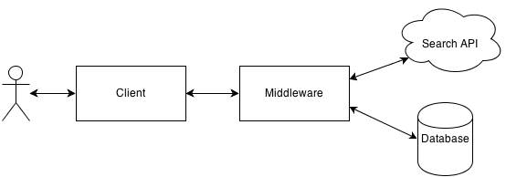
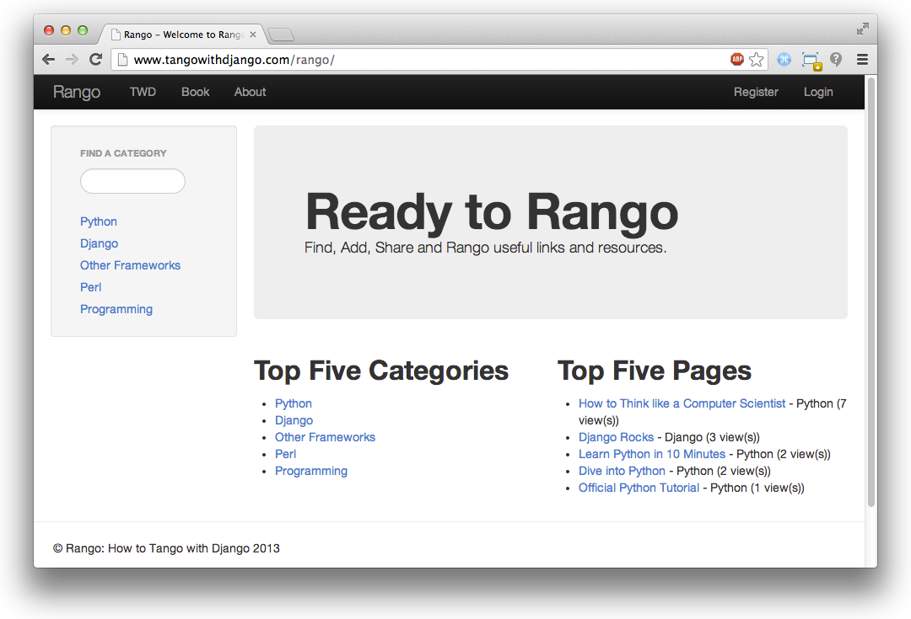
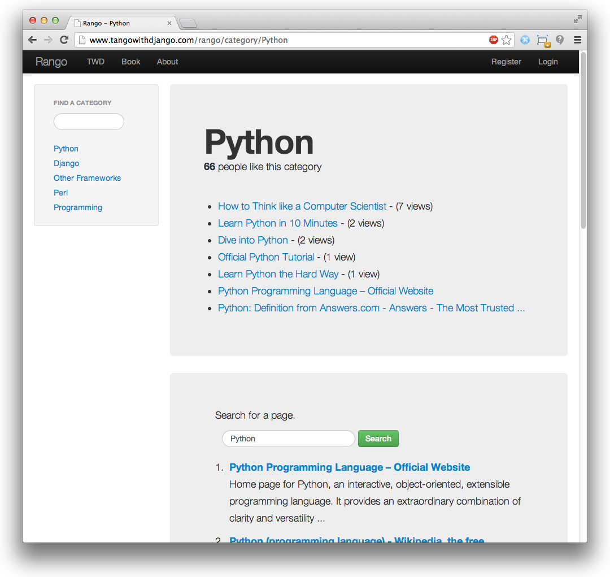

.. _overview-label:

Visão geral
===========
O objetivo deste livro é prover você com um guia prático para desenvolvimento web usando *Django 1.7.* O livro é principalmente para estudantes, fornecendo uma explicação passo a passo das etadas envolvidas no desenvolvimento da sua primeira aplicação web instalada e rodando, bem como fazer deploy dela em um servidor web.

Este livro visa complementar o `official Django Tutorials <https://docs.djangoproject.com/en/1.7/intro/tutorial01/>`_ e vários dos outros excelentes tutoriais disponíveis online. Colocando tudo junto em um só lugar, este livro preenche muitas das lacunas na documentação oficial do Django proporcionando um design orientado na abordagem de exemplos para aprender o framework Django. Além disso, este livro fornece uma introdução a vários dos aspectos para dominar o desenvolvimento de aplicações web.

Porque trabalhar com este livro?
--------------------------------
**Este livro salvará seu tempo.** Em muitas ocasiões, nós temos vistos estudantes inteligentes ficarem presos, gastando horas tentado lutar com Django e outros aspectos de desenvolvimento web. Na maioria das vezes, o problema normalmente era porque uma peça chave da informação não foi fornecida, ou algo não ficou claro. Enquanto o desvio ocasional pode definir seu regresso 10-15 minutos, as vezes eles podem levar horas para resolver. Nós tentamos remover o maior número possível desses obstáculos. Isto significa que você pode continuar com o desenvolvimento de sua aplicação, e não ter que sentar lá coçando a cabeça.

**Este livro vai diminuir a curva de aprendizado.** Frameworks para aplicações web podem salvar você de um monte de problemas e muito tempo. Bem, isso é se você sabe como usá-los em primeiro lugar! Geralmente a curva de aprendizado é íngreme. Este livro tenta fazer você ir - e ir rápido. Ao mostrar-lhe como montar uma aplicação web com todos os recursos desde o início, o livro reduz a curva de aprendizado.

**Este livro irá melhorar seu fluxo de trabalho.** Usando frameworks para aplicações web exige que você aproveite um padrão de design particular - então você só tem que preencher certos pedaços em certos lugares. Depois de trabalhar com muitos estudantes, nós ouvimos muitas reclamações sobre o uso de frameworks de aplicações web - especificamente sobre como eles tomam o controle deles (ou seja, inversão de controle). Para ajudar você, nós criamos uma série de fluxos de trabalho para focar seu processo de desenvolvimento, de modo que você pode recuperar o senso de controle e construir sua aplicação web de uma maneira disciplinada.

**Este livro não foi projetado para ser lido.** Faça o que fizer, não leia este livro! Ele é um guia prático para construir aplicações web em Django. Ler não é fazer. Para aumentar o valor que você ganha nesta experiência, vá e desenvolva a aplicação. Quando você codificar a aplicação, *não faça apenas copiar e colar o código.* Digite-o, pense sobre o que ele faz, então leia as explicações que nós fornecemos para descrever o que está acontecendo. Se você continuar não entendendo, então confira a documentação do Django, vá no `Stack Overflow <http://stackoverflow.com/questions/tagged/django>`_ ou outros sites de ajuda e preencha esta lacuna no seu conhecimento. Se você acha que vale a pena mencionar, por favor entre em contato conosco, para que possamos melhorar o livro - nós já temos uma série de contribuidores e nós teremos o maior prazer de reconhecer sua contribuição!

O que você irá aprender
-----------------------
Neste livro, nós estaremos levando uma abordagem baseada em exemplo (ou aprendizagem baseada na pesquisa). O livro mostrará pra você como projetar uma aplicação web chamada *Rango* (veja o resumo do projeto na Seção	:ref: `overview-design-brief-label` abaixo). Ao longo do caminho, nós mostraremos pra você como realizar as tarefas seguintes.

* Instalar e configurar um ambiente de desenvolvimento - incluindo como usar o terminal, o gerenciador de pacotes Pip, como trabalhar com Git e etc.
* Configurar o projeto Django para servir arquivos estáticos e outros arquivos de mídia.
* Trabalhar com o padrão *Model-View-Template* do Django.
* Crie os modelos do banco de dados e usar a funcionalidade de mapeamento objeto relacional fornecida pelo Django.
* Crie formulários que podem utilizar seu modelo de banco de dados para criar páginas web geradas dinamicamente.
* Use o serviço de Autenticação do Usuário fornecido pelo Django.
* Incorporar serviços externos na sua aplicação.
* Inclua *Folhas de Estilo (CSS)* e *JavaScript* dentro de uma aplicação web.
* Projete e aplique CSS para melhorar a aparência da aplicação web.
* Trabalhar com cookies e sessões com Django.
* Inclua funcionalidades mais avançadas como *AJAX* na sua aplicação.
* Suba sua aplicação para um servidor web usando *PythonAnywhere*.

No final de cada capítulo, nós incluímos uma série de exercícios projetados para pressionar mais e ver se você consegue aplicar o que você aprendeu. Os últimos capítulos do livro fornecem uma série de exercícios de desenvolvimento abertos, juntamente com as soluções codificadas e explicações. Finalmente, todo o código está disponível no *GitHub* em https://github.com/leifos/tango_with_django.

Para ver uma versão completa e funcional da aplicação, você pode vistar o site `How to Tango with Django <http://www.tangowithdjango.com/>`_ no link http://www.tangowithdjango.com/rango/.

Tecnologias e Serviços
----------------------
Através do curso deste livro, vamos usar várias tecnologias e serviços externos, incluindo:

* Python, http://www.python.org
* Pip, http://www.pip-installer.org
* Django, https://www.djangoproject.com
* Git, http://git-scm.com 
* GitHub, https://github.com
* HTML, http://www.w3.org/html/
* CSS, http://www.w3.org/Style/CSS/
* Javascript
* JQuery, http://jquery.com
* Twitter Bootstrap, http://getbootstrap.com/
* Bing Search API via Azure Datamarket, http://datamarket.azure.com
* PythonAnywhere, https://www.pythonanywhere.com

Nós selecionamos estas tecnologias e serviços sendo elas tão fundamentais para o desenvolvimento web, e/ou permitir-nos fornecer exemplos sobre como integrar sua aplicação web com frameworks CSS (como o *Twitter Bootstrap*), serviços externos como (os fornecidos pela *Microsoft Azure*) e subir sua aplicação de forma rápida e fácil (com PythonAnywhere).

Rango: Projeto inicial e Especificação
--------------------------------------
Como mencionado anteriormente, o foco deste livro será desenvolver uma aplicação chamada *Rango*. À medida que desenvolvemos esta aplicação, cobriremos os principais componentes que precisam ser desenvolvidos na construção de qualquer aplicação web.

.. _overview-design-brief-label:

Resumo do Projeto
.................
Seu cliente gostaria que você crie um site chamado *Rango* que permita usuários procure páginas web através das categorias definidas por ele. Em espanhol, a palavra rango é usada no significado de *"uma liga classificada por qualidade"* ou *"uma posição numa hierarquia social"* (veja https://www.vocabulary.com/dictionary/es/rango).

* Para a página principal do site, ele gostaria que os visitantes sejam capazes de ver:
	* As 5 páginas mais vistas;
	* As 5 vategorias mais rangoadas; e
	* .. note:: NT: Aqui o autor faz um jogo com o significado etimológico da palavra rango.
	* Alguma maneira para os visitantes navegar ou procurar através das categorias.
* Quando um usuário visualizasse uma *página de categoria*, eles gostariam de visualizar:
	* O nome da categoria, o número de visitantes, o número de likes;
	* Juntamente com a lista de páginas associadas naquela categoria (mostrando os títulos das páginas e links para suas url); and.
	* Alguma funcionalidade de pesquisa (via API de pesquisa do Bing) para procurar outras páginas que podem estar linkadas a esta categoria.
* Para uma categoria particular, o cliente gostaria que o nome da categoria para ser gravado, o número de vezes que cada categoria foi visitada, e quantos usuários clicaram no botão "like" (por exemplo, a página recebe um rango e sobe na hierarquia social).
* Cada categoria deve ser accessível através de uma URL amigável - por exemplo, ``/rango/books-about-django/``.
* Apenas usuários registrados serão capazes de pesquisar e adicionar páginas nas categorias. E assim, visitantes ao site devem ser capazes de registrarem uma conta.

À primeira vista, a aplicação para desenvolver parece razoavelmente simples. Em essência é apenas uma lista de categorias que linkam para páginas, certo? Entretanto, existem uma série de complexidades e desafios que precisam ser abordados. Primeiro, vamos tentar construir uma imagem melhor do que precisa ser desenvolvido ao estabelecer alguns projetos de alto nível.

Exercícios
----------
Antes de fazer qualquer coisa, pense sobre estas especificações e elabore os seguintes artefatos de design.

* Um `N-Tier <http://pt.stackoverflow.com/questions/26735/o-que-realmente-%C3%A9-uma-aplica%C3%A7%C3%A3o-n-tier/>`_ ou um diagrama de arquitetura de sistema.
	.. note:: NT: Não confuda N-Tier com `MVC <http://stackoverflow.com/questions/698220/mvc-vs-n-tier-architecture/>`_
* `Wireframe <http://pt.wikipedia.org/wiki/Website_wireframe>`_ da página principal e a página categoria.
* Os mapeamentos de URL.
* Um diagrama entidade-relacionamento para descrever o modelo de dados que nós estaremos implementando.

Arquitetura N-Camadas (N-Tier)
------------------------------
A arquitetura de alto nível para a maioria das aplicações web é uma *Arquitetura de 3 camadas.* Rango será uma variante desta arquitetura como ele interage com um serviço externo.

.. _fig-ntier:

	Visão geral da arquitetura do sistema para o Rango. Note a inclusão de uma *Interface de Programação de Aplicação (API)* de pesquisa.

Uma vez que nós estamos construindo uma aplicação web com Django, nós iremos usar as seguintes tecnologias para as seguintes camadas.

* O *cliente* será um navegador web (por exemplo: Chrome, Firefox, Safari, etc.) que irá renderizar páginas HTML/CSS.
* O `middleware <http://pt.wikipedia.org/wiki/Middleware>`_ será uma aplicação Django, e será despachado pelo servidor web padrão de desenvolvimento enquanto nós desenvolvemos.
* O *banco de dados* será o *`SQLite3 <https://docs.python.org/2/library/sqlite3.html>`_*, engine do banco de dados escrita em Python.
* A *API de pesquisa* será o *Bing Search API.*

Para a maior parte, este livro focará no desenvolvimento do middleware, embora isto esteja evidente a partir da figura :num:`fig-ntier` que vamos ter para interafir com todos os outros componentes.

Wireframes
----------
Wireframes são ótimas maneiras de fornecer aos cliente uma ideia visual de como a aplicação deve parecer quando finalizada. Eles economizam muito tempo, e podem variar de esboços feitos a mão para `mockups <http://pt.wikipedia.org/wiki/Mockup>`_ exatos, dependendo de qual ferramenta que você tem disponível. Para o Rango, gostaríamos de fazer a página inicial parecida com a captura de tela mostrada na figura :num:`fig-index-page`. Nossa página categoria é mostrada na figura :num:`fig-cat-page`.

.. _fig-index-page:

	A página inicial com a barra de categorias na esquerda, também mostrando as cinco páginas top, e as cinco categorias top.

.. _fig-cat-page:

	A página categoria mostrando as páginas na categoria (juntamente com o número de visitas). Abaixo, uma busca por *Python* foi realizada, com os resultados mostrados por baixo.

Páginas e mapeamento de URL
---------------------------
A partir da especificação, nós já identificamos duas páginas que nossa aplicação irá apresentar para o usuário em diferentes ponto no tempo. Para acessar cada uma dessas páginas vamos precisar descrever de forma bonita o mapeamento de URL. Pense em um mapeamento de URL como o texto que um usuário terá que entrar na barra de endereço do navegador para chegar a determinada página. O mapeamento básico de URL para o Rango está mostrado abaixo.

* ``/rango/`` apontará para a página principal (ou inicial).
* ``/rango/about/`` apontará para uma página 'sobre'.
* ``/rango/category/<category_name>/`` apontará para a página da categoria indicada ``<category_name>``, onde a categoria pode ser:
	* games;
	* Dicas Python; ou
	* Códigos e compiladores.
* ``/rango/etc/``, onde ``etc`` pode ser substituído com uma URL por qualquer função que nós implementarmos depois.

À medida que construimos nossa aplicação, nós iremos provavelmete precisar criar outros mapeamentos de URL. Entretanto, as listadas acima serão um bom começo. Iremos também em algum ponto ter que transformar os nomes das categorias em uma string de URL válida, bem como também manipular cenários onde o nome da categoria fornecida não existe.

À medida que progredimos no livro, iremos detalhar como contruir essas páginas usando o framework Django, e usar seu padrão Model-View-Template. Entretanto, agora que nós temos o conteúdo essencial do mapeamento das URLs e que as páginas vão parecer, nós precisamos definir o modelo de dados que abrigará os dados para nossa aplicação web.

`Diagrama Entidade Relacionamento <pt.wikipedia.org/wiki/Modelo_de_entidade_e_relacionamento>`_
-----------------------------------------------------------------------------------------------
Dada a especificação, deve ficar claro que temos no mínimo duas entidades: uma *categoria* e uma *página*. Deve também ficar claro que uma *categoria* pode abrigar muitas *páginas*. Nós podemos formular o seguinte diagrama ER para descrever este modelo de dados simples.

.. _fig-rango-erd:

.. _figure:: ../images/rango-erd.svg
	:scale: 100%
	:figclass: align-center

	O diagrama Entidade Relacionamento do Rango tem 2 entidades principais.

Note que esta especificação é vaga. Uma página pode estar em uma ou mais categorias. Então nós poderíamos modelar o relacionamento como um muitos-para-muitos (ou `N-para-N <http://pt.wikipedia.org/wiki/N_para_N>`_). Esta abordagem, no entanto, introduz uma série de complexidades, então nós iremos fazer a hipótese simplificadora que *uma categoria contém muitas páginas, mas uma páginas está atribuída a uma categoria.* Isto não evita que a mesma página pode ser atribuída para diferentes categorias - mas a página teria que ser digitada duas vezes, que pode não ser ideal.

É uma boa prática anotar qualquer hipótese de trabalho como este. Você nunca sabe quando eles podem voltar para assombrar você! Observando-os, isso significa que você pode se comunicar com sua equipe de desenvolvimento e certificar-se que a hipótese é sensata e que eles estão felizes de proceder com tal suposição.

As tabelas resutantes são mostradas abaixo, onde ``Str`` indica uma ``string`` ou um campo ``char``, ``Int`` indica um campo inteiro ``inteiro``, ``URL`` indica um campo de URL e ``FK`` indica uma `Chave Estrangeira <http://pt.wikipedia.org/wiki/Chave_estrangeira>`_ (Foreign Key).

.. raw:: html
	
	
	
	

		<table>
			
			<tr class="table-header">
				<th colspan="2">Tabela Categoria</th>
				<th class="none">&nbsp;</th>
				<th colspan="2">Tabela Página</th>
			</tr>
			
			<tr>
				<th style="width: 20%;">Campo</th>
				<th style="width: 20%;">Tipo</th>
			
				<th class="none"></th>
			
				<th style="width: 20%;">Campo</th>
				<th style="width: 20%;">Tipo</th>
			</tr>
		
			<tr>
				<td>name</td>
				<td>Str</td>
			
				<td class="none">&nbsp;</td>
			
				<td>category</td>
				<td>FK</td>
			</tr>
			
			<tr>
				<td>views</td>
				<td>Int</td>
			
				<td class="none">&nbsp;</td>
			
				<td>title</td>
				<td>Str</td>
			</tr>
			
			<tr>
				<td>likes</td>
				<td>Int</td>
			
				<td class="none">&nbsp;</td>
			
				<td>url</td>
				<td>URL</td>
			</tr>
			
			<tr>
				<td class="none">&nbsp;</td>
				<td class="none">&nbsp;</td>
		
				<td class="none">&nbsp;</td>
		
				<td>views</td>
				<td>Int</td>
			</tr>
	
		</table>
	

Nós iremos ter também uma tabela ``User`` - que nós não mostramos aqui, mas deveremos introduzir mais tarde no livro. Nos capítulos seguintes nós veremos como instanciar esses modelos de dados no Django e como usar o Mapeamento Objeto Relacional dele para conectar ao banco de dados.

Resumo
------
Este projeto e especificações de alto nível servirão como um útil ponto de referência na construção de nossa aplicação web. Enquanto nós estaremos focando no uso de tecnologias específicas, esses passoas são comuns para a maioria dos bancos de dados orientados para websites. É uma boa ideia para se tornar familiar e confortável com a produção de tais especificações e modelos.

Se você já tem Python 2.7 e Django 1.7 instalado, você tem um bom conhecimento prático da linha de comando, configurado seus paths, então você pode pular direto para o capítulo :ref:`Django Básico <django-basics>`. Caso contrário, começe com o capítulo :ref:`requirements-label`.

Trabalho com os Tutoriais Oficiais do Django
............................................
Nós sugerimos a realização do `Tutoriais Oficiais do Django <https://docs.djangoproject.com/en/1.7/intro/tutorial01/>`_ como parte dos exercícios associados com cada capítulo deste livro. Você pode encontrar uma correspondência entre os exercícios do tutorial e os capítulos abaixo do livro. Os exercícios do tutorial ajudarão a reforçar seu entendimento do framework Django, e também ajudará você a fortalecer suas habilidades.

.. raw:: html
	
	
	
	

		<table>
			
			<tr>
				<th style="width: 20%;">Tango with Django</th>
				<th style="width: 20%;">Django Tutorial</th>
			</tr>
			
			<tr>
				<td>Capítulo 3</td>
				<td><a href="https://docs.djangoproject.com/en/1.7/intro/tutorial01/">Part 1 - Models</a></td>
			</tr>
			
			<tr>
				<td>Capítulo 5</td>
				<td><a href="https://docs.djangoproject.com/en/1.7/intro/tutorial02/">Part 2 - The Admin Interface</a></td>
			</tr>
			
			<tr>
				<td>Capítulo 6</td>
				<td><a href="https://docs.djangoproject.com/en/1.7/intro/tutorial03/">Part 3 - URLs and Views</a></td>
			</tr>
			
			<tr>
				<td>Capítulo 7</td>
				<td><a href="https://docs.djangoproject.com/en/1.7/intro/tutorial04/">Part 4 - Templates</a></td>
			</tr>
			
			<tr>
				<td>Capítulo 18</td>
				<td><a href="https://docs.djangoproject.com/en/1.7/intro/tutorial05/">Part 5 - Testing</a></td>
			</tr>
			
			<tr>
				<td>Capítulo 11</td>
				<td><a href="https://docs.djangoproject.com/en/1.7/intro/tutorial06/">Part 6 - CSS</a></td>
			</tr>
	
		</table>
	

