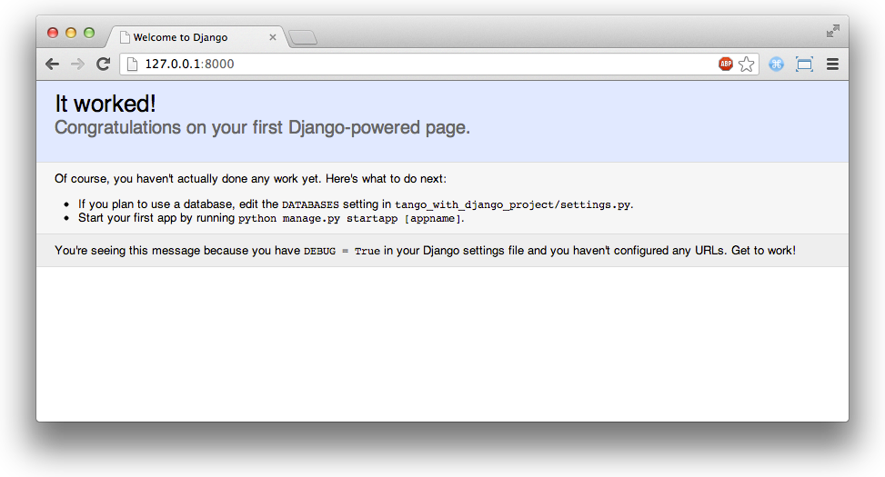

.. _setup-label:

.. _django-basics:

Django Básico
=============
Vamos começar com Django! Nesse capítulo, nós estaremos dando a você uma visão geral de como começar com Django. Você estará configurando um novo projeto e uma nova aplicação web. Ao fim desse capítulo, você terá uma página web simples feita com Django e rodando!

Testando sua instalação
-----------------------
Vamos começar checando se sua instalação do Python e Django estão instaladas corretamente, e estão na versão correta para esse tutorial. Para fazer isso, abra uma nova janela do terminal e execute o seguinte comando.

.. code-block:: guess
	
	$ python --version
	2.7.5

Isso inicia seu interpretador Python e executa o código dentro da string fornecida como parte da chave ``-c``. Você deverá ver a versão da sua instalação Python impressa como a saída para o processo. Se a versão mostrada é qualquer outra coisa menos ``2.7.5``, você precisará voltar para a Seção :ref:`installing-software` e verificar se você completou todos os passos relevantes para o seu sistema operacional.

Depois de verificar sua instalação Python, cheque sua instalação Django executando o seguinte comando.and.

.. code-block:: guess
	
	$ python -c "import django; print(django.get_version())"
	1.7

O comando novamente executa o código dentro da string fornecida como parte da chave ``-c``. Depois de importar o Django, você deverá ver ``1.7`` mostrado logo abaixo. Se você ver um conjunto diferente de números ou recebe um erro Python ``ImportError``, volte para a Seção :ref:`installing-software` ou consulte a `A Documentação sobre instalação do DJango <https://docs.djangoproject.com/en/1.7/topics/install/>`_ para mais informações. Se você achar que você tem uma versão diferente de Django, é possível que você vai se deparar com problemas em algum ponto. Definitivamente vale a pena ter certeza que você tenha o Django 1.7 instalado.

Criando seu Projeto Django
--------------------------
Para criar um novo projeto Django, vá para o seu diretório ``code`` (isto é, seu diretório de trabalho), e execute o seguinte comando:

``$ django-admin.py startproject tango_with_django_project``

.. note:: No Windows você pode ter que usar o caminho completo para o script django-admin.py. Isto é, ``python c:\python27\scripts\django-admin.py startproject tango_with_django_project`` como sugerido no `StackOverflow <http://stackoverflow.com/questions/8112630/cant-create-django-project-using-command-prompt>`_.

Esse comando invocará o script ``django-admin.py``, que irá configurar um novo projeto Django chamado `` tango_with_django_project`` para você. Geralmente, nós adicionamos ``_project`` ao fin do diretório do nosso projeto Django, por isso nós sabem exatamente o que eles contêm - mas a convenção de nomenclatura é inteiramente com você.

Agora você notará que dentro do seu diretório de trabalho está um diretório definido com o nome do seu novo projeto ``tango_with_django_project``. Dentro desse novo diretório criado, você deverá ver 2 itens:

* outro diretório com o mesmo nome que seu projeto ``tango_with_django``; e
* um script Python chamado ``manage.py``.

Para os propósitos desse tutorial, nós chamaremos esse diretório aninhado de *diretório de configuração do projeto*. Dentro desse diretório, você encontrará 4 scripts Python. Nós discutiremos esses scripts em detalhes depois, mas por agora você deverá ver:

* ``__init__.py``, um script Python em branco, cuja presença indica para o interpretador Python que o diretório é um pacote Python;
* ``settings.py``. o lugar para armazenar todas as suas configurações do seu projeto Django;
* ``urls.py``,  um script Python para armazenar padrões URL para seu projeto; e
* ``wsgi.py``, um script Python usado para ajudar a rodar seu servidor de desenvolvimento e deploy do seu projeto para um ambiente de produção.

.. note:: O diretório de configuração do projeto foi criado com novos projetos Django desde a versão 1.4. Tendo 2 diretórios com o mesmo nome pode parece um pouco estranho, mas a mudança foi feita para separar componentes relacionados ao projeto de suas aplicações individuais.

No diretório do projeto, você verá que existe um arquivo chamado ``manage.py``. Nós estaremos chamando esse script vez após vez enquanto desenvolvemos nosso projeto, pois fornece para você uma série de comandos que você pode rodar para manter seu projeto Django. Por exemplo, ``manage.py`` permite que você rode um sistema de desenvolvimento embutido no Django para testar seu trabalho, e rodar comandos de banco de dados. Você estará usando esse script muitas vezes durante o ciclo de desenvolvimento.

.. note:: Veja a documentação Django para mais detalhes sobre os `Scripts Admin e Manage <https://docs.djangoproject.com/en/1.7/ref/django-admin/#django-admin-py-and-manage-py>`_.

Você pode tentar usar o script ``manage.py`` agora, ao executar o seguinte comando:

``$ python manage.py runserver``

Executando esse comando irá instruir o Django iniciar seu servidor de desenvolvimento. Você deverá ver a śaída no seu terminal parecida ao do exemplo mostrado abaixo:

.. code-block:: guess
	
	$ python manage.py runserver

	System check identified no issues (0 silenced).

	You have unapplied migrations; your app may not work properly until they are applied.
	Run 'python manage.py migrate' to apply them.

	October 01, 2014 - 19:49:05
	Django version 1.7c2, using settings 'tango_with_django_project.settings'
	Starting development server at http://127.0.0.1:8000/
	Quit the server with CONTROL-C.
	
O comando ``migrate`` olha nas configurações do INSTALLED_APPS e cria as tabelas necessárias no banco de dados de acordo com as configurações do banco que estão no seu arquivo ``tango_with_django_project/settings.py``, e as migrações de banco de dados das apps fornecidas. Você verá uma mensagem para cada migração aplicada. Se você está curioso, rode o comando no terminal para o seu banco de dados e digite \dt (para PostgreSQL), SHOW TABLES (para MySQL), ou .schema (para SQLite) para mostrar as tabelas criadas pelo Django.
	
.. code-block:: guess

	$ python manage.py migrate
	
	Operations to perform:
	  Apply all migrations: admin, contenttypes, auth, sessions
	Running migrations:
	  Applying contenttypes.0001_initial... OK
	  Applying auth.0001_initial... OK
	  Applying admin.0001_initial... OK
	  Applying sessions.0001_initial... OK

Agora rode novamente o comando para iniciar o servidor de desenvolvimento e abra seu navegador favorito e entre com a URL http://127.0.0.1:8000/ [#f1]_. Você deverá ver uma página web parecida com essa mostrada na Figura :num:`fig-django-dev-server-firstrun`. 

.. _fig-django-dev-server-firstrun:

	
	Uma captura de tela da página inicial do Django que você verá quando rodar o servidor de desenvolvimento pela primeira vez.

Você pode interromper o servidor de desenvolvimento em qualquer momento ao apertar ``CTRL + C`` no seu terminal. Se você desejar rodar o servidor em uma porta diferente, ou permitir usuários de outras máquinas acessá-lo, você pode fazer isso ao fornecer um argumentto opcional. Considere o seguinte comando:

``$ python manage.py runserver <your_machines_ip_address>:5555``

Executar este comando forçará o servidor de desenvolvimento responder a requisições na porta TCP 5555. Você precisará substituir ``<your_machines_ip_address>`` com o indereço IP do seu computador.

Quando setar portas, é improável que você será capaz de usar a porta TCP 80, como essa é tradicionalmente reservada para trafico HTTP. Além disso, qualquer porta abaixo de 1024 é considerada serem `privilegiadas <http://www.w3.org/Daemon/User/Installation/PrivilegedPorts.html>`_ pelo seu sistema operacional.

Enquanto você não estiver usando o servidor de desenvolvimento para subir sua aplicação, algumas vezes é bom ser capaz de mostrar sua aplicação em um computador de um colega. Rodando o servidor com o endereço IP da sua máquina habilitará outros de entrarem em ``http://<your_machines_ip_address>:<port>/`` e ver sua aplicação web. Claro, isso dependerá de como sua rede está configurada. Pode haver servidores proxy ou firewalls no caminho que precisariam ser configurados antes disso funcionar. Cheque com o administrador da rede que você está usando se você não consegue ver o servidor de desenvolvimento remotamente.

.. note:: Os scripts The ``django-admin.py`` e ``manage.py`` fornecem muitas utilidades, funcionalidades que economizam o tempo para você. ``django-admin.py`` permite que você inicie novos projetos e apps, junto com outros comandos. Dentro do diretório do seu projeto, ``manage.py`` permite que você execute tarefas administrativas dentro apenas do escopo do seu projeto. Basta executar o script pertinente sem qualquer argumento para uma o que você pode fazer com cada um. A `documentação oficial do Django fornece uma lista detalhada e a explicação de cada comando possível <https://docs.djangoproject.com/en/1.7/ref/django-admin/>`_ que você pode fornecer para ambos os scripts.

Se você está usando controle de versão, agora pode ser uma boa hora de commitar as mudanças que você fez no seu espaço de trabalho. Consulte o :ref:`Curso Intensivo sobre GIT <git-crash-course>` se você não conseguir lembrar os comandos e passos envolvidos em fazer isso.

Criando uma aplicação Django
----------------------------
Um projeto Django é uma coleção de *configurações* e *aplicações* que juntos compõem uma determinada aplicação web ou website. Um dos resultados esperados do uso dessa abordagem é promover boas práticas de engenharia de software. Ao desenvolver uma série de aplicações pequenas, a ideia é que você possa teoricamente soltar uma aplicação já existente dentro de um projeto django diferente, e ter ele funcionando com um mínimo de esforço. Porque reinventar a roda se ela já existe? [#f2]_

Uma aplicação django existe para executar uma tarefa particular. Você precisa criar aplicações específicas que são responsáveis por fornecer seu site com tipos de funcinalidade particulares. Por exemplo, nós poderiamos imaginar que um projeto pode consistir de várias aplicações incluindo uma aplicação de enquete, uma aplicação de registro e uma aplicativo de conteúdo específico relacionado. Em outro projeto, nós podemos desejar reusar os aplicativos de registro e enquete e usá-los para despachar conteúdo diferente. Existem muitas aplicações Django que você pode `baixar <https://code.djangoproject.com/wiki/DjangoResources#Djangoapplicationcomponents>`_ e usar em seus projetos. Uma vez que estamos começando, nós daremos indo devagar, indo através de como criar sua própria aplicação.

Para iniciar, crie uma nova aplicação chamada *Rango*. A partir do diretório onde está seu projeto Django (isto é, ``<workspace>/tango_with_django_project``), rode o seguinte comando:

.. code-block:: guess
	
	$ python manage.py startapp rango

O comando ``startapp`` cria um novo diretório dentro da raíz do seu projeto. Não é novidade que, esse diretório é chamado ``rango`` - e dentro contêm outros 5 scripts Python:

- outro ``__init__.py``, servindo para o mesmo proprósito que discutimos anteriormente;
- models.py, um lugar para armazenar os modelos de dados da sua aplcação - onde você especifica as entidades e relacionamentos entre os dados;
- tests.py, onde você pode armazenar uma série de funcões para testar o código da sua aplicação; e
- views.py, onde você pode armazenar uma série de funções que pegam uma requisição (request) do cliente e retorna uma resposta (response).
- admin.py, onde você pode registrar seus modelos para que você possa se beneficiar de algumas máquinarias do Django que criam uma interface admin para você.

``views.py`` e ``models.py`` são 2 arquivos que você usará em qualquer aplicação, e forma parte do arquitetura principal do padrão de projeto empregado pelo Django, isto é, o padrão *Model-View-Template*. Você conferir a `documentação oficial do Django <https://docs.djangoproject.com/en/1.7/intro/overview/>`_ para ver como modelos, views e templates se relacionam em mais detalhes.

Antes que você possa começar a criar seus próprios modelos e views, você deve primeiro falar para o seu projeto Django sobre a existência de sua nova aplicação. Para fazer isso, você precisa modificar o arquivo ``settings.py``, que está dentro do diretório de configuração do seu projeto. Abra o arquivo e procura a tupla ``INSTALLED_APPS``. Adicione a aplicação ``rango`` ao final da tupla, que deverá então parecer com o seguinte exemplo:

.. code-block:: python

	INSTALLED_APPS = (
	    'django.contrib.admin',
	    'django.contrib.auth',
	    'django.contrib.contenttypes',
	    'django.contrib.sessions',
	    'django.contrib.messages',
	    'django.contrib.staticfiles',
	    'rango',
	)

Verifique se o Django pegou sua nova aplicação ao rodar o servidor de desenvolvimento novamente. Se você puder iniciar o servidor sem erros, sua aplicação foi pega e você estará pronto para proceder para o próximo passo.

Criando uma View
----------------
Com nossa aplicação Rango criada, vamos agora criar uma simples view. Para nossa primeira view, vamos apenas enviar um simples texto de volta para o cliente - nós não iremos nos preocupar sobre usar modelos ou templates por enquanto.

Na sua IDE favorita, abra o arquivo ``views.py``, localizada dentro do diretório da sua aplicação ``rango`` criada mais cedo. Remova o comentário ``# Create your views here.`` para que agora você tenha um arquivo em branco.

Você pode adicionar o seguinte código:

.. code-block:: python

	from django.http import HttpResponse
	
	def index(request):
	    return HttpResponse("Rango says hey there world!")

Quebrando as 3 linhas de código, nós observamos os seguintes pontos ao criar essa simples view.

* Nós primeiro importamos o objeto `HttpResponse <https://docs.djangoproject.com/en/1.7/ref/request-response/#django.http.HttpResponse>`_ a partir do módulo ``django.http``.
* Cada view existe dentro do arquivo ``views.py`` como uma série de funções individuais. Nessa instância, nós apenas criamos uma view - chamada ``index``.
* Cada view toma pelo menos um argumento - um objeto `HttpRequest <https://docs.djangoproject.com/en/1.7/ref/request-response/#django.http.HttpRequest>`_, que também se encontra no módulo ``django.http``. Por convenção, determina-se que esse argumento seja nomeado como ``request``, mas você pode renomear para o que você desejar.
* Cada view deve retornar um objeto HttpResponse. Um simples objeto HttpResponse recebe uma string como parâmetro, representando o conteúdo da página que nós desejamos enviar para o cliente requisitando aquela view.

Com a view criada, você está em uma parte do caminho para permitir um usuário de acessá-la. Para um usuário ver sua view, você deve mapear um `Localizador Uniforme de Recursos (URL) <http://pt.wikipedia.org/wiki/URL>`_ para a view.

Mapeando URLs
-------------
Dentro do diretório da sua aplicação ``rango``, você precisa agora criar um novo arquivo chamado ``urls.py``. O conteúdo do arquivo permitirá você mapear URLs da sua aplicação (por exemplo, ``http://www.tangowithdjango.com/rango/``) para views específica para aquela URL. Confira o simples arquivo URL abaixo:

.. code-block:: python

	from django.conf.urls import patterns, url
	from rango import views

	urlpatterns = patterns('',
		url(r'^$', views.index, name='index'))

Esse código importa o maquinário Django pertinente que nós usaremos para criar o mapeamento de URL. Importando o módulo ``views`` do ``rango`` também nos fornece acesso para a nossa simples view implementada anteriormente, permitindo-nos referenciar a view no mapeamento de URL que nós criaremos.

Para criar nosso mapeamento, nós usamos uma `tupla <http://en.wikipedia.org/wiki/Tuple>`_. Para o Django pegar seus mapeamentos, essa tupla *deve* ser chamada ``urlpatterns``. A tupla ``urlpatterns`` contém uma série de chamadas para a função ``django.conf.urls.url()``, com cada chamada manipulando um único mapeamento. No código de exemplo acima, nós usamos apenas ``url()`` uma vez, por isso temos definido apenas um mapeamento de URL. O primeiro parâmetro que nós fornecemos para a função ``django.conf.urls.url()`` é a expressão regular ``r'^$'``, que combina com uma string vazia. Qualquer URL fornecida pelo usuário que combine com este padrão, significa que a view ``views.index`` deve ser invocada pelo Django. Para a view deve ser passado um objeto ``HttpRequest`` como parâmetro, contendo informações sobre a requisição do usuário para o servidor. Nós também fazemos uso de um parâmetro opcional para a função ``url()``, ``name``, usando a string ``index`` como o valor associado.

.. note:: Você pode estar pensando que o combinar uma URL em branco não tem muito sentido - para que serviria? Quando o padrão de combinação acontece, apenas uma porção da string da URL original é considerada. Isso é porque nosso projeto Django irá primeiro processar a string original da URL (isto é, ``http://www.tangowithdjango.com/rango/``). Uma vez que isso foi processado, ela é removida, com o restante sendo passado para o padrão de combinação. Neste exemplo, não haveria nada - assim uma string vazia deveria combinar!

.. note:: O parâmetro ``name`` é opcional para a função ``django.conf.urls.url()``. Isso é fornecido pelo Django para permitir você a distinguir um mapeamento de outro. É inteiramente plausível que 2 expressões de mapeamentos separados de URL possam acabar chamando a mesma view. ``name`` permite você diferenciar entre elas - algo que é útil para *combinação reversa de URL*. Confira `a documentação oficial do Django neste tópico <https://docs.djangoproject.com/en/1.7/topics/http/urls/#naming-url-patterns>`_ para mais informações.

Você pode ter visto que dentro do diretório de configuração do seu projeto, um arquivo ``urls.py`` já existe. Porque fazer outro? Tecnicamente, você pode colocar *todas* as URLs para as aplicações do seu projeto dentro deste arquivo. No entando, isso é considerado uma má prática, como isso aumenta o acoplamento nas suas aplicações individuais. Um arquivo ``urls.py`` separado para cada aplicação permite você setar URLs para aplicações individuais. Com acoplamento mínimo, você pode então juntar a eles no seu arquivo ``urls.py`` principal do projeto mais tarde.

Isso significa que nós precisamos configurar o ``urls.py`` do nosso projeto ``tango_with_django_project`` e conectar o nosso projeto principal com nossa aplicação Rango.

Como nós fazemos isso? É muito simples. Abra o arquivo ``urls.py`` do projeto que está localizado dentro do diretório de configuração do projeto. Como um exemplo de caminho relativo do seu diretório de trabalho, este seria o arquivo ``<workspace>/tango_with_django_project/tango_with_django_project/urls.py``. Atualize a tupla ``urlpatterns`` como demonstrado no exemplo abaixo:

.. code-block:: python
	

	urlpatterns = patterns('',
	    # Examples:
	    # url(r'^$', 'tango_with_django_project_17.views.home', name='home'),
	    # url(r'^blog/', include('blog.urls')),

	    url(r'^admin/', include(admin.site.urls)),
	    url(r'^rango/', include('rango.urls')), # ADD THIS NEW TUPLE!
	)

O mapeamento adicionado procura por strings de URL que combinem com o padrão ``^rango/$``. Quando uma combinação é feita o restante da string da URL é então passada e manipulada pelo ``rango.urls`` (que nós já temos configurado). Isso é feito com a ajuda da função ``include()`` do ``django.conf.urls``. Pense disso como uma cadeia que processa a string da URL = como ilustrado na Figura :num:`fig-url-chain`. Nessa cadeia, o domínio é retirado fora e o restante da string da URL (``rango/``) é passado para o tango_with_django_project, onde ele procura uma combinação e despe ``rango/`` deixando uma string vazia para ser passada para a aplicação rango. Rango agora tenta combinar a string vazia, que ele faz, e isso então despacha a view ``index()`` que nós criamos.

Reinicie o servidor de desenvolvimento do Django e visite ``http://127.0.0.1:8000/rango``. Se tudo correu bem, você deverá ver o texto ``Rango says hello world!``. Deve parecer como a captura de tela demonstrada na Figura  :num:`fig-rango-hello-world`.

.. _fig-url-chain:

	
	Uma ilustração de uma URL, mostrando como as diferentes parte da URL são a responsabilidade de arquivos ``urls.py`` diferentes.

.. _fig-rango-hello-world:

	Uma captura de tela do Google Chrome mostrando nossa primeira página web feita com Django. Hello, Rango!

Dentro de cada aplicação, você criará um número de URL para visualizar os mapeamentos. Esse mapeamento inicial é muito simples. Conforme nós progredimos, nós criaremos mapeamentos mais sofisticados que permitem utilizar URLs serem parametrizadas.

É importante ter um bom entendimento de como as URLs são manipuladas no Django. Se você está um pouco confuso ou gostaria de saber mais, confira `a documentação oficial do Django sobre URLs <https://docs.djangoproject.com/en/1.7/topics/http/urls/>`_ para mais detalhes e mais exemplos.

.. note:: O padrão de URL usa `expressões regulares <http://pt.wikipedia.org/wiki/Express%C3%A3o_regular>`_ para executar as combinações. Vale a pena se familiarizar sobre como usar expressões regulares em Python. A documentação oficial do Python contém um `guia útil sobre expressões regulares <http://docs.python.org/2/howto/regex.html>`_, enquanto regexcheatsheet.com fornece um `resumo limpo de expressões regulares <http://regexcheatsheet.com/>`_.

Fluxos de trabalho Básico
-------------------------
O que você acabou de aprender neste capítulo pode ser sucintamente resumido em uma lista de ações. Aqui, nós fornecemos essas listas para 2 tarefas distintas que você executou. Você pode usar essa seção para uma referência rápida se você precisar se lembrar sobre alguma coisa em particular.

Criando um novo projeto Django
..............................
#. Para criar o projeto, rode o comando ``python django-admin.py startproject <name>`` onde ``<name>`` é o nome do projeto que você deseja criar.

Criando uma nova aplicação Django
.................................
#. Para criar uma nova aplicação, rode o comando ``$ python manage.py startapp <appname>``, onde ``<appname>``é o nome da aplicação que você deseja criar.
#. Fale para o seu projeto Django sobre a nova aplicação ao adiciona-la a tupla ``INSTALLED_APPS`` no arquivo ``settings.py`` no seu projeto.
#. No seu arquivo ``urls.py`` do projeto, adicione um mapeamento para a aplicação.
#. No diretório da sua aplicação, crie um arquivo ``urls.py`` para direcionar a entrada de strings de URL para views.
#. No arquivo ``views.py`` da sua aplicação, cria as views requeridas garantindo que elas retornem um objeto ``HttpResponse``.

Exercícios
----------
Parabéns! Você tem o Rango instalado e funcionando. Este é um marco significante no trabalho com Django. Criando views e mapeando URLs para as views é o primeiro passo para desenvolver aplicações web mais complexas e usáveis. Agora tente fazer os exercícios seguintes para reforçar o que você aprendeu.

* Revise o procedimento e certifique-se de seguir a forma como as URLs são mapeadas para views.
* Agora crie uma nova view chamada ``about`` que retorna o seguinte: ``Rango says here is the about page.``
* Agora mapear a esta view para essa URL ``/rango/about``. Para esse passo, você apenas irá precisar editar o ``urls.py`` da aplicação rango.
* Revise o ``HttpResponse`` na view ``index`` para incluir um link para a página about.
* No ``HttpResponse`` na view ``about`` incluir um link para a página principal.
* Se você ainda não tiver feito isso, é uma boa hora de sair e fazer por completo a parte 1 do `tutorial oficial do Django <https://docs.djangoproject.com/en/1.7/intro/tutorial01/>`_.

Sugestões
.........
Se você está tendo dificuldade para fazer os exercícios, esperamos que as seguintes dicas forneçam a você alguma inspiração sobre como continuar.

* Sua view ``index`` deveria ser atualizada para incluir um link para a view ``about``. Mantenha isso simples por enquanto - algo como ``Rango says: Hello world!   <a href='/rango/about'>About</a>`` será suficiente. Nós voltaremos mais tarde para melhorar a apresentação dessas páginas.
* A expressão regular para combinar com ``about/`` é ``r'^about/'`` - isso será útil quando pensar sobre seu padrão URL.
* O HTML para linkar de voltar para a página index é ``<a href="/rango/">Index</a>``. O link usa a mesma estrutura como o link para a página ``about`` mostrada acima.

.. rubric:: Footnotes
.. [#f1] Isso assume que você está usando o endereço IP 127.0.0.1 e a porta 8000 quando roda seu servidor web de desenvolvimento Django. Se você explicitamente não fornece uma pota para rodar o servidor de desenvolvimento, o Django por padrão usa a porta 8000 para você.

.. [#f2] Existem muitas aplicações disponíveis fora daqui que você pode usar no seu projeto. Dê uma olhada no site `PyPI <https://pypi.python.org/pypi?%3Aaction=search&term=django&submit=search>`_ e `Django Packages <https://www.djangopackages.com/>`_ para pesquisar por apps reusáveis que você pode colocar nos seus projetos.
