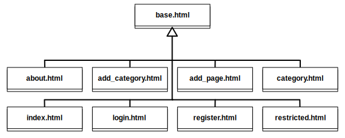

Trabalhando com Templates
=========================
Até agora, nós criamos alguns templates Django para diferentes páginas da aplicação. Você provavelmente já notou que há muito código HTML repetido nesses templates.

Embora a maioria dos sites vão ter muitas estruturas repetidas, (isto é, headers, sidebars, footers e etc), repetir o HTML em cada template não é uma boa maneira de lidar com isso. Então, ao invés de fazer o mesmo trabalho de copiar e colar o mesmo código, podemos minimizar a quantidade de repetição no nosso código base ao usar *herança de template*, fornecido pela Linguagem de Template do Django.

A abordagem básica para usar herança em templates está descrita a seguir:

#. Identifique as partes repetidas de cada página da sua aplicação (ou seja, header, sidebar, footer, content)
#. Em um *template base*, forneça o esqueleto da estrutura de uma página padrão junto com qualquer conteúdo em comum (que pode ser as mensagens que vão no footer, a logo e título que aparecem em alguma seção), e então defina um número de *blocos* que estão sujeitos a mudança dependendo de qual página o usuário está visualizando.
#. Crie templates específicos - todos os quais estarão herdando do template base - e especifique o conteúdo de cada bloco.

HTML Repetido e o Template Base
-------------------------------
Dado os templates que nós criamos até agora, deve estar bem óbvio que temos repetido um monte de código HTML. Abaixo abstraímos quaisquer detalhes específicos da página para mostrar a estrutura esqueleto que temos repetido em cada template:

.. code-block:: html
	
	<!DOCTYPE html>
	
	<html>
	    <head>
	        <title>Rango</title>
	    </head>
	
	    <body>
	        <!-- Page specific content goes here -->
	    </body>
	</html>

Vamos fazer dele nosso template base, por enquanto, e salve-o como ``base.html`` no diretório ``templates`` (por exemplo, ``templates/base.html``).

.. note:: Você deve sempre visar extrair o máximo de conteúdo recorrente para seu template base. Embora possa ser um desafio você fazer isso inicialmente, o tempo que você vai salvar em manutenção do seu template no futuro supera de longe esse desafio inicial. Pense sobre isso: você prefere manter uma cópia do seu markup ou múltiplas cópias?

.. warning:: Lembre-se que a declaração ``<!DOCTYPE html>`` da página **deve** ser colocado na primeira linha da sua página! Não fazer isso significará que seu markup não vai obedecer a guideline HTML5 da W3C.

Template Blocks
---------------
Agora que nós já identificamos nosso template base, podemos prepará-lo para nossa herança de templates. Para fazer isso, precisamos incluir uma tag de template para indicar o que pode ser sobrescrito no template base - e isso é feito através do uso de *blocks*.

Adicione um ``body_block`` ao template base, assim como mostrado abaixo:

.. code-block:: django
	
	<!DOCTYPE html>
	
	<html>
	    <head lang="en">
		<meta charset="UTF-8">
	        <title>Rango</title>
	    </head>
	
	    <body>
	        
	    </body>
	</html>

Lembre-se que os comandos de template do Django se dão por tags que iniciam com ````. Para iniciar um bloco, o comando é ``block <NOME>``, onde ``<NOME>`` é o nome do bloco que você quer criar. Você deve também garantir que fechou o bloco com o comando ``endblock``, que também fica dentro de tags de template do Django.

Você pode também especificar um 'conteúdo padrão' para seus block. Por exemplo:

.. code-block:: django
	
	This is body_block's default content.

Quando formos criar templates para cada página, herdaremos a partir de ``base.html`` e sobrescrevemos o conteúdo de ``body_block``. No entanto, você pode colocar no seu template tantos blocos quanto você achar necessário. Por exemplo, você poderia criar um bloco para o título da página, footer, sidebar e etc. Blocos realmente são uma funcionalidade poderosa do sistema de templates do Django. Para aprender mais sobre eles, dê uma olhada na `documentação oficial do Django sobre templates <https://docs.djangoproject.com/en/1.7/topics/templates/#id1>`_.

Mais Abstração
..............
Agora que você entende blocos de template do Django, vamos ter a oportunidade de abstrair um pouco mais nosso template base. Abra novamente o template ``base.html`` e modifique-o para que ele pareça como no exemplo abaixo:

.. code-block:: django
	
	<!DOCTYPE html>
	
	<html>
	    <head>
	        <title>Rango - How to Tango with Django!</title>
	    </head>

	    <body>
	        

	            
	        

	        
	        

	        
	        

	            <ul>
	                
	                    <li><a href="/rango/restricted/">Restricted Page</a></li>
	                    <li><a href="/rango/logout/">Logout</a></li>
	                    <li><a href="/rango/add_category/">Add a New Category</a></li>
	                
	                    <li><a href="/rango/register/">Register Here</a></li>
	                    <li><a href="/rango/login/">Login</a></li>
	                
	                
	                <li><a href="/rango/about/">About</a></li>
	            </ul>
	        

	    </body>
	</html>

Introduzimos duas novas funcionalidades no template.

* A primeira é um novo bloco de template, ``title``. Isso vai nos permitir especificar um título de página customizado para cada página que herdar de nosso template base. Se uma página que herdar não fizer uso desse recurso, o título padrão que será mostrado é ``Rango - How to Tango with Django!``.
* Também trouxemos toda a lista de links do nosso template ``index.html``, e colocamos eles numa tag ``
``, logo abaixo do nosso ``body_block``. Isso vai garantir que os links estarão presentes em todas as páginas que herdarem do nosso template base. Os links são precedidos por uma *linha horizontal* (``
``) que fornece um visual de separação entre o conteúdo do ``body_block`` e os links

Também note que nós envolvemos o ``body_block`` dentro de uma tag ``
`` - vamos explicar o significado da tag ``
`` no Capítulo :ref:`css-course-label`. Nossos links são também convertidos para uma lista HTML não ordenada, através do uso das tags ``<ul>`` e ``<li>``.

Herança de Template
-------------------
Agora que criamos o template base com um bloco, podemos agora atualizar os templates que criamos para herdar do nosso template base. Por exemplo, vamos refatorar o template ``rango/category.html``.

Para fazer isso, primeiro remova todo o código HTML repetido deixando apenas o HTML e as tags/comandos de template. Então no início do template, adicione a seguinte linha de código:

.. code-block:: django
	
	

.. note:: O parâmetro que você fornece para o comando ``extends`` deve ser relativo ao seu diretório ``templates`` do projeto. Por exemplo, todos os templates que nós usamos para o Rango deve extender de ``rango/base.html``, não ``base.html``.

O comando ``extends`` recebe um parâmetro, o template que será extendido/herdado (isto é, ``rango/base.html``). Podemos então modificar o template ``category.html`` de modo que ele pareça como o seguinte:

.. code-block:: django
	
	
	
	
	
	{{ category_name }}
	
	
	    <h1>{{ category_name }}</h1>
	    
	        
	            <ul>
	                
	                    <li><a href="{{ page.url }}">{{ page.title }}</a></li>
	                
	            </ul>
	        
	        	<strong>No pages currently in category.</strong>
	        
	    
	        
	       	    <a href="/rango/category/{{category.slug}}/add_page/">Add a Page</a>
	        
	    
	        The specified category {{ category_name }} does not exist!
	    
		
	

Agora que herdamos de ``base.html``, tudo que existe no template ``category.html`` é o comando ``extends``, o bloco ``title`` e o bloco ``body_block``. Você não precisa de um documento HTML bem formatado, porque ``base.html`` fornece toda a base para você. Tudo que você precisa fazer é plugar o conteúdo adicional ao template base herdado para criar um documento HTML completo, que é enviado ao browser do cliente.

.. note::
	Templates são muito poderosos, e você pode criar suas próprias tags de template. Aqui nós mostramos como podemos minimizar a repetição da estrutura HTML em nossos templates.

	No entanto, templates podem também ser usados para minimizar código de dentro das suas views da aplicação. Por exemplo, se você quer incluir o mesmo conteúdo do banco de dados em cada página da sua aplicação, você poderia construir um template que chama uma view específica para manipular a parte repetida de sua página web. Isso então evita que você tenha que chamar as funções de ORM do Django que reúne os dados necessários para o template em cada view que o renderiza.

	Para aprender mais sobre as funcionalidades oferecidas pela linguagem de templates do Django, confira a `documentação oficial sobre templates <https://docs.djangoproject.com/en/1.7/topics/templates/>`_.

Usando URLs nos templates
-------------------------
Até agora codificamos a URL da página/view que queremos mostrar no template de forma direta, ou seja, ``<a href="/rango/about/">About</a>``, por exemplo. No entanto, a melhor maneira é usar a tag de template ``url`` para analisar a url nos arquivos ``urls.py``. Para fazer isso, podemos mudar a maneira que referenciamos as URLs da seguinte maneira:

.. code-block:: django

	<li><a href="">About</a></li>

O motor de template do Django vai analisar os arquivos ``urls.py`` por uma URL com o ``name='about'`` (e então fazer uma combinação reversa para a URL real). Isso significa que se nós mudarmos o mapeamento de URL no ``urls.py``, não vamos precisar atualizar os links em todos os nossos templates. Se não tivéssemos dado um name ao nosso urlpattern, poderíamos ainda referenciar diretamente como mostra-se a seguir:

.. code-block:: django

	<li><a href="">About</a></li>

Aqui precisamos especificar a aplicação, e a view about.

Você pode também atualizar o template base com a tag de template ``url`` de modo que os links no template base sejam renderizados usando o seguinte código:

.. code-block:: django
	
	
	

	    <ul>
	        
	            <li><a href="">Restricted Page</a></li>
	            <li><a href="">Logout</a></li>
	            <li><a href="">Add a New Category</a></li>
	        
	            <li><a href="">Register Here</a></li>
	            <li><a href="">Login</a></li>
	        

	        <li><a href="">About</a></li>
	    </ul>
	

No seu template ``index.html`` você vai notar que você tem uma URL parametrizada, ou seja, a url/view ``category`` recebe o ``category.slug`` como um parâmetro. Para lidar com isso, você pode passar para a tag de template url o nome da url/view e o slug, isto é, ```` no template, assim como no exemplo abaixo:

.. code-block:: html

	
	    <li><a href="">{{ category.name }}</a></li>
	

.. note::
	Nota do Autor: O tutorial oficial fornece uma visão geral de como usar a tag URL do template, http://django.readthedocs.org/en/latest/intro/tutorial03.html, e esta resposta no stackoverflow também é de grande ajuda: http://stackoverflow.com/questions/4599423/using-url-in-django-templates.

Exercícios
----------
Agora que você trabalhou todo este capítulo, temos alguns exercícios para você exercitar. Depois de completá-los, você será um codificador Pró de templates do Django.

* Atualize todos os outros templates existentes no Rango, para que extendam do template ``base.html``. Siga o mesmo processo que demonstramos acima. Uma vez completado, todos seus templates devem herdar de ``base.html``, como mostrado na Figura :num:`fig-rango-template-inheritance`. Enquanto você faz isso, garanta que você removeu os links do nosso template ``index.html``. Não precisamos mais deles! Você pode também remover o link para a página inicial que está no template ``about.html``.
* Converta a página restrita para usar um template. Chame o template ``restricted.html``, e garanta que ele também extende de nosso template base.
* Mude todas as referências de links para usarem a tag URL de template.
* Adicione outro link para nossa crescente coleção de links que permita usuários navegar de volta para a página principal do Rango a partir de qualquer página do nosso site.

.. warning:: Lembre-se de adicionar ```` no topo de cada template que fizer uso de arquivos estáticos. Se você não fizer isso, terá um erro! Módulos de template do Django devem ser importados individualmente para cada template que eles sejam necessários - *você não pode usar os módulos incluídos nos templates que você herdou"*

.. _fig-rango-template-inheritance:

	
	Um diagrama de classe demonstrando como seus templates devem herdar a partir de ``base.html``.

.. note:: Uma vez completo todos esses exercícios, todos os templates do Rango devem herdar de ``base.html``. Olhando novamente no conteúdo de ``base.html``, o objeto ``user`` - encontrado no contexto de um dado request do Django - é usado para determinar se o usuário atual do Rango está logado (através do uso do ``user.is_authenticated``). Como todos os templates do Rango devem herdar do template base, podemos dizer que *todos os templates do Rango agora dependem de ter acesso ao contexto de um dado request*.

	Devido a esta nova dependência, é preciso checar cada view do Rango. Para cada view, garanta que o contexto para cada request é disponibilizado para a engine de template do Django. Se você não garantir que isso aconteça, suas views podem ser renderizadas incorretamente - usuários podem aparecer que não estão logados, mesmo que o Django pense que eles estão!

	Como um exemplo rápido das verificações que você deve realizar, dê uma olhada na view ``about``. Inicialmente, ela foi implementada com uma string como resposta, como mostrada abaixo. Note que enviamos apenas a string - não usamos a requisição passada como o parâmetro ``request``.
	
	.. code-block:: python
		
		def about(request):
		    return HttpResponse('Rango says: Here is the about page. <a href="/rango/">Index</a>')

	Para empregar o uso de um template, nós chamamos a função ``render()`` e passamos o objeto ``request``. Isso vai permitir a engine de template acessar os objetos, tais como o ``user``, que permitirá o sistema de template determinar se o usuário está logado (ou seja, autenticado).
	
	.. code-block:: python
		
		def about(request):
		    
		    return render(request, 'rango/about.html', {})
	
	Lembre-se, o último parâmetro do ``render()`` é um dicionário com o qual você pode usar para passar dados adicionais para o sistema de template do Django. Como não temos nenhum dado adicional para passar, passamos então um dicionário vazio. Dê uma olhada na Seção :ref:`adding-a-template-label` pra refrescar a memória sobre o ``render()``.
