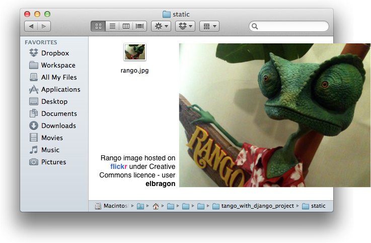

.. _templates-label:

Templates e Mídia Estática
==========================
Neste capítulo, nós estaremos extendendo seu conhecimento de Django ao introduzir você para a engine de template, bem como a forma de servir *mídia estática* dentro da sua página web.

.. _model-setup-templates-label:

Usando Templates
----------------
Até este momento, você ligou algumas coisas juntas para criar uma página web em Django. Esta é uma view acoplada, que por sua vez está acoplada com uma série de mapeamento de URL. Aqui vamos aprofundar como combinar templates neste conjunto.

Sites bem projetados usam muito de repetição em sua estrutura ou layout. Se você ver um header ou footer comum em uma página de site, a `repetição de layouts de página <http://www.techrepublic.com/blog/web-designer/effective-design-principles-for-web-designers-repetition/>`_ ajuda os usuários com a navegação, promove organização do site e reforça um senso de continuidade. Django fornece `templates <https://docs.djangoproject.com/en/1.7/ref/templates/>`_ para tornar mais fácil para desenvolvedores alcançar este objetivo de design, bem como separar lógica da aplicação das preocupações de apresentação. Neste capítulo, você criará um template básico que será usado para criar uma página HTML. Este template será então despachado através de uma view Django. No capítulo :ref:`model-using-label`, vamos dar um passo adiante, ao usar templates em conjunto com models para despachar dados gerados dinamicamente.

Configurando o Diretório de Templates
.....................................
Para obter templates instalados e rodando, você vai precisar configurar um diretório no qual os arquivos de template estará armazenado. 

No seu seu diretório do projeto Django (por exemplo, ``<workspace>/tango_with_django_project/``), crie um novo diretório chamado ``templates``. Dentro do novo diretório de templates, crie outro diretório chamado ``rango``. Assim o diretório ``<workspace>/tango_with_django_project/templates/rango/`` será o localização na qual nós estaremos armazenando templates associados com nossa aplicação ``rango``.

Para falar ao seu projeto Django onde os templates estarão alojados, abra seu arquivo ``settings.py``. Adicione a tupla `TEMPLATE_DIRS`` no ``settings.py`` e adicione o caminho para seu diretório ``templates`` recém criado, de modo que ele pareça como o seguinte exemplo:

.. code-block:: python
	
	TEMPLATE_DIRS = ('<workspace>/tango_with_django_project/',)

Note que você é *obrigado a usar o caminho absoluto* para localizar o diretório ``templates``. Se você faz parte de um time ou trabalha em diferentes computadores, isso pode ser tornar um problema no futuro. Você terá diferentes usernames, o que significa diferente caminhos para o seu diretório ``<workspace>``. O *caminho embutido* (ou caminho codificado) que você entrou acima não seria o mesmo em diferentes computadores. Claro, você pode adicionar no diretório de template para cada configuração diferente, mas isso seria uma maneira bastante desagradável para resolver o problema. Então, o que podemos fazer?

.. warning::
	A estrada para o inferno está cheia de caminhos embutidos.
	Caminho embutido ou `"Hard-coding <http://en.wikipedia.org/wiki/Hard_coding>`_ path" é considerado ser um `anti-padrão de engenharia de software <http://pt.wikipedia.org/wiki/Antipadrões_de_projeto_de_software>`_, e tornará o seu projeto menos `portável <http://pt.wikipedia.org/wiki/Portabilidade_(informática)>`_.


Caminhos Dinâmicos
..................
A solução para o problema do caminho embutido é fazer uso de funções built-in Python para calcular o caminho do nosso diretório ``templates`` automaticamente para nós. Desse jeito, um caminho absoluto pode ser obtido independente de onde você colocou seu código do projeto Django no seu sistema de arquivos. Isto, por sua vez, significa que o código do seu projeto se torna mais *portável*. À custa de um pouco mais de complexidade do seu projeto Django agora, você pode tornar sua vida muito mais fácil depois. *No pain, no gain!*

No Django 1.7 o arquivo ``settings.py`` agora contém uma variável chamada ``BASE_DIR``. Esta armazena o caminho para o diretório no qual o módulo ``settings.py`` do seu projeto estará contido. Isso é obtido ao usar o atributo Python especial ``__file__``, qual está `definido para o caminho absoluto do seu módulo de configuração <http://stackoverflow.com/a/9271479>`_. O ``__file__`` dá o caminho absoluto para o arquivo settings, então a chamada para  chamar ``os.path.dirname()`` fornece a referência ao caminho absoluto do diretório. Chamar ``os.path.dirname()`` novamente remove outra camada, de modo que ``BASE_DIR`` contenha ``<workspace>/tango_with_django_project``. Você pode ver esse processo em ação, se você estiver curioso, ao adicionar as seguintes linhas:

.. code-block:: python
	
	print __file__
	print os.path.dirname(__file__)
	print os.path.dirname(os.path.dirname(__file__))


Vamos usar isso agora. Crie uma nova variável em ``settings.py`` chamada ``TEMPLATE_PATH`` e armazene o caminho para o diretório ``templates`` que você criou anteriormente. Usando a função ``os.path.join()``, seu código deve parecer como o seguinte exemplo:

.. code-block:: python
	
	TEMPLATE_PATH = os.path.join(BASE_DIR, 'templates')

Aqui nós fazemos uso da função ``os.path.join()`` para juntar a variável ``PROJECT_PATH`` e a string ``'templates'``, que geraria, por exemplo ``<workspace>/tango_with_django_project/templates/``. Nós podemos então subistituir o caminho embutido que nós colocamos na tupla ``TEMPLATE_DIRS`` anteriormente com ``TEMPLATE_PATH``, assim como no exemplo abaixo:

.. code-block:: python
	
	TEMPLATE_DIRS = (
		# Put strings here, like "/home/html/django_templates" or "C:/www/django/templates".
		# Always use forward slashes, even on Windows.
		# Don't forget to use absolute paths, not relative paths.
		TEMPLATE_PATH,
	)

Nós podemos manter a variável ``TEMPLATE_PATH`` no topo do nosso módulo ``settings.py`` para torná-lo de fácil acesso, e ele não deve jamais ser alterado. É por isso que nós criamos uma variável adicional para armazenar o caminho do template.

.. warning:: 
	Ao juntar ou concaternar caminhos de sistema, usar ``os.path.join()`` é a abordagem preferida. Usar esta função garante que a barra correta seja usada dependendo do seu sistema operacional. Em um sistema operacional compatível com POSIX, barras normal seriam usadas para separar diretórios, enquanto que um sistema operacional Windows usaria barra invertida. Se você manualmente adicionar barras aos caminhos, você pode acabar com erros de caminho ao tentar rodar seu código em um sistema operacional diferente.


.. _adding-a-template-label:

Adicionando um Template
.......................
Com seu diretório de template e caminho configurado, crie um arquivo chamado ``index.html`` e coloque-o no diretório ``templates/rango/``. Dentro deste novo arquivo, adicione o seguinte código HTML:

.. code-block:: html
	
	<!DOCTYPE html>
	<html>
	
		<head>
			<title>Rango</title>
		</head>
		
		<body>
			<h1>Rango says...</h1>
			hello world! <strong>{{ boldmessage }}</strong><br />
			<a href="/rango/about/">About</a><br />
		</body>
	
	</html>

A partir deste código HTML, deve ficar claro que uma simples página HTML vai ser gerada para cumprimentar um usuário com uma mensagem *hello world*. Você pode também notar algum não-HTML na forma de ``{{ boldmessage }}``. Isso é uma *variável de template do Django*, e nós seremos capazes de setar um valor para esta variável para ser mostrada dentro da saída renderizada. Nós vamos chegar nessa parte daqui a pouco.

Para usar este template, nós precisamos reconfigurar a view ``index()`` que nós criamos anteriormente. Ao invés de despachar uma simples mensagem, nós mudaremos isso para despachar nosso template.

Em ``rango/views.py``, assegure a seguinte declaração de import no topo do arquivo:

.. code-block:: python
	
	from django.shortcuts import render

Você pode então atualizar a função ``index()`` como se segue. Confira o comentário na linha para ver o que cada linha faz.

.. code-block:: python
	
	def index(request):
		
		# Construir um dicionário para passar para o motor do template
		# como seu contexto.
		# Note que a chave boldmessage é a mesma {{ boldmessage }} no template!
		context_dict = {'boldmessage': 'Eu sou a fonte em negrito do contexto.'}
		
		# Retorna uma resposta (response) renderizada para enviar ao cliente.
		# Nós usamos a função atalho para tornar nosso trabalho mais fácil.
		# Note que o primeiro parâmetro é o template que desejamos usar.
		return render(request, 'rango/index.html', context_dict)

Primeiro nós criamos um dicionário de pares chave-valor que nós queremos usar dentro do template, então nós chamamos a função auxiliar ``render()``. Essa função recebe como entrada o ``request`` do usuário, o nome do arquivo de template, e o dicionário de contexto. A função ``render()`` pegará esses dados e juntará com o template para produzir uma página HTML completa. Isso é então retornado e despachado ao browser do usuário.

Quando um arquivo de template é carregado com o sistema de template do Django, um *contexto de template* é criado. Em termos simples, um contexto de template é essencialmente um dicionário Pyton que mapeia nomes de variáveis do template com variáveis Python. No template que nós criamos anteriormente, nós incluímos uma variável de template chamada ``boldmessage``. Em nossa view de exemplo ``index(request)``, a string ``'Eu sou a fonte em negrito do contexto.'`` é mapeada para a variável de template ``boldmessage``. A string ``'Eu sou a fonte em negrito do contexto.'`` portanto substitui qualquer instância de ``{{ boldmessage }}`` dentro do template.

Agora que você atualizou a view para empregar o uso do seu template, rode o servidor de desenvolvimento Django, e visite http://127.0.0.1:8000/rango/. Você deve ver seu template renderizado em toda sua glória, assim como no exemplo mostrado na Figura :num:`fig-rango-hello-world-template`.

Se você não não vê, leia a mensagem de erro apresentada para ver qual é o problema, e então verifique novamente todas as alterações que você fez. Assegure que todas as mudanças necessárias foram feitas. Um dos problemas mais comuns que as pessoas tem com templates, é que o caminho está setado incorretamente em ``settings.py``. Algumas vezes vale a pena adicionar um ``print`` no ``settings.py`` para reportar o ``BASE_DIR`` e ``TEMPLATE_PATH``.

Este exemplo demonstra como usar template dentro de suas views. No entanto, nós temos apenas tocado bem por cima de algumas das funcionalidades fornecidas pelo Django em relação a templates. Nós usaremos templates em maneiras mais sofisticadas conforme progredimos neste tutorial. No meio tempo, você pode descobrir mais sobre `templates na documentação oficial do Django <https://docs.djangoproject.com/en/1.7/ref/templates/>`_.

.. _fig-rango-hello-world-template:

.. figure:: ../images/rango-hello-world-template.png
	:figclass: align-center

	Uma screenshot do Google Chrome renderizando o template feito neste tutorial.

Servindo Mídia Estática
-----------------------
Reconhecidamente, o site *Rango* está muito simples, já que não incluímos qualquer estilo ou imagens. `Folhas de Estilo (CSS) <http://pt.wikipedia.org/wiki/Cascading_Style_Sheets>`_, `JavaScript <http://pt.wikipedia.org/wiki/JavaScript>`_ e imagens são essencialmente arquivos de *mídia estática* que nós podemos incluir em nossas páginas web para adicionar estilo, e introduzir um comportamento dinâmico. Esses arquivos são servidos em uma maneira ligeiramente diferente de páginas web. Isso porque eles não são gerados na hora como nossas páginas HTML. Essa seção mostra para você como configurar seu projeto Django para servir mídia estática para o cliente. Nós também iremos modificar nosso template para incluir alguns exemplos de mídia estática.

Configurando o Diretório de Mídia Estática
..........................................
Para ter mídia estática em funcionamento, você precisará configurar um diretório no qual os arquivos de mídia estática são armazenados. No seu diretório do projeto (por exemplo, ``<workspace>/tango_with_django_project/``), crie um novo diretório chamado ``static`` e dentro dele, um novo diretório chamado ``images``.

Agora coloque uma imagem dentro do diretório ``static/images``. Como mostrado na Figura :num:`fig-rango-picture`, nós escolhemos uma imagem do camaleão, `Rango <http://www.imdb.com/title/tt1192628/>`_, um mascote apropriado, se alguma vez houve um.

.. _fig-rango-picture:



	Rango, o camaleão dentro do nosso diretório de mídia estática.

Com nosso diretório ``static`` criado, nós precisamos falar ao Django sobre ele, assim como fizemos com nosso diretório de templates anterior. No arquivo ``settings.py``, vamos precisar atualizar duas variáveis: ``STATIC_URL`` e a tupla ``STATICFILES_DIRS``. Primeiro, crie uma variável para armazenar o caminho para o diretório (``STATIC_PATH``) como se segue:

.. code-block:: python
	
	STATIC_PATH = os.path.join(BASE_DIR,'static')

	STATIC_URL = '/static/' # You may find this is already defined as such.
	
	STATICFILES_DIRS = (
	    STATIC_PATH,
	)

Você digitou algum código, mas o que ele representa? A primeira variável ``STATIC_URL`` define a URL base com a qual sua aplicação Django vai procurar arquivos de mídia estática quando o servidor está rodando. Por exemplo, ao rodar o servidor de desenvolvimento Django com ``STATIC_URL`` definida para ``/static/`` como no código de exemplo acima, mídia estática estará disponível em ``http://127.0.0.1:8000/static/``. A `documentação oficial sobre servir mídia estática <https://docs.djangoproject.com/en/1.7/ref/settings/#std:setting-STATIC_URL>`_ adverte que é de vital importância se certificar que essas barras estejam lá. Ao não configurar isso, este problema pode levar para um mundo de dor.

Embora ``STATIC_URL`` defina a URL para acessar a mídia através do servidor web, ``STATICFILES_DIRS`` permite você especificar a localização do diretório recém criado ``static`` no seu disco local. Assim como a tupla ``TEMPLATE_DIRS``, ``STATICFILES_DIRS`` requer um caminho absoluto para o diretório ``static``. Aqui, nós reusamos o ``BASE_DIR`` definido na Seção :ref:`model-setup-templates-label` para criar o ``STATIC_PATH``.

Com essas duas 2 variáveis atualizadas, rode seu servidor de desenvolvimento do Django mais uma vez. Se nós quisermos ver nossa imagem do Rango, visite a URL ``http://127.0.0.1:8000/static/images/rango.jpg``. Se ela não aparecer, você irá checar se tudo foi corretamente escrito e que você salvou seu arquivo ``settings.py``, então reinicie o servidor de desenvolvimento. Se ela aparecer, tente colocar um tipo de arquivo adicional dentro do diretório ``static`` e requisite-o através do seu browser.

.. cation:: Embora seja bom usar o servidor de desenvolvimento Django para servir seus arquivos de mídia estática para um ambiente de desenvolvimento, é altamente inadequado para um ambiente de produção - ou *ao vivo*. A `documentação oficial do Django sobre Deploy <https://docs.djangoproject.com/en/1.7/howto/static-files/deployment/>`_ fornece mais informações sobre fazer deploy de arquivos estáticos em um ambiente de produção.

Arquivos de Mídia Estática e Templates
--------------------------------------
Agora que você tem seu projeto Django configurado para manipular mídia estática, você pode agora acessar tais mídias dentro dos seus templates.

Para demonstrar como incluir mídia estática, abra o ``index.html`` localizado no diretório ``<workspace>/templates/rango/``. Modifique o código fonte como o exemplo mostra. As duas linhas que nós adicionamos são mostradas com um comentário em HTML logo após, para fácil identificação.

.. code-block:: html

	<!DOCTYPE html>
	
	 <!-- Nova Linha -->
	
	<html>
	
	    <head>
	        <title>Rango</title>
	    </head>
	    
	    <body>
	        <h1>Rango says...</h1>
	        hello world! <strong>{{ boldmessage }}</strong><br />
	        <a href="/rango/about/">About</a><br />
	         <!-- Nova Linha -->
	    </body>
	
	</html>

Primeiro, nós precisamos informar ao sistema de templates do Django com a tag ```` que nós estaremos usando mídia estática. Isso nos permite chamar a tag de template ``static`` como feito em ````. Como você pode ver, tags de template DJango são indicadas por chaves ``{ }``. Neste exemplo, a tag ``static`` combinará o ``STATIC_URL`` com ``"rango.jpg"`` de modo que o HTML renderizado pareça como o seguinte exemplo:

.. code-block:: html

	 <!-- Nova Linha -->

Se por alguma razão a imagem não pode ser carregada, é sempre bom especificar uma tagline de texto alternativo. Isso é o que o atributo ``alt`` fornece - o texto aqui é usado no evento que a imagem falha para carregar.

Com essas pequenas mudanças, inicie o servidor de desenvolvimento do Django mais uma vez e visite ``http://127.0.0.1:8000/rango``. Com sorte, você verá uma página web com algo como mostrado na Figura :num:`fig-rango-site-with-pic`.

.. _fig-rango-site-with-pic:


	Nosso primeiro template Rango, completo com uma imagem do Rango, o camaleão.

A chamada da função ```` deve ser usada sempre que você desejar referenciar mídia estática dentro de um template. O exemplo de código abaixo demonstra como você poderia incluir JavaScript, CSS e imagens no seu template - todos com a marcação HTML correta.

.. code-block:: html
	
	<!DOCTYPE html>
	
	
	
	<html>
	
	    <head>
	        <title>Rango</title>
	        <link rel="stylesheet" href="" /> <!-- CSS -->
	        <script src=""></script> <!-- JavaScript -->
	    </head>
	    
	    <body>
	        <h1>Including Static Media</h1>
	         <!-- Images -->
	    </body>
	
	</html>

Arquivos estáticos que você referenciar precisarão, obviamente, estar presentes dentro do seu diretório ``static``. Se o arquivo não está lá ou você o referenciou incorretamente, a saída do console fornecido pelo servidor do Django irá sinalizar quaisquer erros. Tente referenciar um arquivo não existente, e veja o que acontece.

Para mais informações sobre incluir mídia estática, você pode ler na `documentação oficial do Django sobre trabalhar com arquivos estáticos em templates <https://docs.djangoproject.com/en/1.7/howto/static-files/#staticfiles-in-templates>`_.

.. caution:: Deve ser tomado cuidado nos seus templates para garantir que qualquer `declaração do tipo de documento <http://pt.wikipedia.org/wiki/Doctype>`_ (por exemplo, ``<!DOCTYPE html>``) que você usa nas suas páginas web apareça na saída renderizada na *primeira linha*. É por isso que nós colocamos o comando de template ```` na linha abaixo da declaração do tipo de documento, em vez de no topo. É um requisito de variações HTML/XHTML que a declaração do tipo de documento seja declarado na exata primeira linha. Comandos Django colocados antes irão obviamente ser removidos na saída final renderizada, mas eles podem deixar para trás espaços em branco residuais que significa que sua saída `falhará na validação <http://tableless.com.br/validar-e-importante/>`_ no `serviço de validação do W3C <http://validator.w3.org>`_.

#Nota do Autor: Perceba que esta não é a melhor prática quando você vai fazer deploy, e que deve-se ver: https://docs.djangoproject.com/en/1.7/howto/static-files/deployment/ e que a seguinte solução funciona quando o ``DEBUG=True``.

#Nota do Autor: A variável DEBUG no settings.py, permite você controlar a saída quando acontecer um erro, e é usado para depuração (debugging). Quando a aplicação é implantada (deploy), não é seguro deixar ``DEBUG``igual a ``True``. Quando você definir ``DEBUG`` ``False``, então você precisará definir a variável ``ALLOWED_HOSTS`` no settings.py, ao rodar na sua máquina local este seria ``127.0.0.1``. Você precisará também atualizar o arquivo urls.py do projeto:

.. code-block:: python


	from django.conf import settings # New Import
	from django.conf.urls.static import static # New Import


	if not settings.DEBUG:
		urlpatterns += static(settings.STATIC_URL, document_root=settings.STATIC_ROOT)


O Servidor de Mídia Estática
----------------------------
Agora que você pode despachar arquivos estáticos, vamos analisar o upload de mídia. Muitos sites web fornecem para seus usuários a habilidade de fazer isso - por exemplo, upload de uma imagem de perfil. Essa seção mostra pra você como adicionar um simples servidor de mídia de desenvolvimento para o seu projeto Django. O servidor de mídia de desenvolvimento pode ser usando em conjunto com o formulário de upload de arquivos que nós iremos abordar no Capítulo :ref:`login-label`.

Então, como vamos fazer sobre a configuração de um servidor de mídia de desenvolvimento? O primeiro passo é criar um outro diretório chamado ``media`` dentro da raiz do nosso projeto Django (por exemplo, ``<workspace>/tango_with_django_project/``). O novo diretório ``media`` deve agora estar ao lado dos diretórios ``templates`` e ``static``. Depois que você criar o diretório, você deve então modificar seu arquivo ``urls.py`` do projeto Django, localizado no diretório de configuração do projeto (por exemplo, ``<workspace>/tango_with_django_project/tango_with_django_project/``). Adicione o seguinte código ao arquivo ``urls.py``.

.. code-block:: python
	
	# At the top of your urls.py file, add the following line:
	from django.conf import settings
	
	# UNDERNEATH your urlpatterns definition, add the following two lines:
	if settings.DEBUG:
	    urlpatterns += patterns(
	        'django.views.static',
	        (r'^media/(?P<path>.*)',
	        'serve',
	        {'document_root': settings.MEDIA_ROOT}), )


O módulo ``settings`` do ``django.conf`` nos permite acessar as variáveis definidas dentro do arquivo ``settings.py`` do nosso projeto. A declaração condicional então checa se o projeto Django está sendo rodado em modo `DEBUG <https://docs.djangoproject.com/en/1.7/ref/settings/#debug>`_. Se a configuração ``DEBUG`` do projeto está setado como ``True``, então uma combinação de padrão URL adicional é acrescentado para a tupla ``urlpatterns``. O padrão estabelece que para qualquer arquivo requisitado com uma URL iniciando com ``media/``, a requisição será passada para a view ``django.views.static``. Essa view manipula o envio de arquivos de mídia enviados por você.

Com o seu arquivo ``urls.py`` atualizado, agora nós precisamos modificar nosso arquivo ``settings.py`` do nosso projeto. Precisaremos definir o valor de duas variáveis. No seu arquivo, adicione ``MEDIA_URL`` e ``MEDIA_ROOT``, e configure-os para os valores mostrados abaixo:

.. code-block:: python
	
	MEDIA_URL = '/media/'
	MEDIA_ROOT = os.path.join(BASE_DIR, 'media') # Absolute path to the media directory

A primeira variável ``MEDIA_URL`` define a URL base a partir da qual todos os arquivos de mídia estarão acessíveis no seu servidor de desenvolvimento. Configurar ``MEDIA_URL``, por exemplo, para ``/media/`` significará que arquivos enviados pelo usuário estarão disponíveis a partir da URL ``http://127.0.0.1:8000/media/``. ``MEDIA_ROOT`` é usada para falar ao Django onde arquivos enviados devem ser armazenados no seu disco local. No exemplo acima, nós setamos essa variável ao resultado de juntar nossa variável ``PROJECT_PATH`` definida na seção :ref:`model-setup-templates-label` com ``/media/``. Isso resulta em um caminho absoluto para ``<workspace>/tango_with_django_project/media/``.

.. caution:: Como mencionado anteriormente, o servidor de mídia de desenvolvimento fornecido com o Django é muito útil para propósitos de depuração. No entanto, ele **não** deve ser usado em um ambiente de produção. A documentação `Oficial do Django sobre arquivos estáticos <https://docs.djangoproject.com/en/1.7/ref/contrib/staticfiles/#static-file-development-view>`_ avisa que tal abordagem é *"extremamente ineficiente e insegura"*. Se você for fazer o deploy do seu projeto Django, leia a documentação para ver uma solução alternativa para envio de arquivos que possa manipular um volume alto de requisições, de uma maneira muito mais segura.

Você pode testar que esta configuração funciona ao colocar um arquivo de imagem no diretório ``media`` que você criou. Coloque o arquivo lá, inicie o servidor de desenvolvimento do Django, e requisite a imagem no seu browser. Por exemplo, se você adicionou o arquivo ``rango.jpg`` em ``media``, a URL que você deve entrar deve ser algo como ``http://127.0.0.1:8000/media/rango.jpg``. A imagem deve aparecer em seu browser. Se não aparecer, você precisará voltar e chegar sua configuração.


Fluxo de Trabalho Básico
------------------------
Com o capítulo completo, você deve agora saber como configurar e criar templates, usar templates dentro de suas views, configurar e usar Django com arquivos de mídia estática, incluir imagens dentro de seus templates *e* configurar o servidor de mídia estática do Django para permitir envio de arquivos. Na verdade, nós abordamos muita coisa!

Criar um template e integrá-lo dentro de uma view Django é um conceito chave para você entender. São necessários vários passos, mas se torna natural para você depois de algumas tentativas.

#. Primeiro, crie o template que você deseja usar e salve-o dentro do diretório ``templates`` que você especificou no arquivo ``settings.py`` do seu projeto. Você pode querer usar variáveis de template do Django (por exemplo, ``{{ nome_variavel }}``) dentro do seu template. Você será capaz de substituir essas variáveis com qualquer coisa que você queira dentro da sua view correspondente.
#. Encontre ou crie uma nova view dentro de um arquivo ``views.py`` da aplicação.
#. Adicione sua lógica específica da view (se você tem alguma) para a view. Por exemplo, isto pode envolver extrair dados de um banco de dados.
#. Dentro da view, construa um objeto dicionário no qual você possa passar para a engine de template como parte do *contexto* do template.
#. Faça iso da função auxiliar ``render()`` para gerar uma resposta (response) renderizada. Garanta que você referencia a requisição (request), e então o arquivo de template, seguido pelo dicionário de contexto!
#. Se você não tiver feito isso, mapeie a view para a URL ao modificar o arquivo ``urls.py`` do seu projeto -  e o arquivo ``urls.py`` específico da aplicação, se você tiver uma.

Os passos envolvidos para ter um arquivo de mídia estática em uma de suas páginas é outro processo importanto que você deve estar familiarizado. Confira os passos abaixo sobre como fazer isso.

#. Pegue o arquivo de mídia estática que você deseja usar e coloque-o dentro do diretório ``static`` do seu projeto. Este é o diretório que você especifica na sua tupla ``STATICFILES_DIRS`` dentro do ``settings.py`` do seu projeto.
#. Adicione uma referencia para o arquivo de mídia estática em um template. Por exemplo, uma imagem seria inserida dentro de uma página HTML através do uso da tag ````.
#. Lembre de usar os comandos ```` e ```` dentro do template para acessar os arquivos estáticos.

No próximo capítulos iremos abordar sobre banco de dados. Nós veremos como usar uma excelente camada de banco de dados do Django para tornar sua fica mais fácil!

Exercícios
----------
Faça os seguintes exercícios para reforçar o que você acabou de aprender neste capítulo.

* Converta a página about para usar também usar um template chamado ``about.html``.
* Dentro do template ``about.html``, adicione uma imagem armazenada de suas mídias estáticas do projeto.
